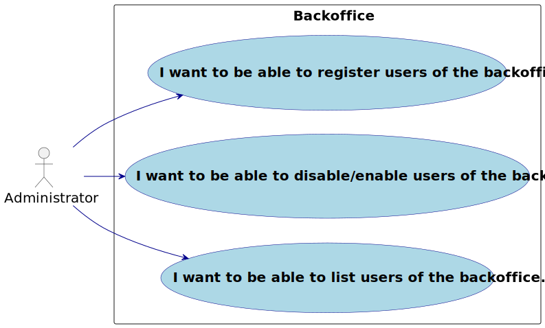
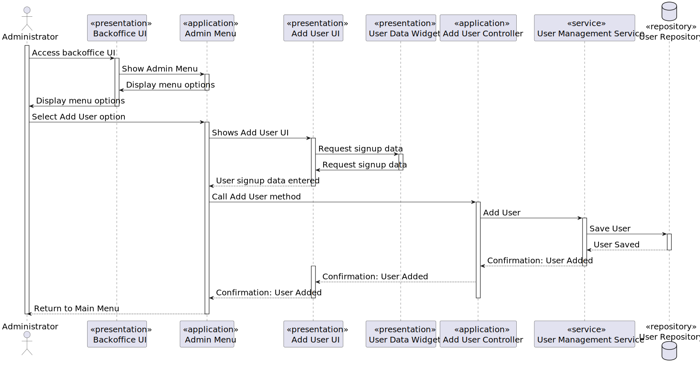
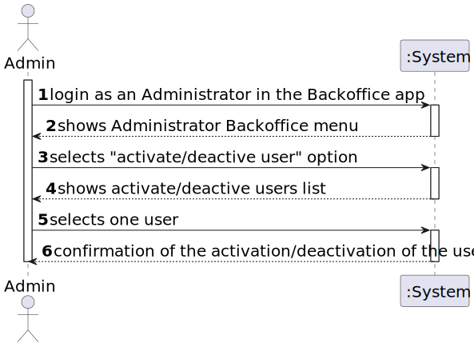
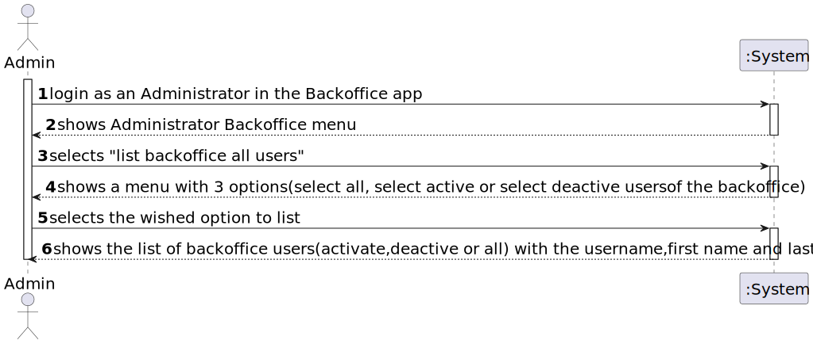
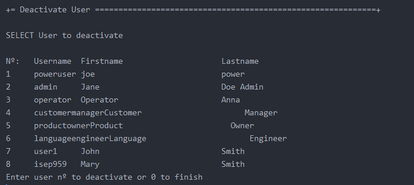
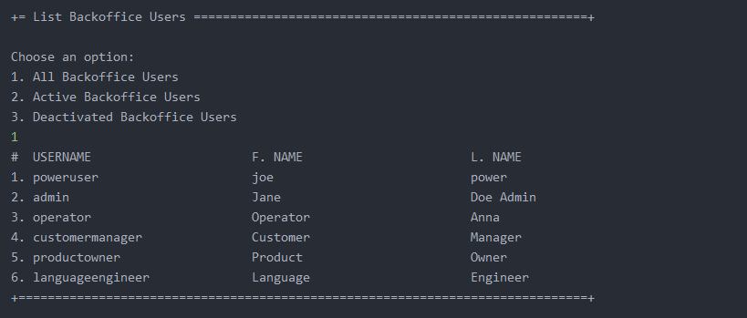
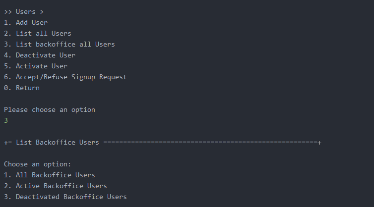
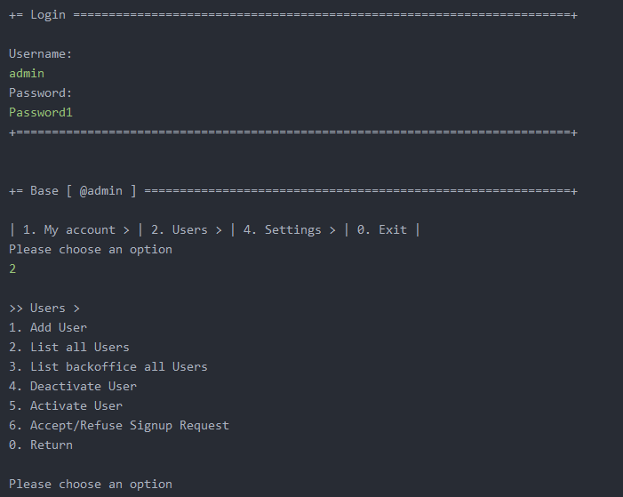

# US 1000

Autor : 1221288

## 1. Context
This is the first time this task is assigned to be developed. This is a new functionality that allow admin to register every type of user, as well as disable/enable and list users of the backoffice.

## 2. Requirements

**US 1000** As Administrator, I want...

- 1000.1. To be able to register, disable/enable, and list users of the backoffice.
- Priority: 1
- References: Alternatively this can be achieved by a bootstrap process

## 2.1. Client Clarifications

### Question 19

> Na criação de um utilizador no sistema o nome é definido pelo utilizador ou é o nome da pessoa (primeiro e último) e se a password é definida pelo utilizador ou gerada pelo sistema?

No âmbito da US 2000a o Operator cria utilizadores do sistema para candidatos que ainda não estejam no sistema. Tem de fazer isso com base nos dados recebidos na candidatura (que incluem email e nome). O email servirá para identificar a pessoa. Neste contexto é necessário ter uma password para esse novo utilizador. Uma vez que essa informação não é transmitida pelo candidato, suponho que a solução mais “aconselhada” será o sistema gerar uma password para esse utilizador. Como o utilizador/candidato irá receber essa informação (a forma de autenticação na app) está out of scope, no sentido em que não existe nenhuma US que remete para isso. As US 1000 e 1001 também remetem para criação de utilizadores. Aqui, eventualmente poderia-se pensar em introduzir manualmente as passwords, mas pode ser pelo mesmo mecanismo de definição automática de password, descrito anteriormente. Relativamente ao nome ver novamente a Q11.

### Question 72

> Multiple enable/disable (US1000) – Can a user (from the backoffice, for example) be enabled/disabled multiple times?

Yes.

### Question 80

> Sérgio – US1000 – Information about the users - Based on the user story description: "As Administrator, I want to be able to register, disable/enable, and list users of the backoffice.", I have the following questions: 1 - Can there be more than one admnistrator of the backoffice? 2 - What information about the backoffice users need to be registered?

Regarding question 1, one admin is enough. Regarding question 2, see Q11.

### Question 81

> US1000 – When we register a customer... are we registering the data of the customer without the data of the user of the company who manage the app or both at the same time? Should we consider the posibility that the Customer User who manage the app changes and we should save the data of the old user too?

For registerinr a customer see US1001.

### Question 86

> US1000 – Na US menciona "Como administrador do sistema (Admin), quero ser capaz de registar, ativar/desativar, e listar utilizadores do backoffice.", gostava que clarificasse a funcionalidade "ativar/desativar" o quê que pretende e a sua finalidade, se possível com um exemplo.

Resposta já dada em Q23, Q30 e Q72

### Question 23

> A mudança de estado é referente ao candidato ou à candidatura individual e como se relaciona com o enable/disable dos utilizadores?

O enable/disable dos users é apenas para controlar os acessos ao sistema. O estado, no processo de candidatura, é o estado da candidatura de um candidato a um job opening, não está diretamente relacionado com o enable/disable dos users.

### Question 30

> US2000b, o que é o enable/disable do candidato?

alguma referencia a Q23). Refere-se a desativar o acesso do candidato ao sistema (i.e., Candidate App)

## 3. Analysis

### 3.1. Conditions

- The admin must be authenticated and authorized to perform the operations.

### 3.2. Use case diagram



## 4. Design

### 4.1. Applied Patterns

- **Repository:** This is used to store the users. This is done to allow the persistence of the enrollments and to allow the use of the enrollments in other parts of the application.
- **Service:** This is used to register the user in the system user repository. This is done to reduce coupling and to allow the use of the services in other parts of the application.

### 4.2. System Diagram
**Add user**


### 4.3 System Sequence Diagram
**Activate/Deactivate user**

**Add user**

**List backoffice users**


### 4.4. Applied Patterns

### 4.5. Tests

### Function Tests 4.5.1.

#### 4.5.1.1 Register Users of the Backoffice

	1. Fazer o login como admin
	2. Escolher a opção   Users >  Add User
	3. Introduzir o Username, Password, First Name, Last Name, E-mail, Role in the System 
	4. Em caso de sucesso, User foi criado.

#### 4.5.1.2 Disable/Enable Users of the Backoffice

	1. Fazer o login como admin
	2. Escolher a opção   Users >  Activate/Deactivate User
	3. Mostrar todos os utilizadores activados/desativados
    4. Escolher o utilizador pretendido
	4. User escolhido  foi activado/desativado.

#### 4.5.1.3 List Users of the Backoffice

	1. Fazer o login como admin
	2. Escolher a opção   Users >  List all backoffice users 
	3. Escolher entre as opções: All Backoffice Users / Active Backoffice Users / Deactivated Backoffice Users
    4. Mostra os utilizadores conforme a opção escolhida.


### Unit Tests 4.5.2
**Test 1:** Ensure user is deactivated

```java
@Test
public void ensureUserIsDeactivated() {
  SystemUser s = getDummyUser();

  deactivateUserController.deactivate(s);

  assertFalse(deactivateUserController.activeUsers().contains(s));
}
```

## 5. Implementation

### 5.1. Deactivate User Controller

```java
public class DeactivateUserController {
    
    private final AuthorizationService authz = AuthzRegistry.authorizationService();
    private final UserManagementService userSvc = AuthzRegistry.userService();

    public Iterable<SystemUser> activeUsers() {
        authz.ensureAuthenticatedUserHasAnyOf(Jobs4uRoles.POWER_USER, Jobs4uRoles.ADMIN);

        return userSvc.activeUsers();
    }

    public SystemUser deactivateUser(final SystemUser user) {
        authz.ensureAuthenticatedUserHasAnyOf(Jobs4uRoles.POWER_USER, Jobs4uRoles.ADMIN);

        return userSvc.deactivateUser(user);
    }
}
```

### 5.2. Add user Controller methods

```java
    public Role[] getRoleTypes() {
        return Jobs4uRoles.nonUserValues();
    }
    
    public SystemUser addUser(final String username, final String password, final String firstName,
            final String lastName,
            final String email, final Set<Role> roles, final Calendar createdOn) {
        authz.ensureAuthenticatedUserHasAnyOf(Jobs4uRoles.POWER_USER, Jobs4uRoles.ADMIN);

        return userSvc.registerNewUser(username, password, firstName, lastName, email, roles,
                createdOn);
    }

    public SystemUser addUser(final String username, final String password, final String firstName,
            final String lastName,
            final String email, final Set<Role> roles) {
        return addUser(username, password, firstName, lastName, email, roles, CurrentTimeCalendars.now());
    }
```

### 5.3 Activate user Controller

```java
    private final AuthorizationService authz = AuthzRegistry.authorizationService();
    private final UserManagementService userSvc = AuthzRegistry.userService();

    public Iterable<SystemUser> deactivatedUsers() {
        authz.ensureAuthenticatedUserHasAnyOf(Jobs4uRoles.POWER_USER, Jobs4uRoles.ADMIN);

        return userSvc.deactivatedUsers();
    }


    public SystemUser activateUser(final SystemUser user) {
        authz.ensureAuthenticatedUserHasAnyOf(Jobs4uRoles.POWER_USER, Jobs4uRoles.ADMIN);

        return userSvc.activateUser(user);
    }
```

### 5.4  List Backoffice users Controller

```java
    private final AuthorizationService authz = AuthzRegistry.authorizationService();
    private final UserManagementService userSvc = AuthzRegistry.userService();
    private final String ACTIVE_USERS = "activeUsers";
    private final String DEACTIVE_USERS = "deactiveUsers";

    public Iterable<SystemUser> backofficeUsers(String opcao) {
        authz.ensureAuthenticatedUserHasAnyOf(Jobs4uRoles.POWER_USER, Jobs4uRoles.ADMIN);
        Iterable<SystemUser> allUsers ;
        switch (opcao) {
            case ACTIVE_USERS:
                allUsers = userSvc.activeUsers();
                break;
            case DEACTIVE_USERS:
                allUsers =  userSvc.deactivatedUsers();
                break;
            default:
                allUsers = userSvc.allUsers();
        }

        List<SystemUser> backofficeUsers = new ArrayList<>();

        for (SystemUser user : allUsers) {
            if (userHasBackofficeRole(user)) {
                backofficeUsers.add(user);
            }
        }

        return backofficeUsers;
    }
    
    private boolean userHasBackofficeRole(SystemUser user) {
        List<Role> backofficeRoles = List.of(
                Jobs4uRoles.POWER_USER,
                Jobs4uRoles.ADMIN,
                Jobs4uRoles.CUSTOMER_MANAGER,
                Jobs4uRoles.OPERATOR,
                Jobs4uRoles.LANGUAGE_ENGINEER,
                Jobs4uRoles.PRODUCT_OWNER
        );

        for (Role userRole : user.roleTypes()) {
            if (backofficeRoles.contains(userRole)) {
                return true;
            }
        }
        return false;
    }
```

### 5.5 List users controller

```java
    private final AuthorizationService authz = AuthzRegistry.authorizationService();
    private final UserManagementService userSvc = AuthzRegistry.userService();
    private final String ACTIVE_USERS = "activeUsers";
    private final String ALL_USERS = "allUsers";
    private final String DEACTIVE_USERS = "deactiveUsers";
    
    public Iterable<SystemUser> listUsers(String opcao) {
        authz.ensureAuthenticatedUserHasAnyOf(Jobs4uRoles.POWER_USER, Jobs4uRoles.ADMIN);

        switch (opcao) {
            case ALL_USERS:
                return  userSvc.allUsers();
            case ACTIVE_USERS:
                return  userSvc.activeUsers();
            case DEACTIVE_USERS:
                return userSvc.deactivatedUsers();
        }
        return  userSvc.allUsers();
    }
    
    public Optional<SystemUser> find(final Username u) {
        return userSvc.userOfIdentity(u);
    }

```

### 5.6 Admin menu

```java
    private static final String RETURN_LABEL = "Return ";

    private static final int EXIT_OPTION = 0;

    // USERS
    private static final int ADD_USER_OPTION = 1;
    private static final int LIST_USERS_OPTION = 2;
    private static final int LIST_BACKOFFICE_USERS_OPTION = 3;
    private static final int DEACTIVATE_USER_OPTION = 4;
    private static final int ACTIVATE_USER_OPTION = 5;
    private static final int ACCEPT_REFUSE_SIGNUP_REQUEST_OPTION = 6;
    
    // SETTINGS
    private static final int NOT_IMPLEMENTED_YET = 1;
    
    public Menu buildAdminSettingsMenu() {
        final Menu menu = new Menu("Settings >");

        menu.addItem(NOT_IMPLEMENTED_YET, "Not implemented yet",
                new ShowMessageAction("Not implemented yet"));
        menu.addItem(EXIT_OPTION, RETURN_LABEL, Actions.SUCCESS);

        return menu;
    }

    public Menu buildUsersMenu() {
        final Menu menu = new Menu("Users >");

        menu.addItem(ADD_USER_OPTION, "Add User", new AddUserUI()::show);
        menu.addItem(LIST_USERS_OPTION, "List all Users", new ListUsersAction());
        menu.addItem(LIST_BACKOFFICE_USERS_OPTION, "List backoffice all Users", new ListBackofficeAction());
        menu.addItem(DEACTIVATE_USER_OPTION, "Deactivate User", new DeactivateUserAction());
        menu.addItem(ACTIVATE_USER_OPTION, "Activate User", new ActivateUserAction());
        menu.addItem(ACCEPT_REFUSE_SIGNUP_REQUEST_OPTION, "Accept/Refuse Signup Request",
                new AcceptRefuseSignupRequestAction());
        menu.addItem(EXIT_OPTION, RETURN_LABEL, Actions.SUCCESS);

        return menu;
    }

```

## 6. Integration & Demonstration

### 6.1. Activate user scenario


### 6.2. Add user backoffice scenario
 


### 6.3. Deactivate user backoffice scenario



### 6.4 List all users backoffice scenario



### 6.5 List backoffice users options scenario



### 6.6 Admin menu backoffice scenario 



## 7. Observations

- N/a