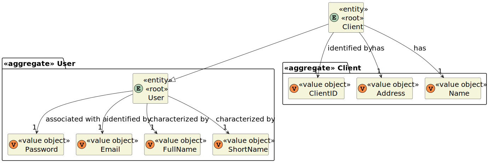
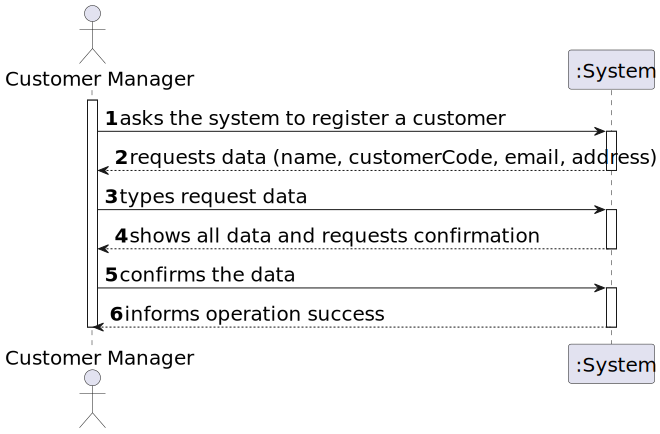
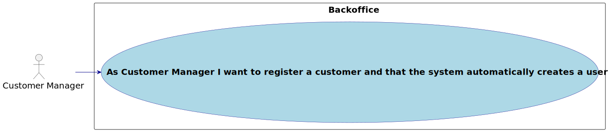
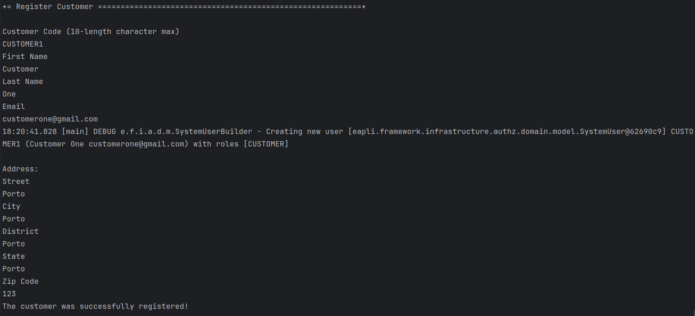

# US 1001

Author : 1221265

## 1. Context

It is the first time this task is being developed.


## 2. Requirements

_In this section you should present the functionality that is being developed, how do you understand it, as well as possible correlations to other requirements (i.e., dependencies)._

**US 1001** As Customer Manager I want to register a customer and that the system automatically creates a user for that customer.

- 1001.1. US 1000 and 1001 also refer to user creation. Here, you could eventually think about manually entering passwords, but it could be through the same automatic password definition mechanism (Q19).
- 1001.2. The Customer Code (ClientID) is a 10-character code and is entered manually when creating the customer (Q22).
- Priority: 1
- References: Alternatively this can be achieved by a bootstrap process


## 3. Analysis

_In this section, the team should report the study/analysis/comparison that was done in order to take the best design decisions for the requirement.
This section should also include supporting diagrams/artifacts (such as domain model; use case diagrams, etc.),_

### 3.1. Domain Model



### 3.2. SSD



### 3.3. Use case diagram




## 4. Design

_In this sections, the team should present the solution design that was adopted to solve the requirement.
This should include, at least, a diagram of the realization of the functionality (e.g., sequence diagram),
a class diagram (presenting the classes that support the functionality),
the identification and rational behind the applied design patterns and the specification of the main tests used to validade the functionality._

### 4.1. Applied Patterns
- **Controller:** This is used to handle user inputs and call the appropriate functionality while separating the UI from the rest of the application
- **Repository:** This is used to store the users. This is done to allow the persistence of the enrollments and to allow the use of the enrollments in other parts of the application.
- **Service:** This is used to register the user in the system user repository. This is done to reduce coupling and to allow the use of the services in other parts of the application.

### 4.2. Tests

**Test 1:** _Verifies that it is not possible to create an instance of the CustomerUser class with null values._

```
@Test
    void testBuildNull() {
        SystemUser systemUser = null;
        String customerCode = null;

        assertThrows(IllegalArgumentException.class, () -> {
            builder.withSystemUser(systemUser)
                    .withCustomerCode(customerCode)
                    .withAddress(null)
                    .build();
        });
    }
```

## 5. Implementation

- Important commits:
    - 41710608c5ea66f92a7e23cc7011524d09720d99 : First commit of the US
    - 8f5538bb0eba834a657a1ee299ce94f4fc6b1617 : Last commit of the US

## 6. Integration/Demonstration

### 6.1. Register Customer



## 7. Observations

- N/a
