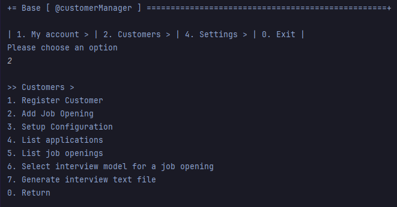
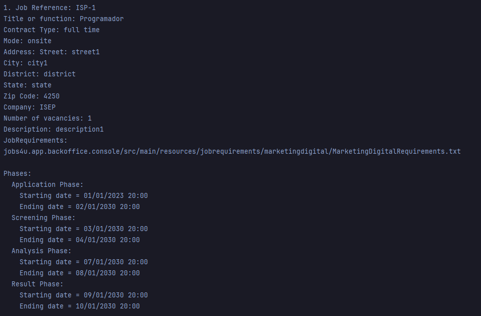

# US 1003

**Author:** 1221289

## 1. Context

This is a new task that hasn't been worked on before.

## 2. Requirements

**US 1003** As Customer Manager, I want to list job openings.
- Priority: 5

## 2.1. Client Clarifications

### Question 68

> Na us1003 é pedido que se liste job openings, há algum critério para definir quais listar? Ou são as do sistema inteiro?

Suponho que poder filtrar por Customer e data seja útil. Também poder filtrar apenas as activas ou todas parece-me útil.

### Question 87

> – Relativamente a uma questão já colocada foi referido que "pode-se filtrar por Customer" nesta US. Nesta caso qual será a forma que o Customer Manager utilizará para filtrar as Job Openings por Costumer (nome, email,...)? E quando se refere a "poder filtrar por data" significa que é uma determinada data ou um intervalo de tempo?

O Customer é tipicamente uma empresa e tem um nome. Também já foi referida a existência de um customer code. Quanto ao filtro por data se estiverem no papel do customer manager que tem de consultar job openings faz sentido ser para um dia? Ou seja ele teria de sabe em que dia é que registou o job opening que está a pesquisar…

### Question 95

> Job Openings Ativas – A resposta à questão Q68 suscitou-nos algumas dúvidas sobre uma job opening no estado "ativa". Em que instante uma job opening se torna ativa? É quando é criada e tem um conjunto de requisitos associada a si? É quando está ligada a um processo de recrutamento ainda a decorrer? Agradecíamos alguns esclarecimentos.

. No contexto da Q68 a referência a activa surge no contexto de datas. Uma job opening cujo processo já tenha terminado não está ativa.

### Question 96

> As Customer Manager, I want to list job openings – Em relação à listagem dos jobs openings, um customer manager pode listar todos os jobs openings ou apenas os que lhe foram atribuídos. Posto de outra forma, os job openings são atribuídos a um customer manager específico, e o mesmo só pode ter acesso à sua lista de job openings?

Ver Q68. Penso que faz sentido listar apenas os “seus” job openings.

### Question 120

> Job Opening Status- O cliente esclareceu o aspeto do status de uma job opening nas questões Q68 e Q95. Disse que uma job opening deixava de estar ativa quando o seu processo de recrutamento termina-se. Contudo, em que estado estão as job openings que já foram registadas mas ainda não têm um processo de recrutamento associado a si?

Relativamente ao estado (nome do estado) em que estão depois de serem registadas mas ainda não terem um processo eu não sei o que responder. Mas posso acrescentar que se não têm processo então não têm datas para as fases do processo e, portanto, parece-me que ainda não entraram na fase de application, pelo que ninguém tem “oficialmente” conhecimento dessa oferta de emprego e não devem haver candidaturas para essa oferta.

## 3. Analysis

### 3.1. Conditions

- Job openings must be registered in the system

### 3.2. Use case diagram

## 4. Design

## 4.1 Applied patterns

- **Repository:** This is used to store the job openings models. This is done to allow the persistence of the enrollments and to allow the use of the enrollments in other parts of the application.

### 4.2. Class Diagram

### 4.3. System Diagram

## 5. Integration/Demonstration

### 5.1. Customer manager menu

### 5.2. Listing options

### 5.3. Listing example

## 6. Observations

N/a
