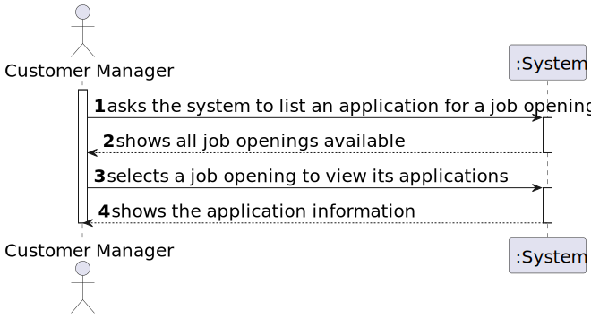
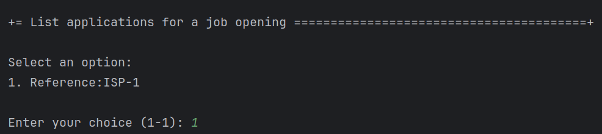
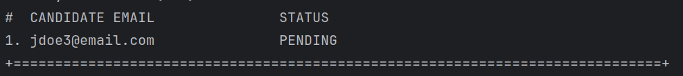

# US 1005

Author: 1221265

## 1. Context

This is a new task that hasn't been worked on before.

## 2. Requirements

**US 1005** As Customer Manager, I want to list all applications for a job opening.

- 1005.1. It makes sense to show all applications, regardless of their status (Q63).
- 1005.2. For each application, the candidate and the status of their application must be identified (Q63).
- Priority: 1
- References: N/A

## 3. Analysis

_In this section, the team should report the study/analysis/comparison that was done in order to take the best design decisions for the requirement.
This section should also include supporting diagrams/artifacts (such as domain model; use case diagrams, etc.),_

### 3.1. SSD

### 3.2. Use case diagram

## 4. Design

_In this sections, the team should present the solution design that was adopted to solve the requirement.
This should include, at least, a diagram of the realization of the functionality (e.g., sequence diagram),
a class diagram (presenting the classes that support the functionality),
the identification and rational behind the applied design patterns and the specification of the main tests used to validate the functionality._

### 4.1. Applied Patterns
- **Controller:** This is used to handle user inputs and call the appropriate functionality while separating the UI from the rest of the application
- **Repository:** This is used to store the users. This is done to allow the persistence of the enrollments and to allow the use of the enrollments in other parts of the application.

## 5. Implementation

- Important commits:
    - 03123858e9e79f1a3d854edbf320e2a0ba561f40 : First commit of the US

## 6. Integration/Demonstration

### 6.1. List Application

### 6.2. Output

## 7. Observations

- N/a
