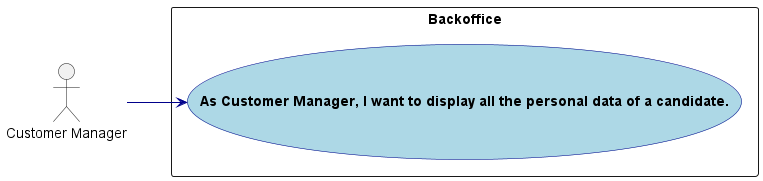
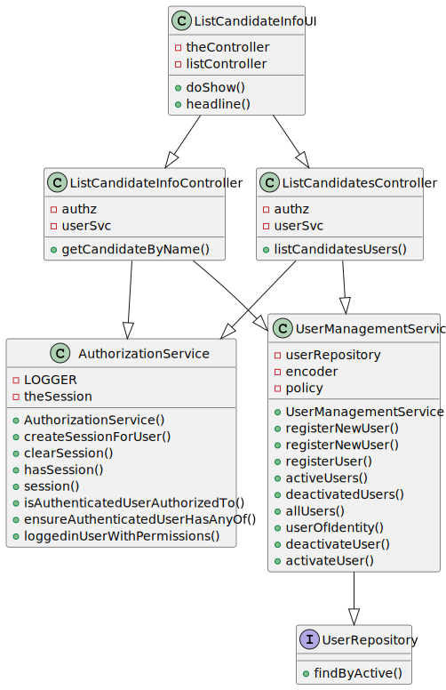
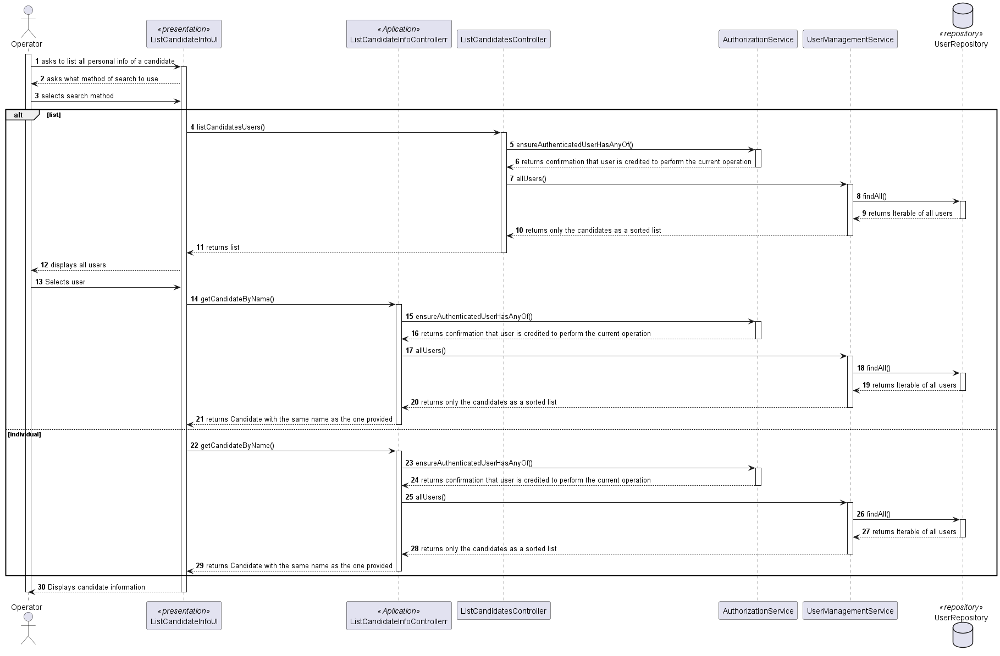
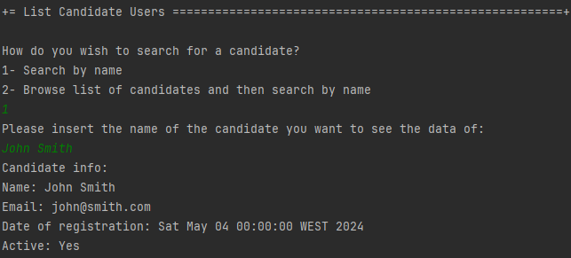
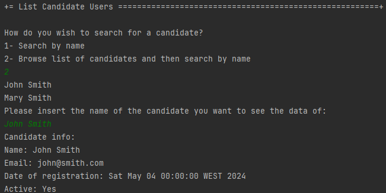

# US 1006

Autor : 1211225

## 1. Context

This feature is being implemented for the first time

## 2. Requirements

**US 1006** As Customer Manager, I want to display all the personal data of a candidate

- 2000c.1. Create the method responsible to get all info of a candidate

- 2000c.2  Create the methods to display that information

- 2000c.3  Make this funcionality available only in the menu for the Customer Manager

_Regarding this requirement we understand that it has a dependency of US2000c, as the functionality to list all users implemented in that US is applied here as well _

## 2.1. Client Clarifications
> Q108 José – US1006b- Quanto á informação que é apresentada na 1006b, que tipo de informação relacionada ás "applications" do candidato espera que seja apresentada ao customer manager?

A108 Espera-se que sejam listadas as candidaturas desse candidato indicando a que job opening, qual a data de registo da candidatura, o seu estado e qual o seu identificador.
## 3. Analysis
### 3.1. Conditions

- The operator has access to the information of all candidates
### 3.2. Use case diagram

## 4. Design

### 4.1. Applied Patterns
- **Controller:** This is used to handle user inputs and call the appropriate functionality while separating the UI from the rest of the application
- **Repository:** This is used to store the users. This is done to allow the persistence of the enrollments and to allow the use of the enrollments in other parts of the application.
- **Service:** This is used to register the user in the system user repository. This is done to reduce coupling and to allow the use of the services in other parts of the application.

### 4.2. Class Diagram

### 4.3. Sequence Diagram

## 5. Implementation

- 2 ways of searching were implemented, either searching for an individual candidate by name or by displaying a list of the names of all candidates and then asking for the name of the of the candidate whose data the operator wants to view

- Important commits:
    - 4d62ae5f332c9119a5b77580528997a2d98eec9c: First commit of the US
## 6. Integration/Demonstration
### 6.1. Search for a candidate by name

### 6.2. Search for a candidate through list

## 7. Observations

- N/a