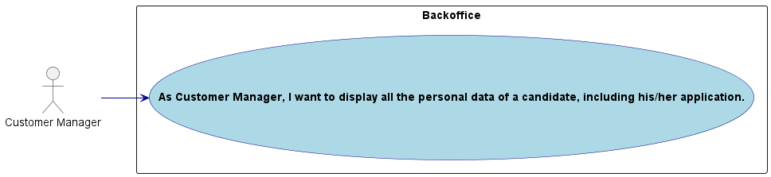
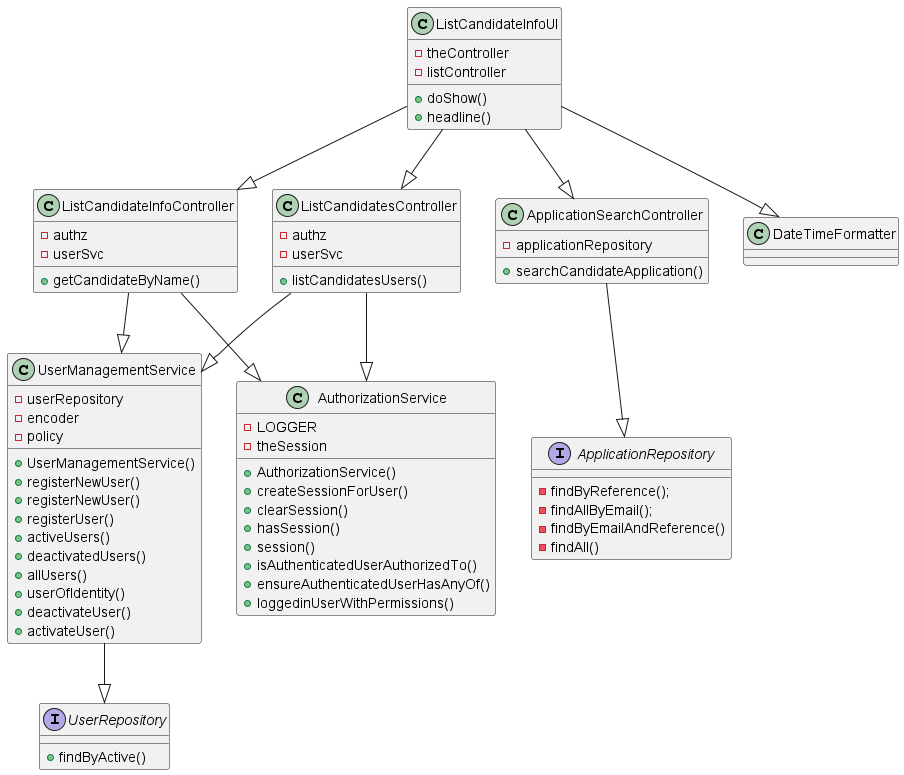
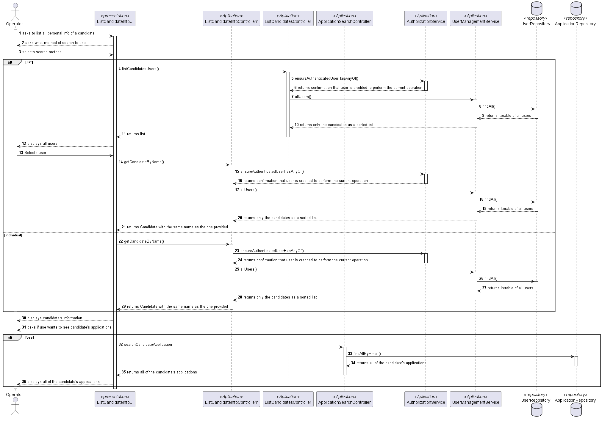
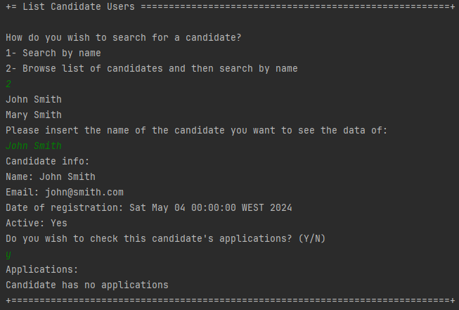
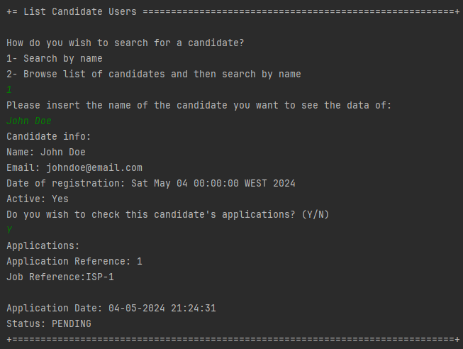

# US 1006b

Autor : 1211225

## 1. Context

This feature is being implemented for the first time

## 2. Requirements

**US 1006b** As Customer Manager, I want to display all the personal data of a candidate, including his/her applications.

- 1006b.1

_Regarding this requirement we understand that it relates to USs 1006 and 2002, as it depends on both of them_
## 2.1. Client Clarifications
>Q108 José – US1006b- Quanto á informação que é apresentada na 1006b, que tipo de informação relacionada ás "applications" do candidato espera que seja apresentada ao customer manager?

A108 Espera-se que sejam listadas as candidaturas desse candidato indicando a que job opening, qual a data de registo da candidatura, o seu estado e qual o seu identificador.
## 3. Analysis
### 3.1. Conditions

- The operator has access to the information of all candidates
### 3.2. Use case diagram

## 4. Design

### 4.1. Applied Patterns
- **Controller:** This is used to handle user inputs and call the appropriate functionality while separating the UI from the rest of the application
- **Repository:** This is used to store the users. This is done to allow the persistence of the enrollments and to allow the use of the enrollments in other parts of the application.
- **Service:** This is used to register the user in the system user repository. This is done to reduce coupling and to allow the use of the services in other parts of the application.

### 4.2. Class Diagram

### 4.3. Sequence Diagram

## 5. Implementation

- Important commits:
    -2b146fa6ee2005971f98c70234f1018ca19a2b2b : First commit of the US
## 6. Integration/Demonstration
### 6.1. Candidate has no applications

### 6.1. Candidate has applications

## 7. Observations

- N/a