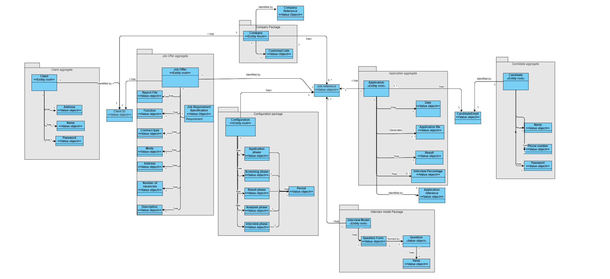
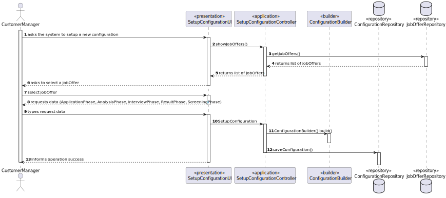

# US 1007

Author : 1221959

## 1. Context

It is the first time this task is being developed.


## 2. Requirements


**US 1007** As Customer Manager, I want to setup the phases of the process for a job opening.


- Priority: 1
- References: Alternatively this can be achieved by a bootstrap process

## 2.1. Client Clarifications

## Question 16

> Relativamente à secção 2.2.1 e às fases do processo de recrutamento, para passarmos para a fase seguinte a anterior tem de fechar ou podemos avançar sem ter a anterior fechada?

A resposta curta é que as fases devem ser sequencias e não sobreposta. Quando fecha uma fase abre a próxima. A US 1007 prevê a definição das fases. A US 1010 prevê a abertura e fecho de fases do processo. A decisão do Customer Manager de fechar uma fase deve assumir que o processo avança para a próxima fase automaticamente (independentemente das datas definidas para as fases).

## Question 46

> US1007, o identificar do processo de recrutamento pode ser um numero automático ou seja mais especifico?

O job opening tem um identificar. O processo de recrutamento de um job opening é um “tributo” desse job opening. À partida não vejo necessidade de ter um identificador “especial” para o processo de recrutamento (i.e., fases do processo de recrutamento desse job opening)

## Question 53

> O recruitment process pode ser identificado pelo job reference?

A US 1007 refere que quando o Customer Manager vai definir as fases do recrutamento para cada job opening. Penso que não haverá necessidade de ter um identificar explicito para o processo de recrutamento, uma vez que apenas existe um para cada job reference e é especifico de cada job reference. Em termos técnicos, se houver necessidade de um ID para o processo de recrutamento, não tenho nada contra que este seja igual ao job reference.

## Question 91

>[1002, 1007, 1009] - Validez de uma Job Openings – A nossa questão principal seria: quando é que uma job opening é considerada válida? Tendo em conta as funcionalidades 1002, 1007, 1009, surgiu-nos uma duvida relativamente às job openings e à sua constituiçao. Na US1002, é suposto resgistar uma job opening e apenas depois, na US1009, devemos selecionar os requirements specifications para a dada job opening. Posto isto, aquando o registo da job opening, esta não iria possuir toda a informaçao obrigatória como requerido. Assim sendo, deveria haver uma ligação direta entre estas user stories de forma a que, aquando o registo, passamos automaticamente a selecionar os requirements obtendo assim uma job opening válida? Adicionalmente, queremos esclarecer se o recruitment process é algo obrigatório para a validez de um job opening

## Question 103

>US1007 – Para um recruitment process vamos ter várias fases. O que é pretendido para o “Setup”

Ver Q73. O processo de recrutamento, explicado na secção 2.2.1, define uma sequência de fases na qual apenas se indica como opcional a fase das entrevistas. O Setup consiste essencialmente em definir as datas para cada fase e se temos ou não a fase das entrevistas.

## Question 126

>Abreu (questão registada a 2024-04-17 no forum) – US1007- Um costumer manager deve conseguir fazer setup a todas os Job Openings disponíveis no sistema ou apenas as que ele registou(US1002) ?

Deve fazer o Setup dos job openings do qual é responsável (que está a gerir).

## 3. Analysis

### 3.1. Domain Model

 "Domain model")

### 3.2. Use case diagram


## 4. Design

### 4.1. Realization

### 4.2. System Diagram



### 4.3. Applied Patterns

- **Repository:** This is used to store the configurations. This is done to allow the persistence of the enrollments and to allow the use of the enrollments in other parts of the application.


### 4.4. Tests

#### 4.4.1.1 Register job offer


```
1-entrar como customerManager
2-selecionar a opção 2
3-selecionar a opção 3
4- inserir os dados pedidos
5. Em caso de sucesso, a configuration foi criada.
```

**Test 1:** _Verifies that it is not possible to create an instance of the Configuration class with null values._

```
@Test
public void creatConstructorWithNullValues() {
        assertThrows(NullPointerException.class, () -> 
        new Configuration(null, null, null, null, null, null));
    }
```

**Test 2:** _Verifies that it is possible to create an instance of the Configuration class with valid values._

```
@Test
    void ConfigurationWithValidPhases() {
        Reference reference = new Reference("REF123");
        ApplicationPhase applicationPhase = new ApplicationPhase(new Period("2023-01-01 20:00", "2023-01-02 20:00"));
        ScreeningPhase screeningPhase = new ScreeningPhase(new Period("2023-01-03 20:00", "2023-01-04 20:00"));
        InterviewPhase interviewPhase = new InterviewPhase(new Period("2023-01-05 20:00", "2023-01-06 20:00"));
        AnalysisPhase analysisPhase = new AnalysisPhase(new Period("2023-01-07 20:00", "2023-01-08 20:00"));
        ResultPhase resultPhase = new ResultPhase(new Period("2023-01-09 20:00", "2023-01-10 20:00"));
        Configuration configuration = new Configuration(reference, applicationPhase, interviewPhase, screeningPhase, resultPhase, analysisPhase);

        assertEquals(applicationPhase, configuration.getApplicationPhase());
        assertEquals(screeningPhase, configuration.getScreeningPhase());
        assertEquals(interviewPhase, configuration.getInterviewPhase());
        assertEquals(analysisPhase, configuration.getAnalysisPhase());
        assertEquals(resultPhase, configuration.getResultPhase());
    }
```

**Test 3:** _Verifies that it is possible to create an instance of the Configuration class without interviewPhase._
```
@Test
    void ConfigurationWithOutInterviewPhase() {
        Reference reference = new Reference("REF123");
        ApplicationPhase applicationPhase = new ApplicationPhase(new Period("2023-01-01 20:00", "2023-01-02 20:00"));
        ScreeningPhase screeningPhase = new ScreeningPhase(new Period("2023-01-03 20:00", "2023-01-04 20:00"));
        AnalysisPhase analysisPhase = new AnalysisPhase(new Period("2023-01-05 20:00", "2023-01-06 20:00"));
        ResultPhase resultPhase = new ResultPhase(new Period("2023-01-07 20:00", "2023-01-08 20:00"));
        Configuration configuration = new Configuration(reference, applicationPhase, screeningPhase, resultPhase, analysisPhase);

        assertEquals(applicationPhase, configuration.getApplicationPhase());
        assertEquals(screeningPhase, configuration.getScreeningPhase());
        assertEquals(analysisPhase, configuration.getAnalysisPhase());
        assertEquals(resultPhase, configuration.getResultPhase());
    }
```
## 5. Implementation

## 5.1 SetupConfigurationController
```java
public class SetupConfigurationController {

    private JobOfferRepository jobOfferRepository = PersistenceContext.repositories().jobOffers();
    private ConfigurationRepository configurationRepository = PersistenceContext.repositories().configurations();
    private final AuthorizationService authorizationService = AuthzRegistry.authorizationService();

    private final String currentManager = getManagerEmail();


    private String getManagerEmail() {
        authorizationService.ensureAuthenticatedUserHasAnyOf(Jobs4uRoles.POWER_USER, Jobs4uRoles.CUSTOMER_MANAGER);

        AuthorizationService authorizationService = AuthzRegistry.authorizationService();
        Optional<UserSession> userSessionOptional = authorizationService.session();
        UserSession userSession = userSessionOptional.get();
        SystemUser authenticatedUser = userSession.authenticatedUser();
        return authenticatedUser.email().toString();
    }

    public Iterable<JobOffer> getJobOffers() {
        authorizationService.ensureAuthenticatedUserHasAnyOf(Jobs4uRoles.POWER_USER, Jobs4uRoles.CUSTOMER_MANAGER);

        Iterable<JobOffer> jobOffers = jobOfferRepository.findAllByManager(currentManager);
        if (jobOffers == null || !jobOffers.iterator().hasNext()) {
            System.out.println("No job offers found.");
            return Collections.emptyList();
        }
        return jobOffers;
    }

    //verificar se já ha configuration com aquela reference
    public boolean checkConfiguration(Reference reference){
        authorizationService.ensureAuthenticatedUserHasAnyOf(Jobs4uRoles.POWER_USER, Jobs4uRoles.CUSTOMER_MANAGER);

        if (configurationRepository.findByReference(reference).iterator().hasNext()) {
            return true;
        }

        return false;
    }

    public boolean deleteConfiguration(Reference reference) {
        authorizationService.ensureAuthenticatedUserHasAnyOf(Jobs4uRoles.POWER_USER, Jobs4uRoles.CUSTOMER_MANAGER);

        Configuration configuration = configurationRepository.findByReference(reference).iterator().next();
        configurationRepository.delete(configuration);
        return true;
    }

    public boolean showJobOffers() {
        System.out.println("Job Offers:");
        Iterable<JobOffer> jobOffers = getJobOffers();
        if (jobOffers == null || !jobOffers.iterator().hasNext()) {
            return false;
        }
        for (JobOffer jobOffer : jobOffers) {
            System.out.println(jobOffer.getReference().toString());
        }
        return true;
    }

    public Iterable<JobOffer> getSpecificJobOffer(Reference reference) {
        authorizationService.ensureAuthenticatedUserHasAnyOf(Jobs4uRoles.POWER_USER, Jobs4uRoles.CUSTOMER_MANAGER);

        Iterable<JobOffer> jobOffers = jobOfferRepository.findAllByManager(currentManager);
        List<JobOffer> jobOfferList = (List<JobOffer>) jobOffers;
        for (JobOffer jobOffer : jobOfferList) {
            if (jobOffer.getReference().toString().equals(reference.toString())) {
                return Collections.singletonList(jobOffer);
            }
        }
        return Collections.emptyList();
    }

    public ApplicationPhase setupApplication() {
        while (true) {
            try {
                String startDate = Console.readLine("Enter start date and time for the Application phase (yyyy-MM-dd HH:mm): ");
                String endDate = Console.readLine("Enter end date and time for the Application phase (yyyy-MM-dd HH:mm): ");

                Period period = new Period(startDate, endDate);
                return new ApplicationPhase(period);
            } catch (DateTimeParseException e) {
                System.out.println(e.getMessage());
        }
    }
}

    public ScreeningPhase setupScreening() {

        while (true) {
            try {
                String startDate = Console.readLine("Enter start date and time for the Screening phase (yyyy-MM-dd HH:mm): ");
                String endDate = Console.readLine("Enter end date and time for the Screening phase (yyyy-MM-dd HH:mm): ");

                Period period = new Period(startDate, endDate);

                return new ScreeningPhase(period);
            } catch (DateTimeParseException e) {
                System.out.println(e.getMessage());
            }
        }
    }

    public InterviewPhase setupInterview() {
        while (true) {
            try {
                String startDate = Console.readLine("Enter start date and time for the Interview phase (yyyy-MM-dd HH:mm): ");
                String endDate = Console.readLine("Enter end date and time for the Interview phase (yyyy-MM-dd HH:mm): ");

                Period period = new Period(startDate, endDate);

                return new InterviewPhase(period);
            } catch (DateTimeParseException e) {
                System.out.println(e.getMessage());
            }
        }
    }

    public AnalysisPhase setupAnalysis() {
        while (true) {
            try {
                String startDate = Console.readLine("Enter start date and time for the Analysis phase (yyyy-MM-dd HH:mm): ");
                String endDate = Console.readLine("Enter end date and time for the Analysis phase (yyyy-MM-dd HH:mm): ");

                Period period = new Period(startDate, endDate);

                return new AnalysisPhase(period);
            } catch (DateTimeParseException e) {
                System.out.println(e.getMessage());
            }
        }
    }

    public ResultPhase setupResult() {
        while (true) {
            try {
                String startDate = Console.readLine("Enter start date and time for the Result phase (yyyy-MM-dd HH:mm): ");
                String endDate = Console.readLine("Enter end date and time for the Result phase (yyyy-MM-dd HH:mm): ");

                Period period = new Period(startDate, endDate);

                return new ResultPhase(period);
            } catch (DateTimeParseException e) {
                System.out.println("Invalid date range. " + e.getMessage());
            }
        }
    }

    public boolean setAll(Reference reference) {

        authorizationService.ensureAuthenticatedUserHasAnyOf(Jobs4uRoles.POWER_USER, Jobs4uRoles.CUSTOMER_MANAGER);

        try {
            Configuration configuration = new ConfigurationBuilder()
                    .reference(reference)
                    .applicationPhase(setupApplication())
                    .screeningPhase(setupScreening())
                    .interviewPhase(setupInterview())
                    .analysisPhase(setupAnalysis())
                    .resultPhase(setupResult())
                    .build();
            configurationRepository.save(configuration);
            return true;
        }
        catch (IllegalArgumentException e) {
            System.out.println(e.getMessage());
        }
        return false;
    }

    public boolean setNoInterview(Reference reference) {

        authorizationService.ensureAuthenticatedUserHasAnyOf(Jobs4uRoles.POWER_USER, Jobs4uRoles.CUSTOMER_MANAGER);

        try {
            Configuration configuration = new ConfigurationBuilder()
                    .reference(reference)
                    .applicationPhase(setupApplication())
                    .screeningPhase(setupScreening())
                    .analysisPhase(setupAnalysis())
                    .resultPhase(setupResult())
                    .buildNoInterview();
            configurationRepository.save(configuration);
            return true;
        }
        catch (IllegalArgumentException e) {
            System.out.println(e.getMessage());
        }
        return false;
    }
}
```


## 6. Integration & Demonstration


## 7. Observations

- N/a