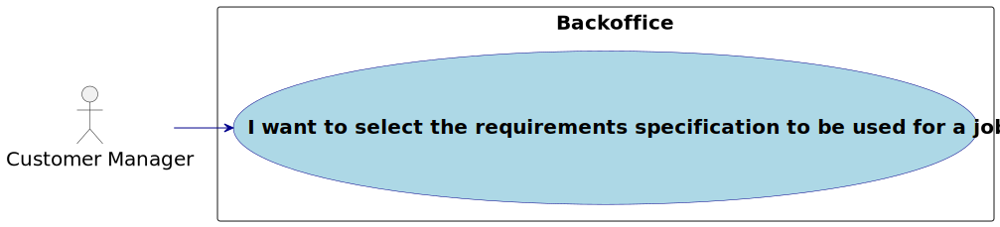

# US 1009

Autor : 1221288

## 1. Context
É a primeira vez que esta tarefa está a ser desenvolvida.

## 2. Requirements

**US 1009** As Customer Manager, I want ...

- 1009.1.  to select the requirements specification to be used for a job opening.

- Priority: 1
- References: See NFR09(LPROG).
## 2.1. Client Clarifications

### Question 41

>Como é que o Language Engineer faz o interview model e os job
requirements? É texto? Ou ele seleciona perguntas para a interview e
requirements para a job opening? E isso é quando se está a criar uma
entrevista ou uma job opening ou para-se a meio para fazer isso e depois
continua se?

O language enginner com informação passada pelo customer manager (que obteve
do customer) vai desenvolver em java um jar correspondente ao modulo/plugin. Para esse
desenvolvimento terá de utilizar técnicas de desenvolvimento de gramáticas/linguagens
como o antlr. Esse código ficará num jar que depois o language engineer “instala/regista”
na aplicação (US1008, por exemplo, associando um nome ao jar num ficheiro de
configuração – “5 anos experiencia java”, “req-model-5-years-java.jar”). A aplicação com
essa informação carrega dinamicamente esse jar. Na gramátca usada no jar é que vão
estar espelhadas a estrutura das perguntas a usar nesse modelo e sua avaliação. Estas
atividades têm de ser feitas antes de se poder fazer a US1008. Esse trabalho é feito “fora”
dos sistema, apenas se registando o modelo (quando está pronto) na US1008. A US 1009 e
US1011 permitem selecionar modelos a usar (dos que foram devidamente registados no
sistema).

### Question 70

>Acerca da User Story da seleção do Job Requirement
Specification para o Job Opening, será que o Customer Manager poderá
escolher um Job Opening que já tenha um Job Requirement Specification?

Admito que essa situação seja possível para qualquer user story similar. Ou seja, a
situação que descreve é equivalente a qualquer situação em que seja necessário fazer
uma seleção mas que o utilizador se tenha enganado e deseje optar por outra opção.
Deve-se, no entanto, garantir que o sistema se mantenha num estado consistente.

### Question 85

> Depois de definir os estados de recrutamento
para uma JobOpening, o Customer Manager poderá selecionar o Job
Requirement Specification para esse mesmo Job Opening? Se sim, até que
fase de recrutamento poderá executar a ação?

O Customer Manager define as fases do processo de recrutamento, não define os
estados. A avaliação de requisitos é feita na fase de Screening. Assim, não percebo bem a
questão colocada.

### Question 88

> Quando o Customer Manager regista uma job offer,
é ele que cria as requirement specifications e as interview models ou é-lhe
dada uma lista destes para ele selecionar?

Existe a US1002 e as US1009 e US1011. Penso que está claro qual a responsabilidade
de cada uma. A criação dos modelos das entrevistas e dos requisitos é um caso de uso
especifico e com um US especifica para registar no sistema os respectivos plugins
(US1008).

### Question 91

> Validez de uma Job Openings – A nossa
questão principal seria: quando é que uma job opening é considerada válida?
Tendo em conta as funcionalidades 1002, 1007, 1009, surgiu-nos uma duvida
relativamente às job openings e à sua constituiçao. Na US1002, é suposto
resgistar uma job opening e apenas depois, na US1009, devemos selecionar
os requirements specifications para a dada job opening. Posto isto, aquando
o registo da job opening, esta não iria possuir toda a informaçao obrigatória
como requerido. Assim sendo, deveria haver uma ligação direta entre estas
user stories de forma a que, aquando o registo, passamos automaticamente
a selecionar os requirements obtendo assim uma job opening válida?
Adicionalmente, queremos esclarecer se o recruitment process é algo
obrigatório para a validez de um job opening.

O product owner não é especialista do dominio da solução (apenas têm
conhecimentos do problema) mas, quanto à primeira questão, sugere que talvez user
stories não sejam (podem não ser) opções de menu “distintas”. Quanto à segunda
questão (recruitment process) julgo que também está mais ligada à solução que ao
problema, pelo que não vou sugerir nada que possa até complicar mais do que esclarecer.

### Question 115

>US1002, 1007, 1009 - Na US1002 ao registar um job opening é
imperativo selecionar também o job requirement e/ou as fases de
recrutamento?

São US diferentes e, do meu ponto de vista, podem ser executadas em momentos
diferentes. Apenas lembro que, como é evidente, desejo que o sistema esteja sempre num
estado consistente

## 3. Analysis

### 3.1. Use case diagram

## 4. Design

### 4.1. Realization

### 4.2 System Sequence Diagram

