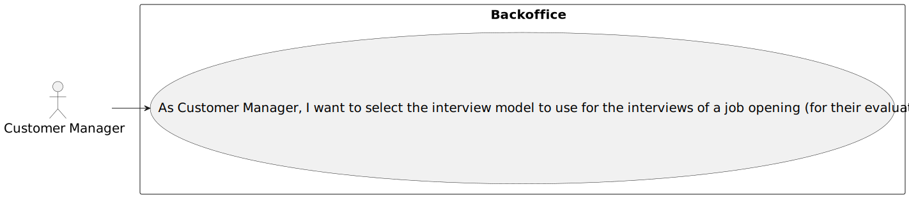
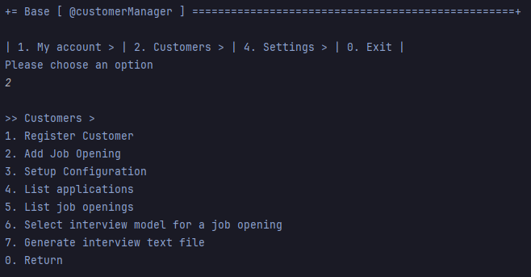
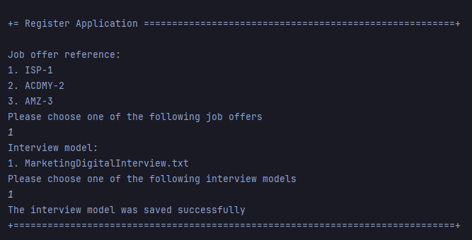

# US 1011

**Author:** 1221289

## 1. Context

This is a new task that hasn't been worked on before.

## 2. Requirements

**US 1011** As Customer Manager, I want to select the interview model to use for the interviews of a job opening (for their evaluation/grading).
- Priority: 1
- References: See NFR09(LPROG).

## 2.1. Client Clarifications

### Question 18

> Na US 1011 como é que o Customer Manager seleciona o modelo a usar para as entrevistas?

Admite-se que os modelos quando são registados no sistema (os tais “plugins”) ficam identificados com um nome ou descrição. Por exemplo “Modelo de Entrevista para Operador de Caixa de Supermercado” ou “Modelo de Entrevista para Programador Junior Backend Java”. Na US 1011 é suposto o Customer manager selecionar um modelo de uma possível lista de modelos.

### Question 38

> Cada questão de um interview model aceita um x tipos de respostas(ex escolha múltipla) ou é a interview model que aceita um x tipos de respostas em todas as suas questões? Assumimos que uma job opening só segue um interview model?

Sim, cada pergunta/resposta aceita um tipo de pergunta/resposta (um dos tipos que aparece no inicio da página 8). Na US1011, o Customer manager seleciona o interview model a usar nas entrevistas para um job opening. Ou seja, existirá apenas um interview model a usar nas entrevistas desse job opening.

### Question 41

> Como é que o Language Engineer faz o interview model e os job requirements? É texto? Ou ele seleciona perguntas para a interview e requirements para a job opening? E isso é quando se está a criar uma entrevista ou uma job opening ou para-se a meio para fazer isso e depois continua se?

O language enginner com informação passada pelo customer manager (que obteve do customer) vai desenvolver em java um jar correspondente ao modulo/plugin. Para esse desenvolvimento terá de utilizar técnicas de desenvolvimento de gramáticas/linguagens como o antlr. Esse código ficará num jar que depois o language engineer “instala/regista” na aplicação (US1008, por exemplo, associando um nome ao jar num ficheiro de configuração – “5 anos experiencia java”, “req-model-5-years-java.jar”). A aplicação com essa informação carrega dinamicamente esse jar. Na gramátca usada no jar é que vão estar espelhadas a estrutura das perguntas a usar nesse modelo e sua avaliação. Estas atividades têm de ser feitas antes de se poder fazer a US1008. Esse trabalho é feito “fora” dos sistema, apenas se registando o modelo (quando está pronto) na US1008. A US 1009 e US1011 permitem selecionar modelos a usar (dos que foram devidamente registados no sistema).

### Question 55

> No seguimento do ponto "2.2.1 Recruitment Process", O customer manager é o responsável por fazer o setup do processo, definindo as fases e indicar se inclui a entrevista. Vimos por este meio solicitar, que nos indique se está previsto que as fases do processo de recrutamento vão ser sempre as mesmas fixas\estanques "candidatura; triagem; entrevistas; análise; resultado;" (entrevista não é obrigatório), ou se as fases podem ser dinâmicas (serem mais, menos, por ordem distinta). No caso de existir entrevista, só vai haver uma para um JobOpening ? Aguardamos esclarecimentos, para adaptar o modelo de domínio se for caso disso.

Sobre a primeira questão remete-se para a pergunta Q39, já respondida. Sobre as entrevistas, a 1011 indica que o customer manager seleciona o “interview model” a usar para as entrevistas de um “job opening”. Assim, estamos a admitir que será sempre o mesmo interview model para todas as entrevistas, ou seja, todas as entrevistas terão as mesmas perguntas. Ou seja, é adequado admitir que só vai haver uma entrevista para um “job opening”.

### Question 92

> Processo de Setup de uma Job Opening – Tendo em conta a US1007, de setup das diferentes fases do processo de recrutamento, gostaríamos que nos fosse esclarecido se, caso seja selecionada uma fase de Interview, é necessário haver uma ligação direta com a US1011, seleção de um interview model, ou serão funcionalidades separadas? Na eventualidade de serem separadas, passa então um recruitment process a ser válido apenas após a seleção de um interview model?

Suponho que a minha reposta seja similar à da pergunta anterior (Q91). Posso adiantar que podemos considerar que a empresa para já pretende usar sempre um processo de avaliaçao de entrevistas “automático”, pelo que este deve estar definido para se poderem “executar/processar” as entrevistas.

## 3. Analysis

### 3.1. Conditions

- Both interview models and job offers must be registered in the system

### 3.2. Use case diagram

## 4. Design

## 4.1 Applied patterns

- **Repository:** This is used to store the interview models. This is done to allow the persistence of the enrollments and to allow the use of the enrollments in other parts of the application.

### 4.2. Class Diagram

### 4.3. System Diagram

## 5. Integration/Demonstration

### 5.1. Customer manager menu

### 5.2. Successful case

## 6. Observations

N/a
