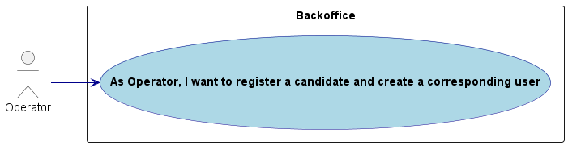
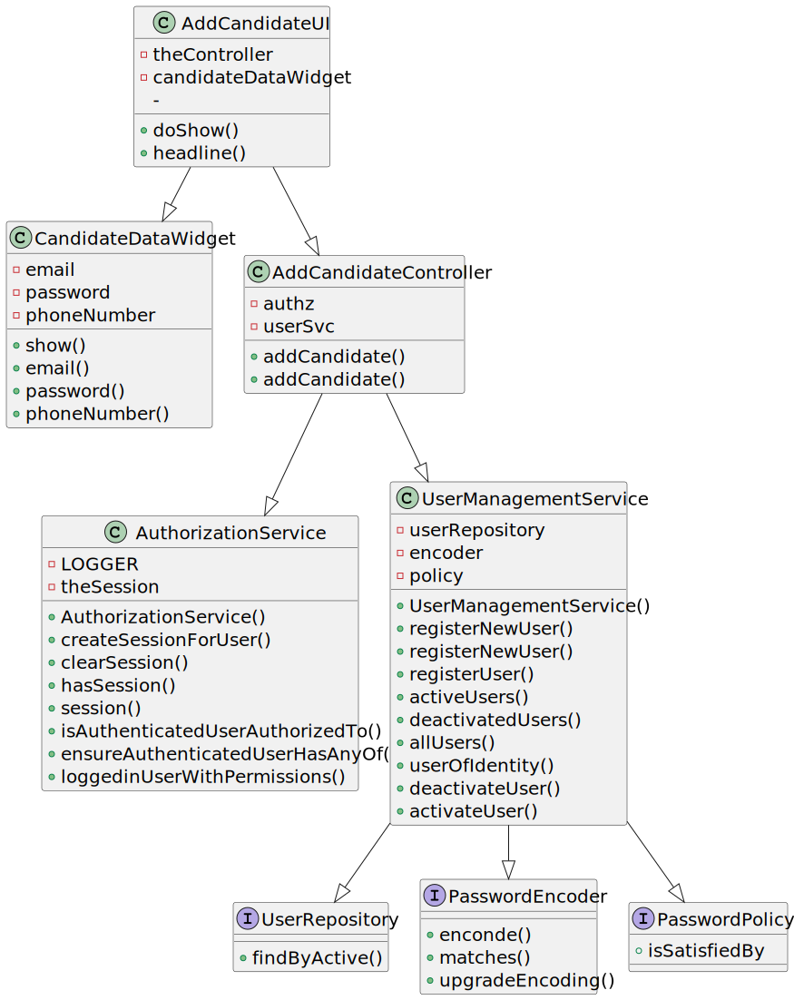
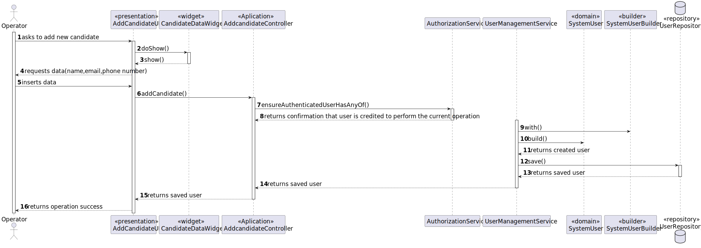
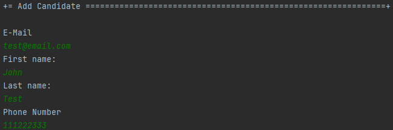

# US 2000a

Autor : 1211225

## 1. Context

This feature is being implemented for the first time

## 2. Requirements

**US 2000a** As Operator, I want to register a candidate and create a corresponding user

- 2000a.1. Create the factory responsible for the creation of "candidate" objects

- 2000a.2. Create the repository to save "candidate" objects

- 2000a.3  Create the Controller that will bridge the gap between factory, repository and UI

- 2000a.4  Create the UI

- 2000a.5  Make this funcionality available only in the menu for the Operator

## 2.1. Client Clarifications
> Q19 Diogo – Na criação de um utilizador no sistema o nome é definido pelo utilizador ou é o nome da pessoa (primeiro e último) e se a password é definida pelo utilizador ou gerada pelo sistema?

A19 No âmbito da US 2000a o Operator cria utilizadores do sistema para candidatos que ainda não estejam no sistema. Tem de fazer isso com base nos dados recebidos na candidatura (que incluem email e nome). O email servirá para identificar a pessoa. Neste contexto é necessário ter uma password para esse novo utilizador. Uma vez que essa informação não é transmitida pelo candidato, suponho que a solução mais “aconselhada” será o sistema gerar uma password para esse utilizador. Como o utilizador/candidato irá receber essa informação (a forma de autenticação na app) está out of scope, no sentido em que não existe nenhuma US que remete para isso. As US 1000 e 1001 também remetem para criação de utilizadores. Aqui, eventualmente poderia-se pensar em introduzir manualmente as passwords, mas pode ser pelo mesmo mecanismo de definição automática de password, descrito anteriormente. Relativamente ao nome ver novamente a Q11.

> Q54 Alejandro – Regarding the US2000a requirement which states "As an Operator, I want to register a candidate and create a corresponding user," I would like to know how a candidate will be registered in the system, i.e., understand the processes for registering a candidate. Since the candidate has their name, email, and phone number, how should their username be formatted to avoid conflicts with other candidates' names? Additionally, how should the candidate be notified of their username and password?

A54. There is no need for a user name (See Q11). Regarding the password, I think the system can generate a unique password. You may assume the candidate will be informed of his/her password by means that are outside of the scope of what is to be developed for this version of the system.

> Q74 Tiago – US2000a – Relativamente ao registo dos candidatos, os dados devem ser inseridos manualmente ou importados do ficheiro com os dados do candidato?

A74. Faz sentido que sejam importados do ficheiro, no âmbito da US2002. Eventualmente dar a possibilidade do utilizador fazer alterações, caso seja necessário. A US2000a refere-se a uma funcionalidade do Operador, manualmente, registar candidatos. (Nota: resposta actualizada em 2024/04/18, a negrito)

> Q78 Padilla – US2000a - The operator can register a candidate: does he put the info manually or has to be read of the file generated by the bot? This user will appear then in the backoffice...enable as default I think. Then the admin, can also register manually a candidate as the operator did it? I don't understand at all the different between a registration of the candidate made by the admin or made by the operator.

A78. See Q74. US2000a is for the Operator to manually register a candidate and his/her user in the system. US2002 is for import of the applications from the data iin the files produced by the application file bot. If the candidate does not exist, it should be created. I think there is no registration of a candidate by the admin.


## 3. Analysis

### 3.1. Conditions

- The operator must be authenticated and authorized to perform the operations.
- A client object will have 3 parameters: e-mail, phone number, and an associated SystemUser
- The candidate will only be registered after a SystemUser object has been created
### 3.2. Use case diagram




## 4. Design

### 4.1. Applied Patterns
- **Factory:** This used to create objects without specifying the exact class of object that will be created
- **Controller:** This is used to handle user inputs and call the appropriate functionality while separating the UI from the rest of the application
- **Repository:** This is used to store the users. This is done to allow the persistence of the enrollments and to allow the use of the enrollments in other parts of the application.
- **Service:** This is used to register the user in the system user repository. This is done to reduce coupling and to allow the use of the services in other parts of the application.


### 4.2. Class Diagram



### 4.3. Sequence Diagram




### 4.4. Tests
- CandidateUserTest
**Test 1:** _verifies if the user() method returns the expected SystemUser object._
```
    @Test
    void user() {
        Assertions.assertEquals( CandidateUserTestUtil.dummyUser("dummy", Jobs4uRoles.CANDIDATE), candidateUser.user());
    }
```
**Test 2:** _Verifies if the phoneNumber() method returns the expected PhoneNumber object_
```
    @Test
    void phoneNumber() {
        Assertions.assertNull(candidateUser.phoneNumber());
    }
```
**Test 3:** _Verifies if the email() method returns the expected EmailAddress object_

```
    @Test
    void email() {
        Assertions.assertEquals(email, candidateUser.email());
    }
```
**Test 4:** _Verifies that equals() returns true when comparing the CandidateUser with itself and false when comparing it with a different CandidateUser._

```
    @Test
    void testEquals() {
        CandidateUser sameUser = CandidateUserTestUtil.getDummyCandidateUser();
        CandidateUser differentUser = CandidateUserTestUtil.getDummyCandidateUser("test2@gmail.com","111222333");

        Assertions.assertEquals(candidateUser, sameUser);
        Assertions.assertNotEquals(candidateUser, differentUser);
    }
```
**Test 5:** _Verifies that the hashCode() method generates the same hash code for two CandidateUser objects that are equal according to the equals() method._

```
    @Test
    void testHashCode() {
        CandidateUser sameUser = CandidateUserTestUtil.getDummyCandidateUser();
        Assertions.assertEquals(candidateUser.hashCode(), sameUser.hashCode());
    }
```
**Test 6:** _Verifies that two CandidateUser objects are considered the same based on their attributes._

```
    @Test
    void sameAs() {
        CandidateUser sameUser = CandidateUserTestUtil.getDummyCandidateUser();
        CandidateUser differentUser = CandidateUserTestUtil.getDummyCandidateUser("test2@gmail.com","111222333");

        Assertions.assertTrue(candidateUser.sameAs(sameUser));
        Assertions.assertFalse(candidateUser.sameAs(differentUser));
    }
```
**Test 8:** _Verifies if the identity() method returns the expected EmailAddress object associated with the CandidateUser._

```
    @Test
    void identity() {
        Assertions.assertEquals(email, candidateUser.identity());
    }
```

## 5. Implementation

- CandidateUser was implemented in a way that enables it to be identified by a candidate's email address

- Important commits:
  - 41bf1514c81f9e5823f63075586a9383d3015c03: First commit of the US
  - 6c77b59f25825721ee3ae6018b212361956d0dc7: Correction of an error that made it impossible to run the bootstrap
## 6. Integration/Demonstration
### 6.1. Add candidate scenario



## 7. Observations

- N/a