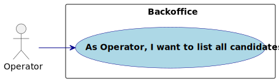
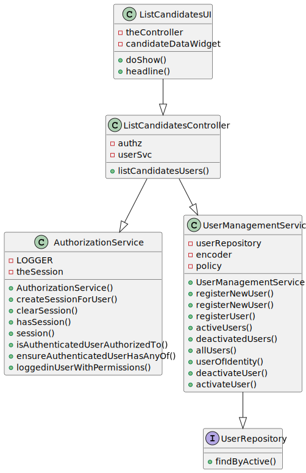
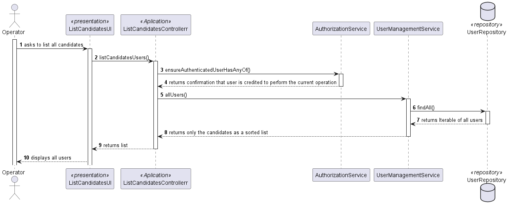

# US 2000c

Autor : 1211225

## 1. Context

This feature is being implemented for the first time

## 2. Requirements

**US 2000c** As Operator, I want to list all candidates

- 2000c.1. Create the method responsible to get all candidates in a list

- 2000c.2. Create the method to sort that list

- 2000c.3  Display that list

- 2000c.4  Make this funcionality available only in the menu for the Operator

_Regarding this requirement we understand that it relates to US 2000a, as adding a new candidate would change the list that is displayed to the user_

## 2.1. Client Clarifications
> Q58 Alejandro – US 2000c, quando estiver a listar os candidatos basta listar os emails?

A58. Eu diria que faz sentido apresentar para cada candidato o seu email e o seu nome

> Q60 Alejandro – Na US 2000c, existem politicas de negócio em relação a listar os candidatos?

A60. Devem seguir eventuais condicionante relativas ao possível estado do candidato.

> Q66 Costa – US2000c - Ordem dos candidatos. Na US 2000c é pedido que implementemos a função de listar todos os candidatos. É necessário ordenar os candidatos (por exemplo por ordem alfabética do nome)? Se for, qual é o critério que devemos seguir?

A66. Sim a listagem pode ser por ordem alfabética do nome.

## 3. Analysis
### 3.1. Conditions
-  Both name and email of the candidate are to be displayed
-  The list will be ordered by alphabetical order of the names
### 3.2. Use case diagram

## 4. Design
### 4.1. Applied Patterns
- **Controller:** This is used to handle user inputs and call the appropriate functionality while separating the UI from the rest of the application
- **Repository:** This is used to store the users. This is done to allow the persistence of the enrollments and to allow the use of the enrollments in other parts of the application.

### 4.2. Class Diagram

### 4.3. Sequence Diagram

## 5. Integration/Demonstration

- Important commits:
    - 41bf1514c81f9e5823f63075586a9383d3015c03: First commit of the US
    - ff4d5f0f28800d79e33624df2b55945c138b7a03: Displayed list of candidates is ordered by alphabetical order
## 6. Integration/Demonstration
### 6.1. List candidates scenario

