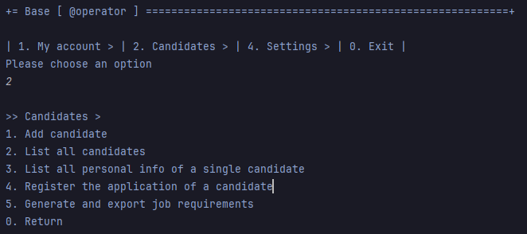
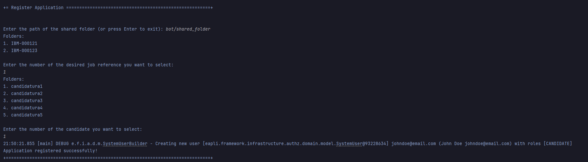
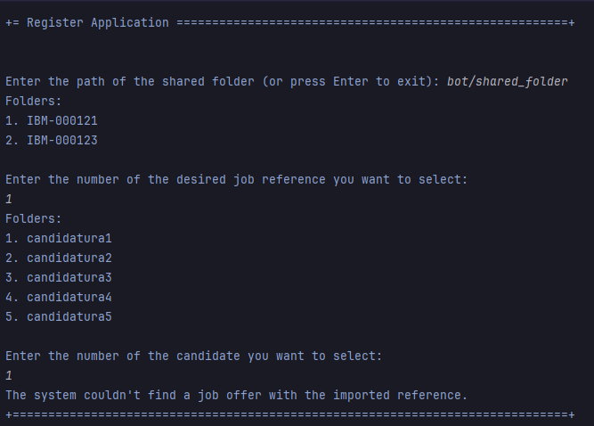

# US 2002

**Author:** 1221289

## 1. Context

This is a new task that hasn't been worked on before.

## 2. Requirements

**US 2002** As Customer Manager, I want to list job openings.
- Priority: 1
- References: Import the data from the file that was processed by the Application
  File Bot in Req 2001. The files should be kept in the shared folder, but the Backoffice
  application needs to know the references to the file locations.

## 2.1. Client Clarifications

### Question 15

> É o Operador que regista uma candidatura ou é o sistema que o faz automaticamente? E como integra o “plugin” de verificação da candidatura neste processo?

Na US 2002 o Operator regista a candidatura. Para isso, é o Operator que inicia o processo mas o sistema deve importar os dados resultantes do Application File Bot de forma “automática” (Ver References da US 2002). O plugin referido entra neste processo através da US 2003, em que o Operador gera um ficheiro template com os dados a introduzir para validar uma candidatura. Na US 2004, o Operador, após preencher os dados específicos da candidatura (com base no ficheiro template anterior) submete no sistema esse ficheiro que vai ser usado para o sistema avaliar/verificar a candidatura. Se os critérios não forem atingidos a candidatura é recusada.

### Question 65

> UI and UX. I'd like to know what is the expected flow of executing US2002 (application registration and files import, by the operator). Can you reproduce step by step which actions should the operator execute? Example: 1. The system asks the operator for the candidate's email. 2. The operator enters the candidate's email. 3. The system asks for the job reference. 4. The operator enters the job reference. 5. The system creates the job application, if there is data for it in the shared folder.

There are no specific requirements for the UI/UX but I think it will be more user friendly if the Operator could start the process by selecting the shared folder for the application to be imported.

### Question 84

> Após a informação dos ficheiros que estiverem na shared folder forem utilizados pelo Operator para registar uma candidatura, devem estes permanecer na pasta ou serem eliminados? Caso não sejam apagados como determinamos quais é que ainda não foram "utilizados"?

Admitindo que já foram importados para o sistema, não tenho requisitos adicionais quanto aos ficheiros. A segunda pergunta é um problema que deve ser resolvido pela solução proposta. Eu não tenho nada a dizer sobre esse aspeto.

### Question 100

> O que é que tem de ser registado no sistema?

Tem de haver um registo que indique que o candidato em questão fez a candidatura e têm de ser registados/importados para o sistema todos os ficheiros submetidos.

### Question 133

> Número da candidatura- na Q24 é referido um número que identifica uma candidatura a uma job reference. Esse número é diferente em todas as candidaturas, independentemente da job reference? Poderá servir como id da candidatura?

Para além da Q24 veja por favor os exemplos de ficheiros disponibilizados pelo applications email bot. Sim, podemos considerar que esse número é único, nunca se repetindo.

### Question 140

> O que se entende por "and import all files received"? Devemos persistir todos os ficheiros para cada Candidate na base de dados ou apenas guardar o diretório de cada Application?

Aqui o termo importar deve ser visto mais como “consolidar” ou “registar” todos os ficheiros devidamente “incorporados” no sistema relativamente a uma candidatura. Normalmente isso poderia passar por importar esses ficheiros para a base de dados. No entanto, no contexto actual do projeto, pode passar apenas por registar alguma forma de acesso a esses ficheiros (por exemplo, guardando o caminho/path para os ficheiros que estão no “folder” partilhado ou outra forma similar).

## 3. Analysis

### 3.1. Conditions

- There must be a job offer for the corresponding application
- All necessary files must be present
- The file with the job reference must have a valid job reference

### 3.2. Use case diagram

## 4. Design

## 4.1 Applied patterns

- **Repository:** This is used to store the applications and their respective files. This is done to allow the persistence of the enrollments and to allow the use of the enrollments in other parts of the application.
- **Service:** Numerous services are present, such as a file handler, an application register and a job offer manager . This is done to reduce coupling and to allow the use of the services in other parts of the application.
- **Builder::** Used to create an application step by step, which is a complex object.

### 4.2. Class Diagram

### 4.3. System Diagram

## 5. Integration/Demonstration

### 5.1. Operator menu

### 5.2. Successful case

### 5.3. Failed case

## 6. Observations

N/a
