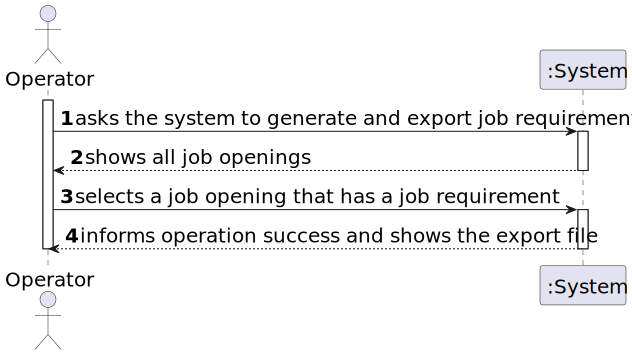
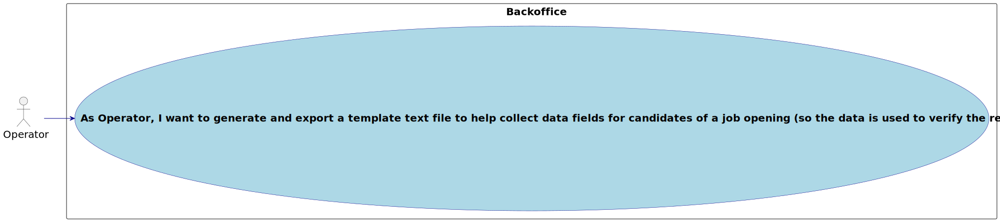
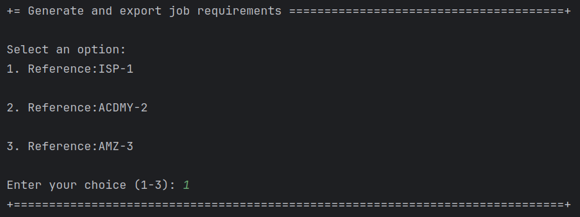
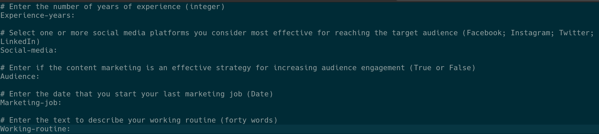

# US 2003

Author : 1221265

## 1. Context

It is the first time this task is being developed.

## 2. Requirements

_In this section you should present the functionality that is being developed, how do you understand it, as well as possible correlations to other requirements (i.e., dependencies)._

**US 2003** As Operator, I want to generate and export a template text file to help collect data fields for candidates of a job opening (so the data is used to verify the requirements of the job opening).

- 2003.1. The Operator generates a template file with the data to be entered to validate an application (Q15).
- Priority: 1
- References: See NFR09(LPROG)

## 3. Analysis

_In this section, the team should report the study/analysis/comparison that was done in order to take the best design decisions for the requirement.
This section should also include supporting diagrams/artifacts (such as domain model; use case diagrams, etc.),_

### 3.1. SSD

### 3.2. Use case diagram

## 4. Design

_In this sections, the team should present the solution design that was adopted to solve the requirement.
This should include, at least, a diagram of the realization of the functionality (e.g., sequence diagram),
a class diagram (presenting the classes that support the functionality),
the identification and rational behind the applied design patterns and the specification of the main tests used to validade the functionality._

### 4.1. Applied Patterns
- **Controller:** This is used to handle user inputs and call the appropriate functionality while separating the UI from the rest of the application
- **Repository:** This is used to store the users. This is done to allow the persistence of the enrollments and to allow the use of the enrollments in other parts of the application.
- **Service:** This is used to register the user in the system user repository. This is done to reduce coupling and to allow the use of the services in other parts of the application.

## 5. Implementation

- Important commits:
    - fa07c1de1a7d73b13fea2a61d7e0dbddde9b24f7 : First commit of the US

## 6. Integration/Demonstration

### 6.1. Exporting Job Requirements

### 6.2. Output

## 7. Observations

- N/a
