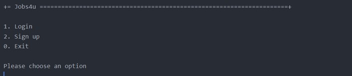
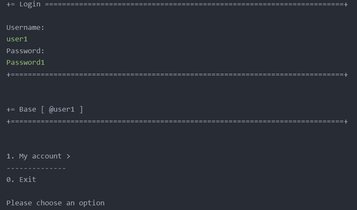
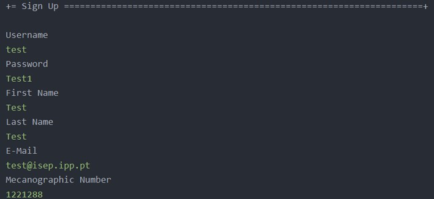

# User Story G007 - Authentication Functionality

> As Project Managers, I want the system to support and apply authentication and authorization for all its users and functionalities.


## 1 Acceptance Criteria

- N/A.

## 2 Requirements

- Authentication and Authorization - The system must support and apply authentication and authorization for all its users and functionalities.

## 3 Analysis

There was already a base implementation of the authentication and authorization system in the framework.

## 4 Design

The framework already had a base implementation of the authentication and authorization system, so we did not implement it from scratch. There is a central component called `AuthenticationService`, which provides the authenticate method to verify a user identity. This service depends on other components such as the `AuthorizationService` which handles the user session, and the `PasswordPolicy`, which is responsible for checking if the password is according to the rules defined by the system.

The `User` entity represents a user in the system.

The `Role` value object represents the user's role in the system, which determines its permissions.
To encode/decode passwords, the `AuthenticationService` relies on a `PasswordEncoder`,that uses `PlainTextEncoder`. This should not be used in a real environment, in our case we should implement, if necessary, a proper encoder.
A `Password` will use this `PasswordEncoder` and also our `PasswordPolicy`, which in our case must have at least 8 characters, uppercase and lowercase letters, digits, and at least one non-alphanumeric character.

For the `backoffice.console`, only `admin`,`customer manager` and `operator` are allowed to log in.
Only users who are `candidate` are authorized to log in to `candidate.console`
and to register as a `candidate` any user who is using the console.
Only users who are `customer` are authorized to log in to `customer.console`.

All the system's user types have been created in the bootstrap to make it easier to use and demonstrate.

## 5 Observations

This console was intended for clients in the eapli project, but I adapted it to be used in our context, i.e. for candidates.
The system of functionalities for users is designed to be highly scalable and easy to develop in the future.


## 6 Tests 

### 6.1 Test for Jobs4uPasswordPolicyTest

```java

class Jobs4uPasswordPolicyTest {


    private final Jobs4uPasswordPolicy subject = new Jobs4uPasswordPolicy();

    @Test
    void ensurePasswordHasAtLeastOneDigitOneCapitalAnd8CharactersLongAndNonAlfa() {
        assertTrue(subject.isSatisfiedBy("abCfefgh1@"));
    }

    @Test
    void ensurePasswordsSmallerThan8CharactersAreNotAllowed() {
        assertFalse(subject.isSatisfiedBy("ab1c"));
    }

    @Test
    void ensurePasswordsWithoutDigitsAreNotAllowed() {
        assertFalse(subject.isSatisfiedBy("abcefghi"));
    }

    @Test
    void ensurePasswordsWithoutCapitalLetterAreNotAllowed() {
        assertFalse(subject.isSatisfiedBy("abcefghi1"));
    }

    @Test
    void testWeakPassword1() {
        assertEquals(PasswordStrength.WEAK, subject.strength("A23456"));
    }

    @Test
    void testWeakPassword2() {
        assertEquals(PasswordStrength.WEAK, subject.strength("A234567"));
    }

    @Test
    void testGoodPassword1() {
        assertEquals(PasswordStrength.GOOD, subject.strength("A2345678"));
    }

    @Test
    void testGoodPassword2() {
        assertEquals(PasswordStrength.GOOD, subject.strength("A23456789"));
    }

    @Test
    void testExcelentPassword1() {
        assertEquals(PasswordStrength.EXCELENT, subject.strength("123456789ABC"));
    }

    @Test
    void testExcelentPassword2() {
        assertEquals(PasswordStrength.EXCELENT, subject.strength("123456789ABCD"));
    }

    @Test
    void testExcelentPassword3() {
        assertEquals(PasswordStrength.EXCELENT, subject.strength("A234$5678"));
    }

    @Test
    void testExcelentPassword4() {
        assertEquals(PasswordStrength.EXCELENT, subject.strength("A234#5678"));
    }

    @Test
    void testExcelentPassword5() {
        assertEquals(PasswordStrength.EXCELENT, subject.strength("A234!5678"));
    }

    @Test
    void testExcelentPassword6() {
        assertEquals(PasswordStrength.EXCELENT, subject.strength("A234?5678"));
    }
}
```

## 7. Integration & Demonstration

### 7.1. Candidate App Menu



### 7.2. Candidate App Login Menu



### 7.3 Candidate App Sign Up Menu


