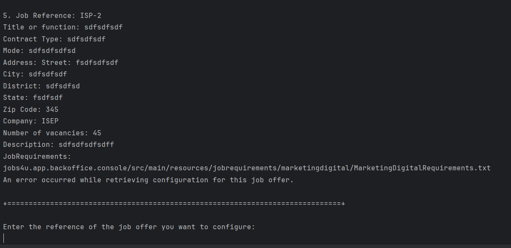
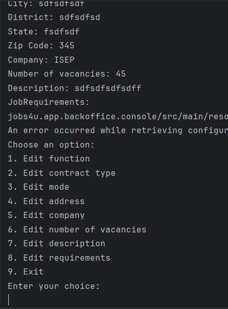

# US 1004

Author : 1221959

## 1. Context

It is the first time this task is being developed.


## 2. Requirements


**US 1004** As Customer Manager, I want to edit a job opening.

- Priority: 5

A job opening includes:
- Job Reference: A unique identifier of the job opening (generated by the system, for instance based on the customer code followed by a sequential number);
-  Title or function: Such as "front end programmer";
-  Contract Type: Such as full-time or part-time;
-  Mode: Such as remote, hybrid, onsite;
-  Address: Address for;
-  Company: Customer name (only companys that are responsabilities of the customer manager logged in);
-  Number of vacancies;
-  Description;
-  Requirements The job requirements specification to use for this opening.

## 2.1. Client Clarifications

## Question  144

>Edit a job opening – No seguimento da US 1004 para permitir editar um job opening, estamos a assumir que é permitido alterar: Nº de vagas; Morada; Contract Type('FULL_TIME', 'PART_TIME'); Mode ('ON_SITE','REMOTE'); Description; Funcao. Estamos na linha de raciocício correta, ou é necessário alterar a lista para incluir outra informação adicional ou suprimir alguma desta lista?

A:Por favor ver A109 e Q117. Do meu ponto de vista deve ser possível alterar “tudo” exceto o próprio job reference. Deve-se ter em conta a manutenção do estado de consistência do sistema.

## Question 150

>Quando o Costumer Manager quer editar uma Job Opening, é suposto ele escolher qual Job Opening quer editar a partir de uma pesquisa pela referência?

A:A150 Relacionada com a Q123. A questão refere-se um pouco a boas práticas de UI/UX. O contexto indicado na pergunta refere-se a uma situação em que o utilizador tem de identificar a entidade/objeto que deseja editar. Pode-se assumir que o utilizador sabe esse identificador. Mas, em termos de UX/UI deve ser possível obter esse identificar por outras vias (até porque é um identificar gerado pelo sistema). Penso que, para este caso particular, existe já uma US que permite fazer isso.

## Question 154

>US 1004 - Em quais ou até que fases de recrutamento de um Job Opening em que pode-se editar as informações dela? E quais são as informações que podem ser editadas dentro de uma Job Opening?

A:Ver Q144. As alterações devem ser compatíveis com o “momento” em que estamos nessa job opening. Por exemplo, não faz sentido alterar o contract type se já estamos a receber candidaturas. Essas candidaturas foram feitas segundo uma descrição da oferta de emprego e não faz sentido estar a alterar depois de as pessoas se candidatarem. Mas, por exemplo, deve ser possível alterar o job requirements specification (refere-se a outra US) enquanto as pessoas se candidatam, pois é um aspeto técnico, que não é do conhecimento público. Portanto, devem ter em conta este tipo de preocupações.

## Question 156

>A cada edição feita de alguma informação numa Job Opening, é necessário registar a data e a hora da edição, tal como acontece no momento de registar a Job Opening?

A:Não me recordo da indicação de registar data e hora no momento de registar um job opening. Mas sobre este tema, e em geral, é comum haver um registo do utilizador que criou ou fez a última atualização de um “registo” no sistema. Outra boa prática é as aplicações terem sistemas de log para situações deste género. Mas não me recordo de haver algum requisito não funcional que mencione um sistema de log para este nosso projeto (exceto o do application file bot).

## Question 173

>Relativamente a esta US, é suposto conseguir editar que parâmetros da job opening

A:Pergunta “repetida”. Veja por favor Q144 e outras relacionadas com este assunto.

## Question 193

> Edit a Job Opening (Active Since e Customer) – Tendo em conta a us1004 já referiu em questões passadas que deveria ser possível editar todos os atributos de job Opening , excepto a job Reference. No entanto, pergunto se faria sentido editar a data ativa (active since) de uma job Opening uma vez que é um registo único de quando a Job Opening ficou ativa. Pergunto também se seria também possível editar o Customer associado a job Opening,uma vez que a Job Reference se baseia no Customer. Dada a impossibilidade de edição de Job Reference pergunto se faria sentido a edição de customer também.

A:Penso que se refere à Q144. Estou de acordo com as suas preocupações. É isso a que me refiro quando na Q144 escrevo “Deve-se ter em conta a manutenção do estado de consistência do sistema.”

## Question 203

>Dúvida de Edição Atributos – Como esclareceu na questão 154 no ficheiro de questões, mencionou que não faria sentido editar o Contract Type se estivéssemos já na fase de Candidaturas. Pergunto se também faria sentido não ser editável nesta fase o Mode, assim como a sua morada e a função (Como "Front-end Programmer"), uma vez que são atributos que um candidato tem em mente quando faz uma candidatura a uma Job Opening. Pergunto também se o Job Requirements não deveriam ser editáveis a partir da frase screening (assim como o Interview Model na fase Interviews) uma vez que esta é a fase em que estes são verificados. Por fim pergunto : O número de vagas é editável em todas as fases ?

A:No geral o que refere está correto. As informações públicas de uma job opening não devem ser alteradas depois de serem tornadas públicas. Quanto a informações não públicas e mais técnicas penso que é aceitável que possam ser alteradas se não resultarem em possíveis estados incoerentes do sistema.

## Question 205

>-Dúivda Edição Job Requirements e Interview Model – Como foi esclarecido em questões previas ,é possível a edição de um Interview Model e Job Requirements de um jobOpening se estiver na fase de candidaturas (por exemplo). Pergunto-lhe se seria possível editar para cada um, a sua designação e descrição . Pergunto também se faria ou teria algum interesse de que seja editado o nome da classe que implementa a interface que faz o serviço do para cada Plugin: "ReqEvaluator" para Job Requirements no meu caso.

A: A pergunta é um pouco técnica para mim. Para mim faz sentido a edição desde que mantendo a consistência do sistema. Quanto aos aspetos mais técnicos não sei responder.

## Question 221

>Em relação à edição de uma Job Opening, uma das regras que pareceu clara no que toca ao que pode ser modificado foi: informações públicas de uma Job Opening, que estejam disponíveis para possíveis candidatos, não podem ser modificadas aquando/após a fase em que estamos a receber candidaturas. Segundo o documento de System Specification ("The recruitment process for a job opening follows a sequence of phases: application; resume screen; interviews; analysis; result.") a equipa estruturou as Job Openings de modo a que a primeira fase possível para uma Job Opening seja de de candidaturas. Assim sendo, pergunto-lhe se lhe parece correto a inclusão de uma nova fase preliminar, na qual as alterações referidas podem ser efetuadas?

A: . Eu diria que isso seria uma opção relacionada com a solução. Talvez seja uma solução para o “problema” que descreve mas não creio que seja a única solução.

## Question 222

>Ainda relativamente à edição de uma Job Opening, foi elaborada a seguinte tabela que representa uma sugestão de quais elementos de uma Job Opening devem ser editáveis para cada uma das fases (considerando a fase preliminar previamente sugerida). Por favor diga se esta abordagem vai de encontro aos seus desejos ou se acha necessário alterar algo de modo a melhor acomodar o objetivo da funcionalidade

A:Parece-me adequado, mas estou a responder sem perceber como está toda a solução.

## Question 225

>Editar fase atual- Ao "editar uma JobOpening" seria possível editar a sua fase atual nesta user story?

A:. A intenção desta US é permitir a edição dos dados que caracterizam a job opening do ponto de vista de conceito de negócio. A alteração das fases tem uma US especifica.


## 3. Analysis

### 3.1. Domain Model

)

### 3.2. Use case diagram


## 4. Design

### 4.1. Realization

### 4.2. Applied Patterns

- **Repository:** This is used to store the jobOffers. This is done to allow the persistence of the enrollments and to allow the use of the enrollments in other parts of the application.

### 4.3. Tests

#### 4.3.1.1 Register job offer


```
1-entrar como customerManager
2-selecionar a opção 2
3-selecionar a opção 8
4- inserir os dados pedidos
5. Em caso de sucesso, a job offer foi criada.
```

**Test 1:** _Verifies that it is not possible to edit some elements of a  Joboffer class based on the application phase._

**Test 2:** _Verifies that it is not possible to edit some elements of a  Joboffer class based on the screening phase.__

**Test 3:** _Verifies that it is not possible to edit some elements of a  Joboffer class based on the screening phase._

**Test 4:** _Verifies that the element edited stays correctly in the saved job offer._


## 5. Implementation
## 5.1 RegisterJobOpeningController
```java
public class EditJobOpeningController {

    private final JobOfferRepository jobOfferRepository= PersistenceContext.repositories().jobOffers();
    private final CompanyRepository companyRepository = PersistenceContext.repositories().companies();
    private final AuthorizationService authorizationService = AuthzRegistry.authorizationService();
    private final ConfigurationRepository configurationRepository = PersistenceContext.repositories().configurations();
    private final InterviewModelRepository interviewModelRepository = PersistenceContext.repositories().interviewModels();

    private final String currentManager = getManagerEmail();


    private String getManagerEmail() {
        authorizationService.ensureAuthenticatedUserHasAnyOf(Jobs4uRoles.POWER_USER, Jobs4uRoles.CUSTOMER_MANAGER);

        AuthorizationService authorizationService = AuthzRegistry.authorizationService();
        Optional<UserSession> userSessionOptional = authorizationService.session();
        UserSession userSession = userSessionOptional.get();
        SystemUser authenticatedUser = userSession.authenticatedUser();
        return authenticatedUser.email().toString();
    }


    public boolean editFunction(JobOffer jobOffer, Function newFunction) {
        authorizationService.ensureAuthenticatedUserHasAnyOf(Jobs4uRoles.POWER_USER, Jobs4uRoles.CUSTOMER_MANAGER);

        if (jobOffer == null || newFunction == null) {
            return false;
        }

        jobOffer.newFunction(newFunction);
        jobOfferRepository.save(jobOffer);
        return true;
    }

    public boolean editContractType(JobOffer jobOffer, ContractType newContractType) {
        authorizationService.ensureAuthenticatedUserHasAnyOf(Jobs4uRoles.POWER_USER, Jobs4uRoles.CUSTOMER_MANAGER);

        if (jobOffer == null || newContractType == null) {
            return false;
        }

        jobOffer.newContractType(newContractType);
        jobOfferRepository.save(jobOffer);
        return true;

    }

    public boolean editMode(JobOffer jobOffer, Mode newMode) {
        authorizationService.ensureAuthenticatedUserHasAnyOf(Jobs4uRoles.POWER_USER, Jobs4uRoles.CUSTOMER_MANAGER);

        if (jobOffer == null || newMode == null) {
            return false;
        }

        jobOffer.newMode(newMode);
        jobOfferRepository.save(jobOffer);
        return true;

    }

    public boolean editAddress(JobOffer jobOffer, Address newAddress) {
        authorizationService.ensureAuthenticatedUserHasAnyOf(Jobs4uRoles.POWER_USER, Jobs4uRoles.CUSTOMER_MANAGER);

        if (jobOffer == null || newAddress == null) {
            return false;
        }

        jobOffer.newAddress(newAddress);
        jobOfferRepository.save(jobOffer);
        return true;

    }

    public boolean editVacancies(JobOffer jobOffer, NumberOfVacancies newNrOfVacancies) {
        authorizationService.ensureAuthenticatedUserHasAnyOf(Jobs4uRoles.POWER_USER, Jobs4uRoles.CUSTOMER_MANAGER);

        if (jobOffer == null || newNrOfVacancies == null) {
            return false;
        }

        jobOffer.newNrOfVacancies(newNrOfVacancies);
        jobOfferRepository.save(jobOffer);
        return true;

    }

    public boolean editDescription(JobOffer jobOffer, Description newDescription) {
        authorizationService.ensureAuthenticatedUserHasAnyOf(Jobs4uRoles.POWER_USER, Jobs4uRoles.CUSTOMER_MANAGER);

        if (jobOffer == null || newDescription == null) {
            return false;
        }

        jobOffer.newDescription(newDescription);
        jobOfferRepository.save(jobOffer);
        return true;

    }

    public boolean editJobRequirements(JobOffer jobOffer, JobRequirements newJobRequirements) {
        authorizationService.ensureAuthenticatedUserHasAnyOf(Jobs4uRoles.POWER_USER, Jobs4uRoles.CUSTOMER_MANAGER);

        if (jobOffer == null || newJobRequirements == null) {
            return false;
        }

        jobOffer.newRequirements(newJobRequirements);
        jobOfferRepository.save(jobOffer);
        return true;

    }

    public boolean editCompany(Reference oldref, JobOffer jobOffer, Company newCompany, Company oldCompany) {
        authorizationService.ensureAuthenticatedUserHasAnyOf(Jobs4uRoles.POWER_USER, Jobs4uRoles.CUSTOMER_MANAGER);

        if (jobOffer == null || newCompany == null) {
            return false;
        }

        jobOffer.newCompany(newCompany);
        jobOffer.editReference(oldref, newCompany.getCustomerCode());
        jobOfferRepository.save(jobOffer);
        checkConfiguration(oldref, jobOffer.getReference());
        checkInterviewModel(oldref, jobOffer.getReference());
        editCompanyReferences(oldref, jobOffer.getReference(), newCompany, oldCompany);
        return true;

    }


    public boolean checkIfPossibleBasedOnApplicationPhase(Reference reference){
        Configuration configuration=null;
        try {
            configuration = PersistenceContext.repositories().configurations().findByReference(reference).iterator().next();
        }
        catch (Exception e){
            return true;
        }
        if (configuration ==null){
            return true;
        }
        if(configuration.getApplicationPhase().getPeriod().getStartDate().toLocalDate().isAfter(SysDate.sysDate())){
            return true;
        }
        System.out.println("It is not possible to edit this job opening because the application phase already started.");
        return false;
    }

    public boolean checkIfPossibleBasedOnScreeningPhase(Reference reference){
        Configuration configuration=null;
        try {
            configuration = PersistenceContext.repositories().configurations().findByReference(reference).iterator().next();
        }
        catch (Exception e){
            return true;
        }
        if (configuration ==null){
            return true;
        }
        if(configuration.getScreeningPhase().getPeriod().getStartDate().toLocalDate().isAfter(SysDate.sysDate())){
            return true;
        }
        System.out.println("It is not possible to edit this job opening because the screening phase already started.");
        return false;
    }

    public boolean checkIfPossibleBasedOnResultPhase(Reference reference){
        Configuration configuration=null;
        try {
            configuration = PersistenceContext.repositories().configurations().findByReference(reference).iterator().next();
        }
        catch (Exception e){
            return true;
        }
        if (configuration ==null){
            return true;
        }
        if(configuration.getResultPhase().getPeriod().getStartDate().toLocalDate().isAfter(SysDate.sysDate())){
            return true;
        }
        System.out.println("It is not possible to edit this job opening because the result phase already started.");
        return false;
    }

    //verificar se já ha configuration com aquela reference
    public void checkConfiguration(Reference oldreference, Reference newReference){
        authorizationService.ensureAuthenticatedUserHasAnyOf(Jobs4uRoles.POWER_USER, Jobs4uRoles.CUSTOMER_MANAGER);
        Iterable<Configuration> configurations = configurationRepository.findByReference(oldreference);
        if (configurations.iterator().hasNext()) {
            Configuration configuration = configurations.iterator().next();
            configuration.newReference(newReference);
            configurationRepository.save(configuration);
        }
    }

    public void checkInterviewModel(Reference oldreference, Reference newReference){
        authorizationService.ensureAuthenticatedUserHasAnyOf(Jobs4uRoles.POWER_USER, Jobs4uRoles.CUSTOMER_MANAGER);
        Iterable<InterviewModel> interviewModels = interviewModelRepository.findByReference(oldreference);
        if (interviewModels.iterator().hasNext()) {
            InterviewModel interviewModel = interviewModels.iterator().next();
            interviewModel.newReference(newReference);
            interviewModelRepository.save(interviewModel);
        }
    }

    public void editCompanyReferences(Reference oldReference, Reference newReference, Company newCompany, Company oldCompany){
        authorizationService.ensureAuthenticatedUserHasAnyOf(Jobs4uRoles.POWER_USER, Jobs4uRoles.CUSTOMER_MANAGER);

        oldCompany.removeJobReference(oldReference);
        newCompany.addJobReference(newReference);
        companyRepository.save(oldCompany);
        companyRepository.save(newCompany);
    }
}
```


## 6. Integration & Demonstration



## 7. Observations

- N/a