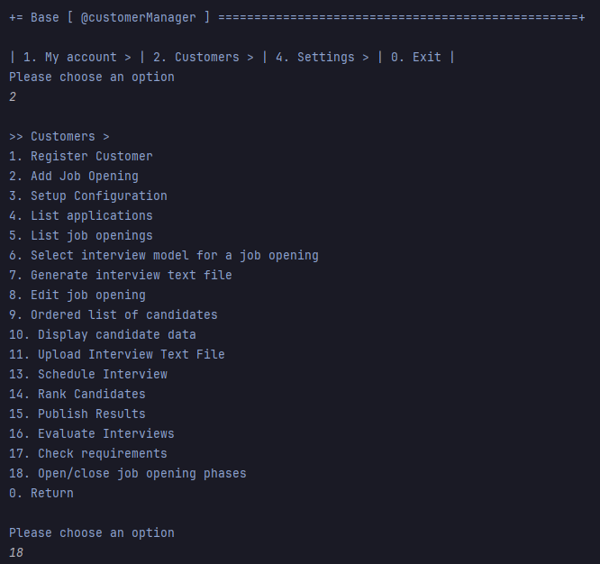
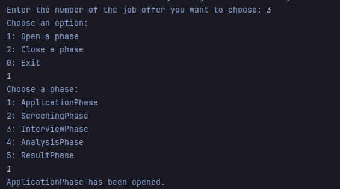

# US 1010

Author : 1221289

## 1. Context

It is the first time this task is being developed.

## 2. Requirements

**US 1010** As Customer Manager, I want to open or close phases of the process for a job opening.

- Priority: 1

## 2.1. Client Clarifications

## Question  151

> Fechar e abrir fases de recrutamento – Venho por este meio perguntar se a maneira como interpretei esta funcionalidade é o que espera para o produto final. Quando o Customer Manager entende que deve fechar uma fase, este vai ás job openings que o sistema lhe mostra que tenham fases para fechar ou começar e após escolher, tem acesso ás fases. Este escolhe que fase abrir, fechando a anterior (se houver) automaticamente, e depois mostrando uma mensagem de sucesso após realizar isso. Esta interpretação é semelhante ao que espera?

Ver Q16, Q143, Q147 e Q149.

## Question  161

> O sistema para a Us1010 deve fazer validações de, por exemplo, o utilizador não pode abrir a fase de interview se o interview model ainda não tiver sido definido, ou o utilizador pode mudar de fase mas não vai conseguir, neste caso, executar o processo de avaliação de entrevistas enquanto não tiver um interview specification atribuído?

Penso que poderá fazer isso. O que não deve conseguir é fazer entrevistas sem ter o interview model especificado.

## Question  168

> O utilizador deve escolher a fase que quer abrir ou fechar?

Sem querer condicionar a UI/UX, penso que uma possibilidade seria o sistema apresentar a fase atual do processo e indicar o que é possível fazer. Se for possível avançar ou recuar, deve indicar que é possível e qual a fase resultante. Se não (ainda) possível avançar/recuar deve indicar a justificação desse facto.

## Question  171

> Consideramos que uma fase "open" não é o mesmo que uma fase "active". A fase "open" é uma fase que está disponível para ser executada, enquanto que a fase "active" é uma fase que está a ser executada. Concorda com esta distinção? Porque se o sistema quando fecha uma fase automaticamente considera a fase seguinte como "open" e se "open" for o mesmo que "active/in progress" então nunca vai ser possível "recuar" de fase.

Sim, penso que o que refere está de acordo com o que tentei explicar nas perguntas anteriores sobre esta US. Usei o termo “open” e “close” para indicar a abertura e o fecho das fases. Usei o termo “active” para indicar que alguma operação especifica da fase já teria sido executada (ou estava em execução) e consierava então essa fase como “activa”, o que significava que não podia mudar de fase enquanto essas “operações” não terminassem.

## Question  196

> Se estiver na primeira fase e se esta estiver no estado "open" posso recuar a fase e colocar o recruitment process como não começado?

Parece-me um caso particular das repostas anteriores deste tema.

## Question  201

> Em termos de estados da fase, os estado concluída e fechada são sinónimos ou representam conceitos diferentes? Deu um exemplo para a fase de "screening" que encontra-se concluída quando todos os candidatos forem verificados e notificados. Consegue dar uma explicação para as outras fases existentes, quando é que as podemos considerar fechadas.?

Quando, em questões anteriores sobre este tópico, usei o termos concluído era no sentido de indicar que as atividades relativas ao “propósito” da fase tinham sido terminadas, concluídas, portanto estariam reunidas as condições para poder avançar para a fase seguinte (i.e., fechar a atual). Quando às condições para cada fase penso que devem pensar no problema e tentar identificá-las. Como está colocada a questão parece-me muito ampla e julgo que devem conseguir chegar a elas através da análise detalhada do problema. Mas se tiverem questões mais especificas posso tentar responder.

## Question  207

> Ativar Fase "Result"- Já foi referido anteriormente que para uma fase estar no estado "active" é necessário que processos estejam a ser realizados. Sendo assim, que tipo de processos tem esta fase para poder colocá-la no estado "active"? Penso que não existe nenhuma US relacionada a esta fase.

Na fase “Result”, secção 2.2.1: “candidates as well as customers are notified of the final result “. Este texto parece o texto da US 1020.

## Question  212

> Quando se pode recuar de fase?

O princípio geral é, se não estiver a fazer nada específico da fase atual pode-se recuar. Por exemplo, se estiver na fase das entrevistas e ainda não comecei a avaliar nenhuma entrevista, então pode-se recuar para a fase de screening. Embora não faça sentido voltar a avaliar os requisitos dos candidatos se eles já foram avisados do resultado. Numa situação real, em que aconteça um erro que invalide um resultado que já foi notificado a terceiros (candidatos ou empresas) podemos assumir que isso será resolvido no âmbito de um processo excecional que está fora do âmbito do nosso sistema atual (o sistema não tem atualmente de suportar esses casos).

## Question  217

> Dados a alterar quando se avança ou recua uma fase – É certo que quando mudamos de fase do processo de recrutamento, esta tem que ser refletida no estado do mesmo. Para além de validações que permitam/não permitam avançar e recuar, não existem mais dados a alterar nesta US? Na A147, diz que as datas são indicativas, ou seja, é irrelevante altera-las ou não quando se muda de fase (seja para anterior ou seguinte)?

Sim, não vejo necessidade de alterar as datas das fases na US1010.


## 3. Analysis

### 3.1. Domain Model

)

### 3.2. Use case diagram


## 4. Design

### 4.1. Applied Patterns

- **Repository:** Used to save and update the configurations of the job offers.

### 4.2. Sequence Diagram


### 4.3. Tests

```java
@Test
void testOpenPhaseStatus() {
    PhaseStatus phaseStatus = new PhaseStatus(false, false);

    PhaseStatus openedPhaseStatus = phaseStatus.open();

    // verificar se a fase está aberta, mas ainda não começou o seu processo
    assertTrue(openedPhaseStatus.isOpen());
    assertFalse(openedPhaseStatus.hasStarted());
}

@Test
void testClosePhaseStatus() {
    PhaseStatus phaseStatus = new PhaseStatus(true, true);

    PhaseStatus closedPhaseStatus = phaseStatus.close();

    // verificar se a fase terminou corretamente, indicando que já fez o seu processo e está fechada
    assertFalse(closedPhaseStatus.isOpen());
    assertTrue(closedPhaseStatus.hasStarted());
}

@Test
void testStartPhaseStatus() {
    PhaseStatus phaseStatus = new PhaseStatus(true, false);

    PhaseStatus startedPhaseStatus = phaseStatus.start();

    // verificar se a fase já começou o seu processo
    assertTrue(startedPhaseStatus.hasStarted());
}

@Test
void testEquals() {
    PhaseStatus phaseStatus1 = new PhaseStatus(true, false);
    PhaseStatus phaseStatus2 = new PhaseStatus(true, false);

    // verificar se são iguais
    assertEquals(phaseStatus1, phaseStatus2);
}

@Test
void testInequality() {
    PhaseStatus phaseStatus1 = new PhaseStatus(true, false);
    PhaseStatus phaseStatus2 = new PhaseStatus(false, false);

    // verificar se são diferentes
    assertNotEquals(phaseStatus1, phaseStatus2);
}

@Test
void testOpenPhaseStatusAndNotStarted() {
    PhaseStatus phaseStatus = new PhaseStatus(true, false);

    // verificar que está apenas aberta
    assertTrue(phaseStatus.isOpen());
    assertFalse(phaseStatus.hasStarted());
}

@Test
void testStartedPhaseStatus() {
    PhaseStatus phaseStatus = new PhaseStatus(true, true);

    // verificar se a fase já está aberta e já começou o seu processo
    assertTrue(phaseStatus.hasStarted());
}

@Test
void testOpenPhaseApplication() {
    Period applicationPeriod = new Period("2023-01-01 20:00", "2023-01-02 20:00");
    Period screeningPeriod = new Period("2023-01-03 20:00", "2023-01-04 20:00");
    Period interviewPeriod = new Period("2023-01-05 20:00", "2023-01-06 20:00");
    Period analysisPeriod = new Period("2023-01-07 20:00", "2023-01-08 20:00");
    Period resultPeriod = new Period("2023-01-09 20:00", "2023-01-10 20:00");

    ApplicationPhase applicationPhase = new ApplicationPhase(applicationPeriod, false, false);
    ScreeningPhase screeningPhase = new ScreeningPhase(screeningPeriod, false, false);
    InterviewPhase interviewPhase = new InterviewPhase(interviewPeriod, false, false);
    AnalysisPhase analysisPhase = new AnalysisPhase(analysisPeriod, false, false);
    ResultPhase resultPhase = new ResultPhase(resultPeriod, false, false);

    Configuration configuration = new Configuration(null, applicationPhase, interviewPhase,screeningPhase, resultPhase, analysisPhase);

    configuration.openPhase(applicationPhase);
    configuration.openPhase(screeningPhase);
    configuration.openPhase(interviewPhase);
    configuration.openPhase(analysisPhase);
    configuration.openPhase(resultPhase);

    assertTrue(configuration.getApplicationPhase().isOpen());
    assertFalse(configuration.getScreeningPhase().isOpen());
    assertFalse(configuration.getInterviewPhase().isOpen());
    assertFalse(configuration.getAnalysisPhase().isOpen());
    assertFalse(configuration.getResultPhase().isOpen());
}

@Test
void testOpenPhaseScreening() {
    Period applicationPeriod = new Period("2023-01-01 20:00", "2023-01-02 20:00");
    Period screeningPeriod = new Period("2023-01-03 20:00", "2023-01-04 20:00");
    Period interviewPeriod = new Period("2023-01-05 20:00", "2023-01-06 20:00");
    Period analysisPeriod = new Period("2023-01-07 20:00", "2023-01-08 20:00");
    Period resultPeriod = new Period("2023-01-09 20:00", "2023-01-10 20:00");

    ApplicationPhase applicationPhase = new ApplicationPhase(applicationPeriod, false, true);
    ScreeningPhase screeningPhase = new ScreeningPhase(screeningPeriod, false, false);
    InterviewPhase interviewPhase = new InterviewPhase(interviewPeriod, false, false);
    AnalysisPhase analysisPhase = new AnalysisPhase(analysisPeriod, false, false);
    ResultPhase resultPhase = new ResultPhase(resultPeriod, false, false);

    Configuration configuration = new Configuration(null, applicationPhase, interviewPhase,screeningPhase, resultPhase, analysisPhase);

    configuration.openPhase(screeningPhase);
    configuration.openPhase(interviewPhase);
    configuration.openPhase(analysisPhase);
    configuration.openPhase(resultPhase);

    assertFalse(configuration.getApplicationPhase().isOpen());
    assertTrue(configuration.getScreeningPhase().isOpen());
    assertFalse(configuration.getInterviewPhase().isOpen());
    assertFalse(configuration.getAnalysisPhase().isOpen());
    assertFalse(configuration.getResultPhase().isOpen());
}

@Test
void testOpenPhaseInterview() {
    Period applicationPeriod = new Period("2023-01-01 20:00", "2023-01-02 20:00");
    Period screeningPeriod = new Period("2023-01-03 20:00", "2023-01-04 20:00");
    Period interviewPeriod = new Period("2023-01-05 20:00", "2023-01-06 20:00");
    Period analysisPeriod = new Period("2023-01-07 20:00", "2023-01-08 20:00");
    Period resultPeriod = new Period("2023-01-09 20:00", "2023-01-10 20:00");

    ApplicationPhase applicationPhase = new ApplicationPhase(applicationPeriod, false, false);
    ScreeningPhase screeningPhase = new ScreeningPhase(screeningPeriod, false, true);
    InterviewPhase interviewPhase = new InterviewPhase(interviewPeriod, false, false);
    AnalysisPhase analysisPhase = new AnalysisPhase(analysisPeriod, false, false);
    ResultPhase resultPhase = new ResultPhase(resultPeriod, false, false);

    Configuration configuration = new Configuration(null, applicationPhase, interviewPhase,screeningPhase, resultPhase, analysisPhase);

    configuration.openPhase(interviewPhase);
    configuration.openPhase(analysisPhase);
    configuration.openPhase(resultPhase);

    assertFalse(configuration.getApplicationPhase().isOpen());
    assertFalse(configuration.getScreeningPhase().isOpen());
    assertTrue(configuration.getInterviewPhase().isOpen());
    assertFalse(configuration.getAnalysisPhase().isOpen());
    assertFalse(configuration.getResultPhase().isOpen());
}

@Test
void testOpenPhaseAnalysis() {
    Period applicationPeriod = new Period("2023-01-01 20:00", "2023-01-02 20:00");
    Period screeningPeriod = new Period("2023-01-03 20:00", "2023-01-04 20:00");
    Period interviewPeriod = new Period("2023-01-05 20:00", "2023-01-06 20:00");
    Period analysisPeriod = new Period("2023-01-07 20:00", "2023-01-08 20:00");
    Period resultPeriod = new Period("2023-01-09 20:00", "2023-01-10 20:00");

    ApplicationPhase applicationPhase = new ApplicationPhase(applicationPeriod, false, false);
    ScreeningPhase screeningPhase = new ScreeningPhase(screeningPeriod, false, false);
    InterviewPhase interviewPhase = new InterviewPhase(interviewPeriod, false, true);
    AnalysisPhase analysisPhase = new AnalysisPhase(analysisPeriod, false, false);
    ResultPhase resultPhase = new ResultPhase(resultPeriod, false, false);

    Configuration configuration = new Configuration(null, applicationPhase, interviewPhase,screeningPhase, resultPhase, analysisPhase);

    configuration.openPhase(analysisPhase);
    configuration.openPhase(resultPhase);

    assertFalse(configuration.getApplicationPhase().isOpen());
    assertFalse(configuration.getScreeningPhase().isOpen());
    assertFalse(configuration.getInterviewPhase().isOpen());
    assertTrue(configuration.getAnalysisPhase().isOpen());
    assertFalse(configuration.getResultPhase().isOpen());
}

@Test
void testOpenPhaseResult() {
    Period applicationPeriod = new Period("2023-01-01 20:00", "2023-01-02 20:00");
    Period screeningPeriod = new Period("2023-01-03 20:00", "2023-01-04 20:00");
    Period interviewPeriod = new Period("2023-01-05 20:00", "2023-01-06 20:00");
    Period analysisPeriod = new Period("2023-01-07 20:00", "2023-01-08 20:00");
    Period resultPeriod = new Period("2023-01-09 20:00", "2023-01-10 20:00");

    ApplicationPhase applicationPhase = new ApplicationPhase(applicationPeriod, false, false);
    ScreeningPhase screeningPhase = new ScreeningPhase(screeningPeriod, false, false);
    InterviewPhase interviewPhase = new InterviewPhase(interviewPeriod, false, false);
    AnalysisPhase analysisPhase = new AnalysisPhase(analysisPeriod, false, true);
    ResultPhase resultPhase = new ResultPhase(resultPeriod, false, false);

    Configuration configuration = new Configuration(null, applicationPhase, interviewPhase,screeningPhase, resultPhase, analysisPhase);

    configuration.openPhase(resultPhase);

    assertFalse(configuration.getApplicationPhase().isOpen());
    assertFalse(configuration.getScreeningPhase().isOpen());
    assertFalse(configuration.getInterviewPhase().isOpen());
    assertFalse(configuration.getAnalysisPhase().isOpen());
    assertTrue(configuration.getResultPhase().isOpen());
}

@Test
void testStartApplicationPhase() {
    testConfiguration.startPhase(testApplicationPhase);
    assertTrue(testConfiguration.getApplicationPhase().hasStarted());
}

@Test
void testCloseApplicationPhase() {
    testConfiguration.closePhase(testApplicationPhase);
    assertFalse(testConfiguration.getApplicationPhase().isOpen());
}

@Test
void testStartScreeningPhase() {
    testConfiguration.startPhase(testScreeningPhase);
    assertTrue(testConfiguration.getScreeningPhase().hasStarted());
}

@Test
void testCloseScreeningPhase() {
    testConfiguration.closePhase(testScreeningPhase);
    assertFalse(testConfiguration.getScreeningPhase().isOpen());
}

@Test
void testStartInterviewPhase() {
    testConfiguration.startPhase(testInterviewPhase);
    assertTrue(testConfiguration.getInterviewPhase().hasStarted());
}

@Test
void testCloseInterviewPhase() {
    testConfiguration.closePhase(testInterviewPhase);
    assertFalse(testConfiguration.getInterviewPhase().isOpen());
}

@Test
void testStartAnalysisPhase() {
    testConfiguration.startPhase(testAnalysisPhase);
    assertTrue(testConfiguration.getAnalysisPhase().hasStarted());
}

@Test
void testCloseAnalysisPhase() {
    testConfiguration.closePhase(testAnalysisPhase);
    assertFalse(testConfiguration.getAnalysisPhase().isOpen());
}

@Test
void testStartResultPhase() {
    testConfiguration.startPhase(testResultPhase);
    assertTrue(testConfiguration.getResultPhase().hasStarted());
}

@Test
void testCloseResultPhase() {
    testConfiguration.closePhase(testResultPhase);
    assertFalse(testConfiguration.getResultPhase().isOpen());
}


```

## 5. Implementation
## 5.1 ChangePhaseStatusUI
```java
public class ChangePhaseStatusUI extends AbstractUI {

    private final ChangePhaseStatusController controller = new ChangePhaseStatusController();
    private final ConfigurationRepository configurationRepository = PersistenceContext.repositories().configurations();

    @Override
    public boolean doShow() {

        JobOffer jobOffer = listAndChooseJobOffer();

        if(jobOffer == null) {
            System.out.println("There was an error while retrieving the chosen job offer.");
            return false;
        }

        Configuration configuration = controller.getConfigurationFromJobOffer(jobOffer);

        if(configuration == null) {
            System.out.println("There was no configuration for this chosen job offer.");
            return false;
        }

        choosePhaseToOpenOrClose(configuration);

        configurationRepository.save(configuration);

        return true;
    }

    @Override
    public String headline() {
        return "Open/close a phase of a job opening";
    }

    public JobOffer listAndChooseJobOffer() {

        JobOfferPrinter printer = new JobOfferPrinter();

        List<JobOffer> jobOffers = controller.getJobOffers();

        if (jobOffers.isEmpty()) {
            System.out.println("No job offers available.");
            return null;
        }

        System.out.println("List of Job Offers:");
        for (int i = 0; i < jobOffers.size(); i++) {
            System.out.println((i + 1) + ": ");
            printer.visit(jobOffers.get(i));
        }

        Scanner scanner = new Scanner(System.in);
        JobOffer selectedJobOffer = null;
        boolean validChoice = false;

        while (!validChoice) {
            try {
                System.out.print("Enter the number of the job offer you want to choose: ");
                int choice = scanner.nextInt();

                if (choice < 1 || choice > jobOffers.size()) {
                    System.out.println("Invalid choice. Please enter a number between 1 and " + jobOffers.size());
                } else {
                    selectedJobOffer = jobOffers.get(choice - 1);
                    validChoice = true;
                }
            } catch (InputMismatchException e) {
                System.out.println("Invalid input. Please enter a number.");
                scanner.next();
            } catch (Exception e) {
                System.out.println("An unexpected error occurred: " + e.getMessage());
                break;
            }
        }

        return selectedJobOffer;
    }

    public void choosePhaseToOpenOrClose(Configuration configuration) {
        Scanner scanner = new Scanner(System.in);
        boolean continueLoop = true;

        while (continueLoop) {
            System.out.println("Choose an option:");
            System.out.println("1: Open a phase");
            System.out.println("2: Close a phase");
            System.out.println("0: Exit");

            try {
                int action = scanner.nextInt();
                if (action == 1) {
                    controller.openPhase(configuration);
                } else if (action == 2) {
                    controller.closePhase(configuration);
                } else if (action == 0) {
                    continueLoop = false;
                } else {
                    System.out.println("Invalid choice. Please enter a valid option.");
                }
            } catch (InputMismatchException e) {
                System.out.println("Invalid input. Please enter a number.");
                scanner.next();
            }
        }
    }
}
```
## 5.2 ChangePhaseStatusUI
```java

public class ChangePhaseStatusController {

    private final JobOfferRepository jobOfferRepository= PersistenceContext.repositories().jobOffers();
    private final ConfigurationRepository configurationRepository = PersistenceContext.repositories().configurations();

    public List<JobOffer> getJobOffers() {
        Iterable<JobOffer> iterable = jobOfferRepository.findAll();
        List<JobOffer> jobOffers = new ArrayList<>();
        iterable.forEach(jobOffers::add);
        return jobOffers;
    }

    public Configuration getConfigurationFromJobOffer(JobOffer jobOffer){
        if(configurationRepository.findByReference(jobOffer.getReference()).iterator().hasNext()){
            return configurationRepository.findByReference(jobOffer.getReference()).iterator().next();
        }

        return null;
    }

    public void openPhase(Configuration configuration) {
        Phase phase = choosePhase(configuration);
        if (phase != null && configuration.canOpenPhase(phase)) {
            configuration.openPhase(phase);
            System.out.println(phase.getClass().getSimpleName() + " has been opened.");
        } else {
            System.out.println("Cannot open the selected phase, as it might be already open or another phase has already started.");
        }
    }

    public void closePhase(Configuration configuration) {
        Phase phase = choosePhase(configuration);
        if (phase != null && configuration.isPhaseOpen(phase)) {
            configuration.closePhase(phase);
            System.out.println(phase.getClass().getSimpleName() + " has been closed.");
        } else {
            System.out.println("Cannot close the selected phase, as it might be already closed");
        }
    }

    private Phase choosePhase(Configuration configuration) {
        System.out.println("Choose a phase:");
        int index = 1;

        System.out.println(index++ + ": ApplicationPhase");
        if (configuration.getScreeningPhase() != null) {
            System.out.println(index++ + ": ScreeningPhase");
        }
        if (configuration.getInterviewPhase() != null) {
            System.out.println(index++ + ": InterviewPhase");
        }
        if (configuration.getAnalysisPhase() != null) {
            System.out.println(index++ + ": AnalysisPhase");
        }
        if (configuration.getResultPhase() != null) {
            System.out.println(index + ": ResultPhase");
        }

        Scanner scanner = new Scanner(System.in);

        try {
            int choice = scanner.nextInt();
            index = 1;

            if (choice == index++) return configuration.getApplicationPhase();
            if (configuration.getScreeningPhase() != null && choice == index++) return configuration.getScreeningPhase();
            if (configuration.getInterviewPhase() != null && choice == index++) return configuration.getInterviewPhase();
            if (configuration.getAnalysisPhase() != null && choice == index++) return configuration.getAnalysisPhase();
            if (configuration.getResultPhase() != null && choice == index) return configuration.getResultPhase();
            System.out.println("Invalid choice.");
        } catch (InputMismatchException e) {
            System.out.println("Invalid input. Please enter a number.");
            scanner.next();
        }

        return null;
    }
}

```

## 6. Integration & Demonstration




## 7. Observations

- N/a