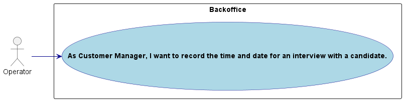
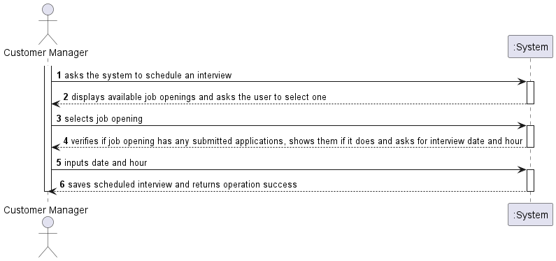
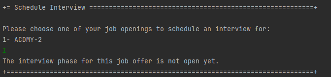
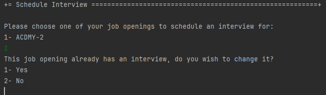
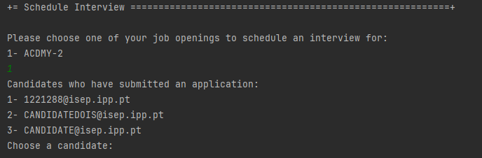
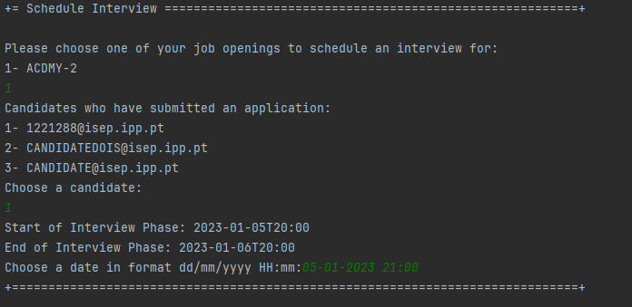
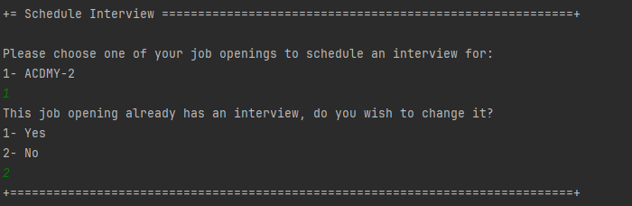

# US 1014

Autor : 1211225

## 1. Context

This feature is being implemented for the first time

## 2. Requirements

**US 1014** As Customer Manager, I want to record the time and date for an interview with a candidate.

- 1014.1. Create the factory responsible for the creation of "candidate" objects

- 1014.2. Create the repository to save "candidate" objects

- 1014.3  Create the Controller that will bridge the gap between factory, repository and UI

- 1014.4  Create the UI

- 1014.5  Make this funcionality available only in the menu for the Operator

## 2.1. Client Clarifications
> Q40 Bernardo – Uma entrevista pode ter apenas uma questão? US1014, time and date, quer dizer data de inicio e não data final? Podem haver entrevistas em paralelo?

A40. Quanto ao número de perguntas numa entrevista, não está definido nenhum limite inferior ou superior. Ou seja, pode haver uma entrevista com apenas 1 pergunta (não fará sentido não ter perguntas). A US1014 refere-se à marcação da data de uma entrevista com um candidato. Algo como indicar o dia e a hora (ex: 23 de abril pelas 14:00). Em relação à marcação de entrevistas “sobrepostas” (com a mesma data de inicio), neste momento, seria algo a permitir (pode, por exemplo, o customer manager delegar noutra pessoa a condução da entrevista). Isso não invalida que devam validar se as entrevistas ocorrem dentro da fase das entrevistas.

> Q145 Tiago – US 1014 – Em relação à marcação da intervista, só deve ser possível marcar esta data quando? Só será possível marcar a entrevista quando a fase de recrutamento se encontrar na fase de intervista? Ou será possivel marcar noutras fases anteriores?

A145 Por mim pode ser possível marcar as entrevistas antes mas deve-se ter em atenção se o candidato “passou” o screening. Não faz sentido marcar uma entrevista para um candidato que não foi aceite. Tenham em atenção este tipo de aspetos.

> Q182 Ribeiro – US1014 - In the us "US 1014 - As Customer Manager, I want to record the time and date for an interview with a candidate." Is it possible to schedule interviews for any day and time or we must take into account weekends, working hours and holidays, for example?

A182 The system should display the day of the week for the selected date. But the system should accept any valid date.

> Q206 Luís Estebaínha – US1014- Em relação à marcação de uma entrevista com um candidato, deve ser possível marcar mais do que uma entrevista por candidatura?

A206. O sistema nesta fase está pensado para apenas suportar uma entrevista por job opening por isso não faz muito sentido marcar mais do que uma entrevista para um candidato a não ser para remarcar a mesma entrevista (por exemplo, o candidato faltou justificadamente a uma entrevista anterior). Neste contexto, eu diria que faz mais sentido poder alterar a marcação de uma entrevista do que marcar mais do que uma entrevista para o mesmo candidato.

## 3. Analysis

### 3.1. Conditions

- The Customer Manager must be authenticated and authorized to perform the operations.
- A candidate must have passed the screening phase to be able to attend an interview
### 3.1. Domain Model


### 3.2. Use case diagram




## 4. Design

### 4.1. Applied Patterns

- **Repository:** Used to save the scheduled interview

### 4.2. Sequence Diagram



## 5. Implementation
```java
package lapr4.jobs4u.app.backoffice.console.presentation.authz;

import eapli.framework.general.domain.model.EmailAddress;
import eapli.framework.infrastructure.authz.application.AuthorizationService;
import eapli.framework.infrastructure.authz.application.AuthzRegistry;
import lapr4.jobs4u.applicationmanagement.domain.Application;
import lapr4.jobs4u.applicationmanagement.repositories.ApplicationRepository;
import lapr4.jobs4u.candidateusermanagement.domain.CandidateUser;
import lapr4.jobs4u.candidateusermanagement.repositories.CandidateRepository;
import lapr4.jobs4u.infrastructure.persistence.PersistenceContext;
import lapr4.jobs4u.joboffermanagement.domain.*;
import lapr4.jobs4u.joboffermanagement.repository.ConfigurationRepository;
import lapr4.jobs4u.joboffermanagement.repository.InterviewRepository;
import lapr4.jobs4u.joboffermanagement.repository.JobOfferRepository;
import lapr4.jobs4u.usermanagement.domain.Jobs4uRoles;
import org.springframework.boot.autoconfigure.batch.BatchProperties;

import java.time.Instant;
import java.time.LocalDateTime;
import java.time.ZoneId;
import java.util.*;

public class ScheduleInterviewController {
    private final JobOfferRepository jobOfferRepository= PersistenceContext.repositories().jobOffers();
    private final ApplicationRepository applicationRepository = PersistenceContext.repositories().applications();
    private final CandidateRepository candidateRepository = PersistenceContext.repositories().candidateUsers();
    private final AuthorizationService authz = AuthzRegistry.authorizationService();
    private final ConfigurationRepository configurationRepository = PersistenceContext.repositories().configurations();
    private final AuthorizationService authorizationService = AuthzRegistry.authorizationService();
    private final InterviewRepository interviewRepository = PersistenceContext.repositories().interviews();

    public List<JobOffer> getMyJobOpenings() {
        EmailAddress operatorEmail = authz.session().get().authenticatedUser().email();
        Iterable<JobOffer> managerOffers = jobOfferRepository.findAllByManager(operatorEmail.toString());
        List<JobOffer> jobOffers = new ArrayList<>();

        for(JobOffer job: managerOffers) {
            Configuration configuration = configurationRepository.findByReference(job.getReference()).iterator().next();

            Calendar cal = Calendar.getInstance();
            Date ts = cal.getTime();
            Instant instant = Instant.ofEpochMilli(ts.getTime());
            LocalDateTime now = LocalDateTime.ofInstant(instant, ZoneId.systemDefault());

            if (job.getManagerEmail().equals(operatorEmail.toString())
                    && configuration != null
                    && configuration.getAnalysisPhase().getPeriod().getEndDate().isBefore(now)
            ) {

                jobOffers.add(job);
            }
        }

        return jobOffers;
    }

    public List<Application> getJobOfferApplications(JobOffer offer){
        Iterable<Application> jobApplications = applicationRepository.findByReference(offer.getReference());

        List<Application> applications = new ArrayList<>();

        for(Application a : jobApplications){
            applications.add(a);
        }

        return applications;
    }

    public CandidateUser getCandidate(EmailAddress email){
       Iterable<CandidateUser> it = candidateRepository.findAllbyEmail(email);
       CandidateUser c = it.iterator().next();
       return c;
    }

    public boolean interviewExists(JobOffer jobOffer){
        Iterable<Interview> interview = interviewRepository.findByJobOfferReference(jobOffer.getReference());
        if(interview == null){
            return false;
        }else{
            return true;
        }
    }

    public boolean checkInterviewPhase(Reference reference){
        authorizationService.ensureAuthenticatedUserHasAnyOf(Jobs4uRoles.POWER_USER, Jobs4uRoles.CUSTOMER_MANAGER);
        Configuration configuration;

        try {
            configuration = configurationRepository.findByReference(reference).iterator().next();
        } catch (Exception e) {
            return false;
        }
        try {
            boolean check = configuration.getInterviewPhase().isOpen();
            return check;
        }
        catch (Exception e) {
            return false;
        }
    }

    public Period getInterviewPhasePeriod(Reference reference){
        Iterable<Configuration> configurations =configurationRepository.findByReference(reference);
        Period period = new Period();
        for(Configuration c: configurations){
            period=c.getInterviewPhase().getPeriod();
        }
        return period;
    }

    public void saveInterview(Interview interview){
        interviewRepository.save(interview);
    }

    public void deleteInterview(JobOffer offer){
        interviewRepository.delete(interviewRepository.findByJobOffer(offer).get(0));
    }

}
```
## 6. Integration/Demonstration
### 6.1. Schedule new Interview
#### 6.1.1 Interview Phase not open scenario

#### 6.1.2 Change previous interview scenario

#### 6.1.2 Job opening has no previous interview

#### 6.1. Full scheduling process scenario


### 6.2. Leaving a job opening with an already scheduled interview unaltered

## 7. Observations

- N/a