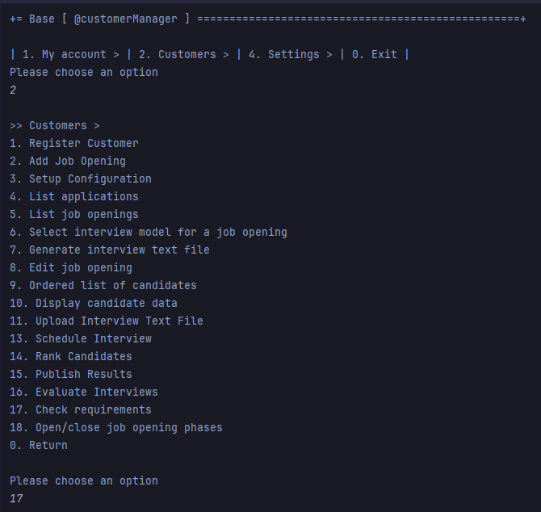
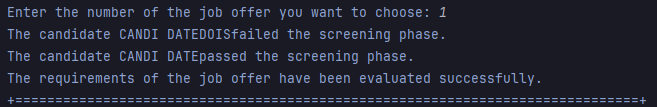

# US 1015

Author : 1221289

## 1. Context

It is the first time this task is being developed.

## 2. Requirements

**US 1015** As Customer Manager, I want to execute the process of verification of requirements of applications for a job opening.

- Priority: 1

## 2.1. Client Clarifications

## Question  167

> Deve ser executado o processo para todos os candidatos ou apenas para alguns (segundo algum critério)?

Os ficheiros com as respostas aos requisitos vão entrando no sistema gradualmente. Talvez seja mais “simples” que o processo execute (ou seja, faça a verificação dos requisitos) para os candidatos para os quais já foi submetido o ficheiro de requisitos. Nalgum momento o processo irá executar com todos os candidatos já com os ficheiros de requisitos submetidos.

## 3. Analysis

### 3.1. Domain Model

)

### 3.2. Use case diagram


## 4. Design

### 4.1. Applied Patterns

- **Repository:** Used to save and update the configurations of the job offers.

### 4.2. Sequence Diagram


## 5. Implementation
## 5.1 EvaluateRequirementsUI
```java
public class EvaluateRequirementsUI extends AbstractUI {

    private final AnswerEvaluatorController controller = new AnswerEvaluatorController();
    private final ConfigurationRepository configurationRepository = PersistenceContext.repositories().configurations();

    @Override
    protected boolean doShow() {

        JobOffer jobOffer = listAndChooseJobOffer();

        if (jobOffer == null) {
            System.out.println("There was an error while retrieving the chosen job offer.");
            return false;
        }

        Configuration configuration = controller.getConfigurationFromJobOffer(jobOffer);

        if(configuration == null) {
            System.out.println("There was no configuration for this chosen job offer.");
            return false;
        }

        if(controller.checkIfRequirementIsOpen(configuration)) {
            ScreeningPhase screeningPhase = configuration.getScreeningPhase();
            configuration.startPhase(screeningPhase);

            configurationRepository.save(configuration);
        }
        else{
            System.out.println("The screening phase is not open.");
            return false;
        }

        List<EmailAddress> candidates = controller.getUsersWithApplications(jobOffer.getReference());
        if (candidates.isEmpty()){
            System.out.println("There are no applications or interviews for this job offer.");
            return false;
        }

        Map<EmailAddress, String> candidatePaths = controller.getPaths(candidates);
        if (candidatePaths.isEmpty()){
            return false;
        }

        String path = controller.getRequirementsPath(jobOffer);

        if (path == null){
            System.out.println("It was not possible to continue the evaluation process as there was no file with the correct answers.");
            return false;
        }

        controller.evaluateCandidates(path, candidatePaths, jobOffer);

        System.out.println("The requirements of the job offer have been evaluated successfully.");

        return true;
    }

    @Override
    public String headline() {
        return "Check requirements";
    }

    public JobOffer listAndChooseJobOffer() {

        JobOfferPrinter printer = new JobOfferPrinter();

        List<JobOffer> jobOffers = controller.getJobOffers();

        if (jobOffers.isEmpty()) {
            System.out.println("No job offers available.");
            return null;
        }

        System.out.println("List of Job Offers:");
        for (int i = 0; i < jobOffers.size(); i++) {
            System.out.println((i + 1) + ": ");
            printer.visit(jobOffers.get(i));
        }

        Scanner scanner = new Scanner(System.in);
        JobOffer selectedJobOffer = null;
        boolean validChoice = false;

        while (!validChoice) {
            try {
                System.out.print("Enter the number of the job offer you want to choose: ");
                int choice = scanner.nextInt();

                if (choice < 1 || choice > jobOffers.size()) {
                    System.out.println("Invalid choice. Please enter a number between 1 and " + jobOffers.size());
                } else {
                    selectedJobOffer = jobOffers.get(choice - 1);
                    validChoice = true;
                }
            } catch (InputMismatchException e) {
                System.out.println("Invalid input. Please enter a number.");
                scanner.next();
            } catch (Exception e) {
                System.out.println("An unexpected error occurred: " + e.getMessage());
                break;
            }
        }

        return selectedJobOffer;
    }
}
```

## 5.2 EvaluateRequirementsUI
```java
public class AnswerEvaluatorController {

    private final JobOfferRepository jobOfferRepository = PersistenceContext.repositories().jobOffers();
    private final ConfigurationRepository configurationRepository= PersistenceContext.repositories().configurations();
    private final AuthorizationService authorizationService = AuthzRegistry.authorizationService();
    private final CandidateRepository repository = PersistenceContext.repositories().candidateUsers();
    private final ApplicationRepository applicationRepository = PersistenceContext.repositories().applications();
    private final CandidateRepository candidateRepository = PersistenceContext.repositories().candidateUsers();

    public List<JobOffer> getJobOffers() {
        Iterable<JobOffer> iterable = jobOfferRepository.findAll();
        List<JobOffer> jobOffers = new ArrayList<>();
        for (JobOffer jobOffer : iterable) {
            if(jobOffer.getRequirements() != null){
                jobOffers.add(jobOffer);
            }
        }

        return jobOffers;
    }

    public Configuration getConfigurationFromJobOffer(JobOffer jobOffer){
        if(configurationRepository.findByReference(jobOffer.getReference()).iterator().hasNext()){
            return configurationRepository.findByReference(jobOffer.getReference()).iterator().next();
        }

        return null;
    }

    public boolean checkIfRequirementIsOpen(Configuration configuration){
        if(configuration != null){
            return configuration.getScreeningPhase().isOpen();
        }
        return false;
    }

    public List<EmailAddress> getUsersWithApplications(Reference reference) {
        authorizationService.ensureAuthenticatedUserHasAnyOf(Jobs4uRoles.POWER_USER, Jobs4uRoles.CUSTOMER_MANAGER);
        List<EmailAddress> emails = new ArrayList<>();

        try{
            Iterable<Application> applications;

            applications = applicationRepository.findByReference(reference);

            if (applications == null || !applications.iterator().hasNext()) {
                System.out.println("No applications available for this job offer.");
                return emails;
            }

            for (Application application : applications) {
                if (application.email() != null && application.getScreeningPhaseResult() == STATUS.PENDING) {
                    emails.add(application.email());
                }

            }
            return emails;

        } catch (Exception e){
            System.out.println("Error: " + e.getMessage());
            return emails;
        }
    }

    public Map<EmailAddress,String> getPaths(List <EmailAddress> candidatesEmail) {
        authorizationService.ensureAuthenticatedUserHasAnyOf(Jobs4uRoles.POWER_USER, Jobs4uRoles.CUSTOMER_MANAGER);

        Map<EmailAddress,String> candidatesAndTheirAnswers = new HashMap<>();
        String path;

        for (EmailAddress email : candidatesEmail) {
            try {

                CandidateUser candidate = repository.findAllbyEmail((email)).iterator().next();

                path = candidate.getRequirementsPath();

                if (path != null) {
                    candidatesAndTheirAnswers.put(candidate.email(), path);
                }
            } catch (Exception e) {
                System.out.println("Error: " + e.getMessage());
                return candidatesAndTheirAnswers;
            }
        }
        if (candidatesAndTheirAnswers.isEmpty()) {
            System.out.println("No requirements available for this job offer.");
            return candidatesAndTheirAnswers;
        }

        return candidatesAndTheirAnswers;
    }

    public String getRequirementsPath(JobOffer jobOffer) {
        authorizationService.ensureAuthenticatedUserHasAnyOf(Jobs4uRoles.POWER_USER, Jobs4uRoles.CUSTOMER_MANAGER);

        JobRequirements jobRequirements = jobOffer.getRequirements();
        if (jobRequirements == null) {
            System.out.println("No requirements available for this job offer.");
            return null;
        }

        String requirementsPath;

        try {
            requirementsPath = jobRequirements.getPath();

            return requirementsPath;
        }
        catch (Exception e) {
            System.out.println("Error: " + e.getMessage());
            return null;
        }
    }

    public String evaluate(String requirementsPath, String answersPath) {
        try {
            // colocar as respostas esperadas
            CharStream requirementsCharStream = CharStreams.fromFileName(requirementsPath);

            // criar o analisador léxico e o analisador sintático para os requisitos do trabalho
            FrontEndJuniorProgrammerRequirementsLexer lexer = new FrontEndJuniorProgrammerRequirementsLexer(requirementsCharStream);
            CommonTokenStream tokens = new CommonTokenStream(lexer);
            FrontEndJuniorProgrammerRequirementsParser parser = new FrontEndJuniorProgrammerRequirementsParser(tokens);
            ParseTree tree = parser.jobRequirementSpecification();

            // criar o listener
            AnswerEvaluatorListener answerEvaluatorListener = new AnswerEvaluatorListener();

            // visitar a árvore para obter as respostas corretas
            answerEvaluatorListener.setParsingCorrectAnswers(true); // parsing das respostas corretas
            ParseTreeWalker walker = new ParseTreeWalker();
            walker.walk(answerEvaluatorListener, tree);

            // colocar as respostas do candidato
            CharStream answersStream = CharStreams.fromFileName(answersPath);
            FrontEndJuniorProgrammerRequirementsLexer answersLexer = new FrontEndJuniorProgrammerRequirementsLexer(answersStream);
            CommonTokenStream answersTokens = new CommonTokenStream(answersLexer);
            FrontEndJuniorProgrammerRequirementsParser answersParser = new FrontEndJuniorProgrammerRequirementsParser(answersTokens);
            ParseTree answersTree = answersParser.jobRequirementSpecification();

            // visitar a árvore para obter as respostas do candidato
            answerEvaluatorListener.setParsingCorrectAnswers(false); // parsing das respostas do candidato
            walker.walk(answerEvaluatorListener, answersTree);

            // avaliar o candidato com base na comparação das respostas
            return answerEvaluatorListener.evaluateCandidate();
        } catch (IOException e) {
            e.printStackTrace();
            return "Error: " + e.getMessage();
        }
    }

    public void evaluateCandidates(String requirementsPath, Map<EmailAddress, String> candidatePaths, JobOffer jobOffer) {

        for (Map.Entry<EmailAddress, String> entry : candidatePaths.entrySet()) {
            String evaluationResult = evaluate(requirementsPath, entry.getValue());

            updateScreeningPhaseResult(entry.getKey(), jobOffer, evaluationResult);
        }

    }

    private void updateScreeningPhaseResult(EmailAddress email, JobOffer jobOffer, String evaluationResult) {
        try {

            Application application = null;
            if(applicationRepository.findByEmailAndReference(email, jobOffer.getReference()).isPresent()){
                application = applicationRepository.findByEmailAndReference(email, jobOffer.getReference()).get();

            }

            if(application == null){
                System.out.println("There was a problem retrieving the candidate application.");
            }
            else{
                if (evaluationResult.contains("Candidate accepted")) {
                    if(candidateRepository.findByEmail(email).isPresent()){
                        System.out.println("The candidate " + candidateRepository.findByEmail(email).get().user().name() + " passed the screening phase." );
                        application.setScreeningPhaseResult(STATUS.ACCEPTED);
                    }

                } else {
                    System.out.println("The candidate " + candidateRepository.findByEmail(email).get().user().name() + " failed the screening phase." );
                    application.setScreeningPhaseResult(STATUS.REFUSED);
                }

                applicationRepository.save(application);
            }

        } catch (Exception e) {
            e.printStackTrace();
            System.out.println("Error updating screening phase result for candidate: " + email);
        }
    }

}
```

## 5.3 AnswerEvaluatorListener
```java
public class AnswerEvaluatorListener extends FrontEndJuniorProgrammerRequirementsBaseListener {
    private final Map<String, String> correctAnswers = new HashMap<>();
    private final Map<String, String> candidateAnswers = new HashMap<>();
    @Setter
    private boolean parsingCorrectAnswers;

    public void enterRequirement(FrontEndJuniorProgrammerRequirementsParser.RequirementContext ctx) {
        String question = ctx.question().getText();
        String answer = ctx.answer().getText().replace("Answer: ", "").trim();

        if (parsingCorrectAnswers) {
            correctAnswers.put(question, answer);
        } else {
            candidateAnswers.put(question, answer);
        }
    }

    public String evaluateCandidate() {
        for (Map.Entry<String, String> entry : correctAnswers.entrySet()) {
            String question = entry.getKey();
            String expectedAnswer = entry.getValue();
            String candidateAnswer = candidateAnswers.get(question);

            if (candidateAnswer == null || candidateAnswer.isEmpty()) {
                return "Candidate rejected. Reason: No answer provided for: " + question;
            }

            if (!checkAnswer(expectedAnswer, candidateAnswer)) {
                return "Candidate rejected. Reason: Invalid answer provided for: " + question + ". Expected: " + expectedAnswer;
            }
        }
        return "Candidate accepted.";
    }

    private boolean checkAnswer(String expected, String candidate) {
        try {
            // verificar se é um numero inteiro
            if (expected.matches("\\d+")) {
                int expectedInt = Integer.parseInt(expected);
                int candidateInt = Integer.parseInt(candidate);
                return candidateInt >= expectedInt;
            }

            // verificar se é um numero decimal
            if (expected.matches("\\d+\\.\\d+")) {
                double expectedDouble = Double.parseDouble(expected);
                double candidateDouble = Double.parseDouble(candidate);
                return candidateDouble >= expectedDouble;
            }

            // verificar se é uma data e se é igual á esperada
            if (expected.matches("\\d{4}-\\d{2}-\\d{2}")) {
                return expected.equals(candidate);
            }

            // verificar se as respostas do candidato contêm as esperadas
            return candidate.toLowerCase().contains(expected.toLowerCase());
        } catch (NumberFormatException e) {
            return false;
        }
    }
}
```

## 6. Integration & Demonstration




## 7. Observations

- N/a