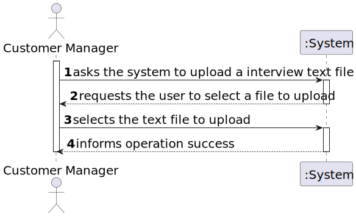
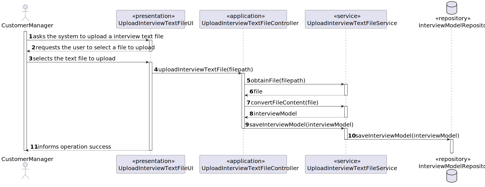
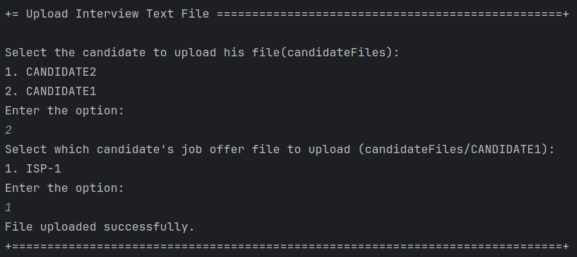

# US 1017

Author : 1221265

## 1. Context

It is the first time this task is being developed.


## 2. Requirements


**US 1017** As Customer Manager, I want to upload a text file with the candidate responses for an interview.

- Priority: 1
- References: NFR09(LPROG) - Requirement Specifications and Interview Models The support for this functionality must follow specific technical requirements, specified in LPROG. The ANTLR tool should be used (https://www.antlr.org/).

## 2.1. Client Clarifications

## Question 214

> No caso de upload de um ficheiro, se a pergunta que requer um número como resposta for preenchida com um formato inválido, por exemplo, uma letra, devemos considerar isso como um formato inválido na US 1017 (e pedir para o user voltar a dar upload a um ficheiro válido) ou devemos, na US1018, considerar que está incorreta e atribuir 0 pontos automaticamente para essa resposta inválida? Isto é, na US 1017, devemos apenas verificar o formato do ficheiro ou devemos verificar também se as respostas são preenchidas com o tipo de dados correto?

O caso mencionado deve ser considerado um erro de validação do ficheiro (ou seja, o ficheiro submetido não corresponde à gramática definida).

## Question 227

> Em termos "upload" certamente passa pela verificação com a gramática e após sucesso colocar o ficheiro das respostas da entrevista junto da pasta com os ficheiros da "Application" certo?

Sim, a sintaxe deve ser verificada e, se tudo estiver correto, o ficheiro deve ser “importado” para o sistema de forma a que possa ser usado posteriormente, por exemplo, no âmbito da US 1018. Qual a solução para o “importar” faz parte da vossa solução. Idealmente julgo que faria sentido que ficasse integrado na base de dados. Não sendo possível, penso que é aceitável que fique numa pasta/diretório de um servidor.


## 3. Analysis

### 3.1. Domain Model


### 3.2. Use case diagram


## 4. Design

### 4.1. SSD



### 4.2. SD



### 4.2. Applied Patterns

- **Controller:** Manages incoming requests, orchestrating operations between the user interface and the application’s service layer, ensuring that responses are delivered effectively.

- **Repository:** Abstracts the data layer, providing a collection-like interface for accessing domain entities while hiding the complexities of the data store.

- **Service:** Defines an application’s boundaries with a set of interfaces that encapsulate business logic, serving as a conduit for communication between the domain and external agents.


## 5. Implementation
## 5.1 UploadInterviewTextFileController
```java
public class UploadInterviewTextFileController {

    private final CandidateRepository candidateRepository = PersistenceContext.repositories().candidateUsers();

    private final ApplicationRepository applicationRepository = PersistenceContext.repositories().applications();

    public Optional<CandidateUser> findCandidateByUsername(String username) {
        return candidateRepository.findByUsername(Username.valueOf(username));
    }

    public boolean updateCandidateWithInterviewPath(CandidateUser candidate, String filepath) throws IOException {

        final FrontEndInterviewModelImporter importer = new FrontEndInterviewModelImporter();
        InputStream content = inputStreamFromResourceOrFile(filepath);
        boolean result = importer.checkSyntaxErrors(content);

        if (result) {
            System.out.println("The file has syntax errors");
            return false;
        }

        candidate.setInterviewPath(filepath);
        candidateRepository.save(candidate);
        return true;
    }

    public InputStream inputStreamFromResourceOrFile(final String filename) throws FileNotFoundException {
        InputStream content;
        final ClassLoader classLoader = this.getClass().getClassLoader();
        final URL resource = classLoader.getResource(filename);
        if (resource != null) {
            final File file = new File(resource.getFile());
            content = new FileInputStream(file);
        } else {
            content = new FileInputStream(filename);
        }
        return content;
    }
}
```


## 6. Integration & Demonstration


## 7. Observations

- N/a