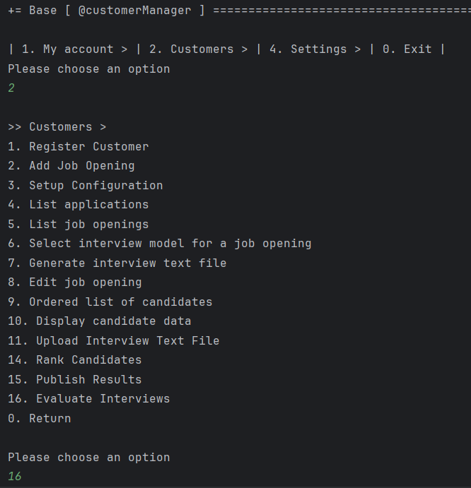
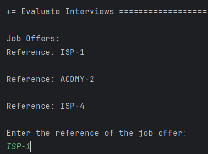
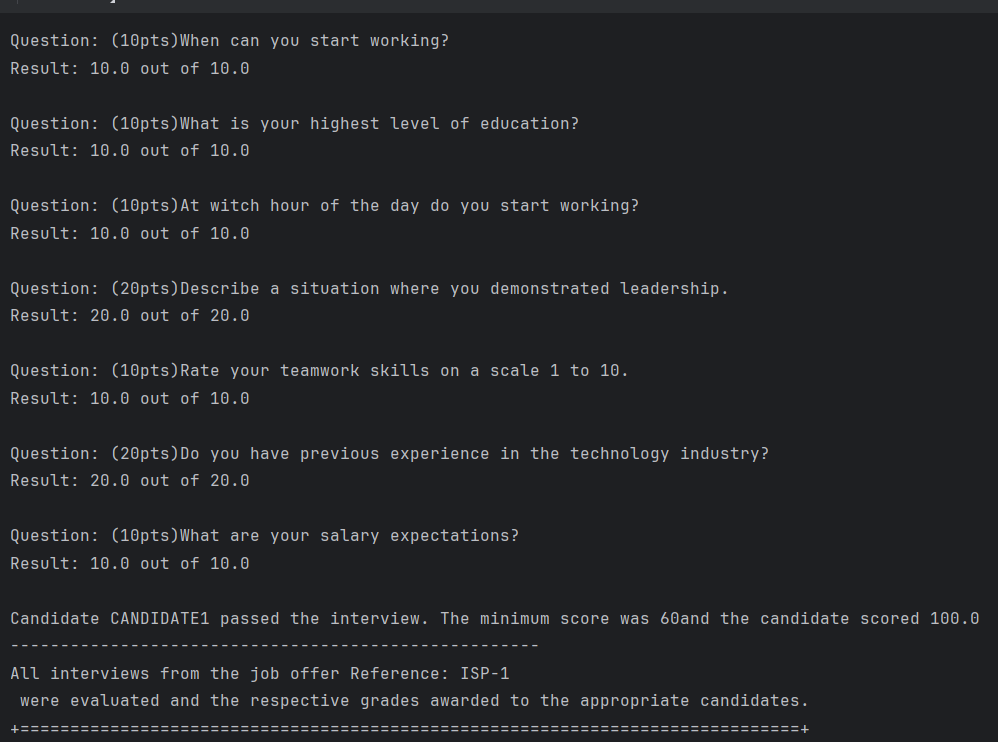

# US 1018

Author : 1221959

## 1. Context

It is the first time this task is being developed.


## 2. Requirements


**US 1018**  As Customer Manager, I want to execute the process that evaluates (grades) the
interviews for a job opening.


- Priority: 1

## 2.1. Client Clarifications

## Question 199

> Relativamente à US1018, após a execução do processo de avalição de todas as entrevistas da job opening, a fase em que esta se encontra deve ser automaticamente mudado para "Result" ou deve ser mantida em "Analysis" e apenas pode ser mudada pela execução da US1010?
>
A US1018 não deve alterar a fase actual. A US1010 permite fazer a mudança de fases do processo de recrutamento.

## Question 214

> O nosso grupo tem uma dúvida em relação ao processamento dos ficheiros de respostas dos candidatos para a entrevista. No caso de upload de um ficheiro, se a pergunta que requer um número como resposta for preenchida com um formato inválido, por exemplo, uma letra, devemos considerar isso como um formato inválido na US 1017 (e pedir para o user voltar a dar upload a um ficheiro válido) ou devemos, na US1018, considerar que está incorreta e atribuir 0 pontos automaticamente para essa resposta inválida? Isto é, na US 1017, devemos apenas verificar o formato do ficheiro ou devemos verificar também se as respostas são preenchidas com o tipo de dados correto?

O caso mencionado deve ser considerado um erro de validação do ficheiro (ou seja, o ficheiro submetido não corresponde à gramática definida).

## Question 227

>Em termos "upload" certamente passa pela verificação com a gramática e após sucesso colocar o ficheiro das respostas da entrevista junto da pasta com os ficheiros da "Application" certo?
>
Sim, a sintaxe deve ser verificada e, se tudo estiver correto, o ficheiro deve ser “importado” para o sistema de forma a que possa ser usado posteriormente, por exemplo, no âmbito da US 1018. Qual a solução para o “importar” faz parte da vossa solução. Idealmente julgo que faria sentido que ficasse integrado na base de dados. Não sendo possível, penso que é aceitável que fique numa pasta/diretório de um servidor.

## Question 238

>  US1018 - Relativamente a resposta que forneceu na Q206, referiu que uma jobOpening suporta apenas uma entrevista, isto significa que só um candidato que fez uma candidatura pode ser entrevistado de cada vez ou que cada candidatura está associada aquela entrevista em específico? Além disso cada candidatura que sofre uma entrevista terá de ter uma resposta a essa entrevista ou será antes a entrevista de uma job Opening terá uma resposta? Esta dúvida surge pois na US1018 é suposto avaliar todas as entrevistas de uma jobOpening quando disse que uma jobOpening suporta apenas uma entrevista.

Peço desculpa se não ficou claro, mas então deviam ter colocar a questão há mais tempo. Para cada job opening define-se o processo de recrutamento. Este pode ter ou não uma fase e entrevista. Se tiver fase de entrevista, então podemos admitir que é apenas uma entrevista. Mas quando digo isso, quero dizer uma entrevista para cada candidato e não uma entrevista para todos os candidatos a essa job opening. Penso que isso era claro. Caso contrário não fazia sentido ter, por exemplo, uma US para marcar uma entrevista com um candidato. Marcava-se uma entrevista com “todos” os candidatos ao mesmo tempo? Cada candidato, quando é entrevistado, são preenchidas as respostas que esse candidato deu na sua entrevista no documento que depois é submetido (US1017). Portanto, se houver fase de entrevistas, cada candidato deve ter a sua entrevista e a sua “classificação” nessa sua entrevista


## 3. Analysis

### 3.1. Domain Model

 "Domain model")

### 3.2. Use case diagram


## 4. Design

### 4.1. Realization

### 4.2. Applied Patterns

- **Repository:** This is used to store the entitys. This is done to allow the persistence of the enrollments and to allow the use of the enrollments in other parts of the application.

### 4.3. Tests

#### 4.3.1.1 Register job offer



```
1-entrar como customerManager
2-selecionar a opção 2
3-selecionar a opção 16
4- inserir os dados pedidos
5. Em caso de sucesso, as interviews foram avalaidas e os resultados
persistidos.
```



**Test 1:** _Verifies if all the maps are correctly populated._


**Test 2:** _Verifies that it is not possible to evaluate with empty or null files._


**Test 3:** _Verifies that the total score cant be different of 100._


**Test 4:** _Verifies that the resume is correctly printed._


## 5. Implementation
## 5.1 RegisterJobOpeningController
```java
public class EvaluatesInterviewController {

    private final JobOfferRepository jobOfferRepository = PersistenceContext.repositories().jobOffers();
    private final AuthorizationService authorizationService = AuthzRegistry.authorizationService();
    private final ConfigurationRepository configurationRepository = PersistenceContext.repositories().configurations();
    private final ApplicationRepository applicationRepository = PersistenceContext.repositories().applications();
    private final CandidateRepository repository = PersistenceContext.repositories().candidateUsers();
    private final InterviewModelRepository interviewModelRepository = PersistenceContext.repositories().interviewModels();


    private final String currentManager = getManagerEmail();
    private final List<CandidateUser> candidates = new ArrayList<>();
    private String getManagerEmail() {
        authorizationService.ensureAuthenticatedUserHasAnyOf(Jobs4uRoles.POWER_USER, Jobs4uRoles.CUSTOMER_MANAGER);

        AuthorizationService authorizationService = AuthzRegistry.authorizationService();
        Optional<UserSession> userSessionOptional = authorizationService.session();
        UserSession userSession = userSessionOptional.get();
        SystemUser authenticatedUser = userSession.authenticatedUser();
        return authenticatedUser.email().toString();
    }

    public Iterable<JobOffer> getJobOffers() {
        authorizationService.ensureAuthenticatedUserHasAnyOf(Jobs4uRoles.POWER_USER, Jobs4uRoles.CUSTOMER_MANAGER);

        Iterable<JobOffer> jobOffers = jobOfferRepository.findAllByManager(currentManager);
        if (jobOffers == null || !jobOffers.iterator().hasNext()) {
            System.out.println("No job offers found.");
            return Collections.emptyList();
        }
        return jobOffers;
    }

    public boolean showJobOffers() {
        System.out.println("Job Offers:");
        Iterable<JobOffer> jobOffers = getJobOffers();
        if (jobOffers == null || !jobOffers.iterator().hasNext()) {
            return false;
        }
        for (JobOffer jobOffer : jobOffers) {
            System.out.println(jobOffer.getReference().toString());
        }
        return true;
    }

    public Iterable<JobOffer> getSpecificJobOffer(Reference reference) {
        authorizationService.ensureAuthenticatedUserHasAnyOf(Jobs4uRoles.POWER_USER, Jobs4uRoles.CUSTOMER_MANAGER);

        Iterable<JobOffer> jobOffers = jobOfferRepository.findAllByManager(currentManager);
        List<JobOffer> jobOfferList = (List<JobOffer>) jobOffers;
        for (JobOffer jobOffer : jobOfferList) {
            if (jobOffer.getReference().toString().equals(reference.toString())) {
                return Collections.singletonList(jobOffer);
            }
        }
        return Collections.emptyList();
    }

    //verificar se já está na interview phase
    public boolean checkInterviewPhase(Reference reference){
        authorizationService.ensureAuthenticatedUserHasAnyOf(Jobs4uRoles.POWER_USER, Jobs4uRoles.CUSTOMER_MANAGER);
        Configuration configuration = new Configuration();
        InterviewPhase interviewPhase = new InterviewPhase();

        try {
            configuration = configurationRepository.findByReference(reference).iterator().next();
            interviewPhase = configuration.getInterviewPhase();
        } catch (Exception e) {
            return false;
        }
        try {
            boolean check = interviewPhase.getPeriod().getStartDate().isBefore(LocalDateTime.now());
            return check;
        }
        catch (Exception e) {
            return false;
        }
    }

    public List<String> getCandidatesEmail(Reference reference) {
        authorizationService.ensureAuthenticatedUserHasAnyOf(Jobs4uRoles.POWER_USER, Jobs4uRoles.CUSTOMER_MANAGER);
        List<String> emails = new ArrayList<>();

        try{
            Iterable<Application> applications=null;

            applications = applicationRepository.findByReference(reference);
            if (applications == null || !applications.iterator().hasNext()) {
                System.out.println("No applications available for this job offer.");
                return emails;
            }

            for (Application application : applications) {
                if (application.email() != null) {
                    emails.add(application.email().toString());
                }

            }
            return emails;
        }catch (Exception e){
            System.out.println("Error: " + e.getMessage());
            return emails;
        }
    }

    public void getCandidates(List<String > candidatesEmail) {
        authorizationService.ensureAuthenticatedUserHasAnyOf(Jobs4uRoles.POWER_USER, Jobs4uRoles.CUSTOMER_MANAGER);
        for (String email : candidatesEmail) {
            try {
                CandidateUser candidate = repository.findAllbyEmailStr(email).iterator().next();
                candidates.add(candidate);
            } catch (Exception e) {
                System.out.println("Error: " + e.getMessage());
            }
        }
    }

    public Map<EmailAddress,String>  getPaths(List <String> candidatesEmail) {
        authorizationService.ensureAuthenticatedUserHasAnyOf(Jobs4uRoles.POWER_USER, Jobs4uRoles.CUSTOMER_MANAGER);

        Map<EmailAddress,String> mapaTeste = new HashMap<>();
        String path;
        for (String email : candidatesEmail) {
            try {

                CandidateUser candidate = repository.findAllbyEmail(EmailAddress.valueOf(email)).iterator().next();

                path = candidate.getInterviewPath();

                if (path != null) {
                    mapaTeste.put(candidate.email(),path);
                }
            } catch (Exception e) {
                System.out.println("Error: " + e.getMessage());
                return mapaTeste;
            }
        }
        if (mapaTeste.isEmpty()) {
            System.out.println("No interviews available for this job offer.");
            return mapaTeste;
        }

        return mapaTeste;
    }

    public String getInterviewModelPath(Reference reference) {
        authorizationService.ensureAuthenticatedUserHasAnyOf(Jobs4uRoles.POWER_USER, Jobs4uRoles.CUSTOMER_MANAGER);

        Iterable<InterviewModel> interviewModel  =interviewModelRepository.findByReference(reference);

        InterviewModel interview=null;
        String interviewModelPath= null;

        try {
            if (interviewModel.iterator().hasNext()) {
                interview = interviewModel.iterator().next();
                String path = interview.getQuestionForm().filePath();

                // Extract the part of the path starting from "InterviewModel"
                String keyword = "interviewmodel";
                int startIndex = path.indexOf(keyword);
                if (startIndex != -1) {
                    interviewModelPath = path.substring(startIndex);
                } else {
                    // Handle case where "InterviewModel" is not found in the path
                    interviewModelPath = path; // or set to null or some default value
                }
                return interviewModelPath;
            }
        }
        catch (Exception e) {
            System.out.println("Error: " + e.getMessage());
            return interviewModelPath;
        }
        return interviewModelPath;
    }

    public Map<EmailAddress, Double> callEvaluator(Map<EmailAddress,String> candidatePaths, String modelPath) throws IOException {

        String expectedInput = new String(Files.readAllBytes(Paths.get(modelPath)));
        CharStream expectedCharStream = CharStreams.fromString(expectedInput);
        ExpectedAnswersVisitor expectedAnswersVisitor = getExpectedAnswersVisitor(expectedCharStream);

        Map<String, String> expectedAnswers = expectedAnswersVisitor.getSymbolTable();
        Map<String, Double> questionScores = expectedAnswersVisitor.getQuestionScores();
        Map<String, String> typeQuestions = expectedAnswersVisitor.getTypeQuestions();
        Map<String, Map<String, Double>> answerScores = expectedAnswersVisitor.getAnswerScores();
        Map<String, String> criteriaMap =  expectedAnswersVisitor.getCriteriaMap();


        Map<EmailAddress, Double> candidatResult = new HashMap<>();

        for (Map.Entry<EmailAddress, String> entry : candidatePaths.entrySet()) {
            String candidateFile = entry.getValue();
            String candidateInput = new String(Files.readAllBytes(Paths.get(candidateFile)));
            CharStream candidateCharStream = CharStreams.fromString(candidateInput);
            FrontEndJuniorInterviewModelLexer candidateLexer = new FrontEndJuniorInterviewModelLexer(candidateCharStream);
            CommonTokenStream candidateTokens = new CommonTokenStream(candidateLexer);
            FrontEndJuniorInterviewModelParser candidateParser = new FrontEndJuniorInterviewModelParser(candidateTokens);
            ParseTree candidateTree = candidateParser.form();
            CandidateAnswersVisitor candidateAnswersVisitor = new CandidateAnswersVisitor();
            candidateAnswersVisitor.visit(candidateTree);

            Map<String, String>  candidateAnswers = candidateAnswersVisitor.getSymbolTable();

            AnswerEvaluatorVisitor evaluatorVisitor = new AnswerEvaluatorVisitor(
                    candidateAnswers,
                    expectedAnswers,
                    questionScores,
                    answerScores,
                    typeQuestions);
            evaluatorVisitor.visit(candidateTree);

            Map<String, Double> evaluationResults = evaluatorVisitor.getEvaluationResults();
            System.out.println("-----------------------------------------------------");
            double totalScore = 0.0;
            for (Map.Entry<String, Double> entry2 : evaluationResults.entrySet()) {
                String question = entry2.getKey();
                double result = entry2.getValue();
                String expectedAnswer = expectedAnswers.get(question);
                String answered = candidateAnswers.getOrDefault(question, "Not Answered");

                double maxScore = questionScores.getOrDefault(question, 0.0); // Obter a pontuação máxima da pergunta

                System.out.println("Question: " + question);
//                System.out.println("Expected: " + expectedAnswer);
//                System.out.println("Answered: " + answered);
                System.out.println("Result: " + result + " out of " + maxScore + "\n");

                totalScore += result;
            }

            totalScore = Math.round(totalScore * 100.0) / 100.0;
            CandidateUser currentCandidate = repository.findAllbyEmail(entry.getKey()).iterator().next();
            candidatResult.put(entry.getKey(), totalScore);

            if (totalScore >= Double.parseDouble(criteriaMap.get("%"))){
                System.out.println("Candidate " +currentCandidate.user().username() +" passed the interview. The minimum score was " + criteriaMap.get("%")+ "and the candidate scored " + totalScore) ;
                System.out.println("-----------------------------------------------------");
            }
            else {
                System.out.println("Candidate" +currentCandidate.user().username() +" did not pass the interview. The minimum score was " + criteriaMap.get("%")+ "and the candidate scored " + totalScore) ;
                System.out.println("-----------------------------------------------------");
            }

        }
        return candidatResult;
    }

    private static ExpectedAnswersVisitor getExpectedAnswersVisitor(CharStream expectedCharStream) {
        FrontEndJuniorInterviewModelLexer expectedLexer = new FrontEndJuniorInterviewModelLexer(expectedCharStream);
        CommonTokenStream expectedTokens = new CommonTokenStream(expectedLexer);
        FrontEndJuniorInterviewModelParser expectedParser = new FrontEndJuniorInterviewModelParser(expectedTokens);
        ParseTree expectedTree = expectedParser.form();

        ExpectedAnswersVisitor expectedAnswersVisitor = new ExpectedAnswersVisitor();
        expectedAnswersVisitor.visit(expectedTree);
        return expectedAnswersVisitor;
    }

    public boolean updateScores(Map<EmailAddress, Double> grades) {
        authorizationService.ensureAuthenticatedUserHasAnyOf(Jobs4uRoles.POWER_USER, Jobs4uRoles.CUSTOMER_MANAGER);

        for (Map.Entry<EmailAddress, Double> entry : grades.entrySet()) {
            try {
                Application application = applicationRepository.findAllByEmail(entry.getKey()).iterator().next();
                application.updateGrade(entry.getValue());
                applicationRepository.save(application);
            } catch (Exception e) {
                System.out.println("Error: " + e.getMessage());
                return false;
            }
        }
        return true;
    }
}
```


## 6. Integration & Demonstration

## 7. Observations

- N/a