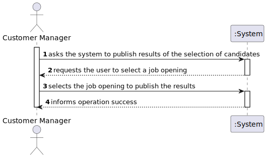
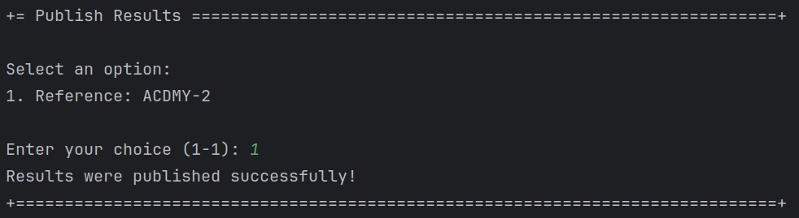

# US 1020

Author : 1221265

## 1. Context

It is the first time this task is being developed.


## 2. Requirements


**US 1020** As Customer Manager, I want to publish the results of the selection of candidates for a job opening, so that candidates and customer are notified by email of the result.

- Priority: 1
- References: NFR11(RCOMP) The solution should be deployed using several network nodes. It is expected that, at least, the relational database server and the Follow Up Server be deployed in nodes different from localhost, preferably in the cloud. The e-mail notification tasks must be executed in background by the Follow Up Server.

## 2.1. Client Clarifications

## Question 51

> US 1020, qual é o formato para essa publicação?

A publicação refere-se a informar os candidatos e o cliente, por email. Os candidatos que são selecionados devem receber um email a indicar que para a sua candidatura ao job opening foram selecionados e irão ser contactados pela empresa. No que se refere à empresa, esta deve receber um email com a lista dos candidatos selecionados que deve incluir o nome e dados de contacto do candidato.

## Question 190

> Regarding the selection of candidates, should we assume that the first N candidates in the ranking (where N is the number of job vacancies) are chosen, or should we allow the customer manager to select the N candidates?

The first option (using the results from US1013).

## Question 224

> Esta US pede que seja publicado os resultados das candidaturas, a minha pergunta seria se este processo só pode acontecer quando a job opening estiver encerrada ou se executar esta operação terminaria a job opening.

Esta US é relativa à última fase do processo. Se as notificações executarem todas com sucesso em princípio já não existe mais nada a fazer neste processo.


## 3. Analysis

### 3.1. Domain Model


### 3.2. Use case diagram


## 4. Design

### 4.1. SSD



### 4.2. Applied Patterns

- **Controller:** Manages incoming requests, orchestrating operations between the user interface and the application’s service layer, ensuring that responses are delivered effectively.

- **Repository:** Abstracts the data layer, providing a collection-like interface for accessing domain entities while hiding the complexities of the data store.

- **Service:** Defines an application’s boundaries with a set of interfaces that encapsulate business logic, serving as a conduit for communication between the domain and external agents.

## 5. Implementation
## 5.1 PublishResultsController
```java
public class PublishResultsController {

    private final AuthorizationService authz = AuthzRegistry.authorizationService();

    private PublishResultsService service = new PublishResultsService();

    private JobOfferRepository jobOfferRepository = PersistenceContext.repositories().jobOffers();

    private ConfigurationRepository configurationRepository = PersistenceContext.repositories().configurations();

    private ApplicationRepository applicationRepository = PersistenceContext.repositories().applications();

    private RankRepository rankRepository = PersistenceContext.repositories().ranks();

    private CustomerRepository customerRepository = PersistenceContext.repositories().customerUsers();


    public boolean publishResults(JobOffer jobOffer) {
        authz.ensureAuthenticatedUserHasAnyOf(Jobs4uRoles.POWER_USER, Jobs4uRoles.CUSTOMER_MANAGER);

        // Start Result Phase
        configurationRepository.findByReference(jobOffer.getReference()).iterator().next().getResultPhase().start();

        try {
            // Get N candidates
            Integer nCandidates = jobOffer.getNrOfVacancies().getValue();

            Rank rank = rankRepository.findByJobOffer(jobOffer).iterator().next();
            List<Order> ranking = rank.getOrders();
            List<Order> sortedRanking = sortRanking(ranking);

            List<Order> approvedOrders = getListApprovedOrders(sortedRanking, nCandidates);
            List<Order> notApprovedOrders = getListNotApprovedOrders(sortedRanking, nCandidates);

            //Set approved applications to approves
            setApplicationToApprovedOrRefused(approvedOrders, true);
            setApplicationToApprovedOrRefused(notApprovedOrders, false);


        } catch (NoSuchElementException e) {
            e.printStackTrace();
        }

        return true;
    }

    public boolean checkResultPhase(Reference reference){
        authz.ensureAuthenticatedUserHasAnyOf(Jobs4uRoles.POWER_USER, Jobs4uRoles.CUSTOMER_MANAGER);
        Configuration configuration;

        try {
            configuration = configurationRepository.findByReference(reference).iterator().next();
        } catch (Exception e) {
            return false;
        }
        try {
            boolean check = configuration.getResultPhase().isOpen();
            return check;
        }
        catch (Exception e) {
            return false;
        }
    }

    public void startResultPhase(Reference reference) {
        authz.ensureAuthenticatedUserHasAnyOf(Jobs4uRoles.POWER_USER, Jobs4uRoles.CUSTOMER_MANAGER);

        Configuration configuration = configurationRepository.findByReference(reference).iterator().next();
        ResultPhase resultPhase = configuration.getResultPhase();
        configuration.startPhase(resultPhase);

        configurationRepository.save(configuration);
    }

    public List<JobOffer> obtainJobOffers() {
        authz.ensureAuthenticatedUserHasAnyOf(Jobs4uRoles.POWER_USER, Jobs4uRoles.CUSTOMER_MANAGER);

        List<JobOffer> jobOffers = new ArrayList<>();
        jobOfferRepository.findAll().forEach(jobOffers::add);

        return jobOffers;
    }


    public List<Order> sortRanking(List<Order> ranking) {
        authz.ensureAuthenticatedUserHasAnyOf(Jobs4uRoles.POWER_USER, Jobs4uRoles.CUSTOMER_MANAGER);

        return service.sortRanking(ranking);
    }

    public List<Order> getListApprovedOrders(List<Order> ranking, Integer nCandidates) {
        authz.ensureAuthenticatedUserHasAnyOf(Jobs4uRoles.POWER_USER, Jobs4uRoles.CUSTOMER_MANAGER);

        return service.getListApprovedOrders(ranking, nCandidates);
    }

    public List<Order> getListNotApprovedOrders(List<Order> ranking, Integer nCandidates) {
        authz.ensureAuthenticatedUserHasAnyOf(Jobs4uRoles.POWER_USER, Jobs4uRoles.CUSTOMER_MANAGER);

        return service.getListNotApprovedOrders(ranking, nCandidates);
    }

    public void setApplicationToApprovedOrRefused(List<Order> ranking, boolean isAccepted) {
        authz.ensureAuthenticatedUserHasAnyOf(Jobs4uRoles.POWER_USER, Jobs4uRoles.CUSTOMER_MANAGER);

        service.setApplicationToApprovedOrRefused(ranking, isAccepted);
    }
}
```

## 5.2 Server (Publish Results Thread)
```java
public class Server {

    private static final int PORT = Integer.parseInt(Config.getProperty("PORT"));
    private static final JpaRepositoryFactory repositoryFactory = new JpaRepositoryFactory();
    private static final JpaApplicationRepository applicationRepository = repositoryFactory.applications();
    private static final JobOfferRepository jobOfferRepository = PersistenceContext.repositories().jobOffers();
    private static final CustomerRepository customerRepository = PersistenceContext.repositories().customerUsers();
    private static final ConfigurationRepository configurationRepository = PersistenceContext.repositories().configurations();
    private static final UserRepository userRepository = PersistenceContext.repositories().users();
    private static final EmailSender emailSender = new EmailSender(repositoryFactory.candidateUsers(), repositoryFactory.customerUsers());

    public static void main(String[] args) {

        // Configurar a autenticacao
        AuthzRegistry.configure(PersistenceContext.repositories().users()
                , new Jobs4uPasswordPolicy(),new PlainTextEncoder());

        try (ServerSocket serverSocket = new ServerSocket(PORT)) {
            System.out.println("Server listening on port " + PORT);

            // thread que serve para monitorizar a base de dados (tabela applications) e enviar emails dos results
            new Thread(() -> {
                System.out.println("Results sender thread started");

                while (!Thread.currentThread().isInterrupted()) {

                    synchronized (Server.class) {
                        boolean candidatesEmailSent = false;
                        List<Application> approvedApplicationsList = new ArrayList<>();
                        List<Application> notApprovedApplicationsList = new ArrayList<>();
                        applicationRepository.findApprovedApplicationsToPublish().forEach(approvedApplicationsList::add);
                        applicationRepository.findNotApprovedApplicationsToPublish().forEach(notApprovedApplicationsList::add);

                        CopyOnWriteArrayList<Application> approvedApplications = new CopyOnWriteArrayList<>(approvedApplicationsList);
                        CopyOnWriteArrayList<Application> notApprovedApplications = new CopyOnWriteArrayList<>(notApprovedApplicationsList);


                        if (!approvedApplications.isEmpty()) {
                            // Obtain job offer
                            Reference jobOfferReference = approvedApplicationsList.get(0).getReference();
                            JobOffer jobOffer = jobOfferRepository.findByReference(jobOfferReference).iterator().next();

                            // Obtain Company
                            String companyName = jobOffer.getCompany().getName();

                            // Obtain customer manager data
                            String customerManagerEmail = jobOffer.getManagerEmail();
                            SystemUser customerManager = getCustomerManager(customerManagerEmail);

                            if (customerManager != null) {
                                for (Application application : approvedApplications) {
                                    emailSender.publishResultsCandidate(customerManager, companyName, jobOfferReference, application);
                                    application.markResultAsNotified();
                                    application.markAsAlreadyPublished();
                                    applicationRepository.save(application);
                                    candidatesEmailSent = true;
                                }

                                for (Application application : notApprovedApplications) {
                                    emailSender.publishResultsCandidate(customerManager, companyName, jobOfferReference, application);
                                    application.markResultAsNotified();
                                    application.markAsAlreadyPublished();
                                    applicationRepository.save(application);
                                    candidatesEmailSent = true;
                                }

                                if (candidatesEmailSent) {
                                    CustomerCode customerCode = jobOffer.getCompany().getCustomerCode();
                                    CustomerUser customerUser = customerRepository.findByCustomerCode(customerCode).get();
                                    emailSender.publishResultsCustomer(customerManager, customerUser, jobOfferReference, approvedApplications);

                                    // Terminate Job Opening
                                    Configuration configuration = configurationRepository.findByReference(jobOfferReference).iterator().next();
                                    ResultPhase resultPhase = configuration.getResultPhase();
                                    resultPhase.close();
                                    configurationRepository.save(configuration);
                                }
                            }
                        }
                    }


                    try {
                        Thread.sleep(1000);
                    } catch (InterruptedException e) {
                        throw new RuntimeException(e);
                    }
                }
            }).start();


            // cada ligaçao com o servidor é criada uma thread para tratar a ligaçao
            while (true) {
                Socket clientSocket = serverSocket.accept();
                new Thread(new ClientHandler(clientSocket)).start();
            }

        } catch (IOException ex) {
            System.out.println("Failed to open server socket");
            System.exit(1);
        }
    }

    private static SystemUser getCustomerManager(String customerManagerEmail) {
        List<SystemUser> users = (List<SystemUser>) userRepository.findAll();

        for (SystemUser user : users) {
            if (user.email().toString().equals(customerManagerEmail) ) {
                return user;
            }
        }

        return null;
    }
}
```


## 6. Integration & Demonstration



## 7. Observations

- N/a