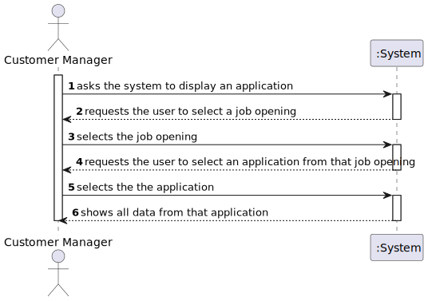
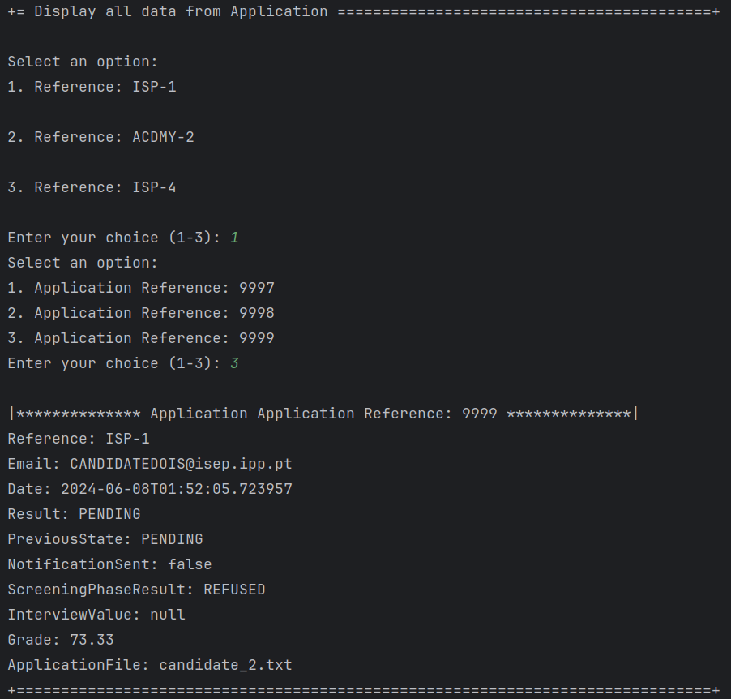

# US 1021

Author : 1221265

## 1. Context

It is the first time this task is being developed.


## 2. Requirements


**US 1021** As Customer Manager, I want to display all the data of an application.

- Priority: 5
- References: N/A

## 2.1. Client Clarifications

## Question 36

> US1021, o que é “all data of an application”? O que é uma job application?

Uma job application é uma candidatura (de um candidato) a uma job opening. Relativamente ao “all data of an application” refere-se a todos os dados de uma candidatura, nomeadamente, os ficheiros submetidos pelos candidato assim como dados recolhidos ou gerados durante o processo (como as entrevistas e processamento de requisitos).

## Question 179

> Relativamente à US1021, como é que a Application a exibir é escolhida? O utilizador pode começar por selecionar uma Job Reference e depois o e-mail de um dos candidatos? Ou recomenda uma outra abordagem?

Devem aplicar melhores práticas de UX/UI. Já houve perguntas anteriores sobre assuntos similares (ex: Q150). Note que existe uma US para listar todas as candidaturas a um job opening, por exemplo.

## Question 184

> Em relação à listagem dos dados de uma determinada jobApplication, um customer manager vai ter acesso a todas as jobApplications do sistema ou apenas às jobApplications feitas para uma job opening de um cliente que é gerido por esse customer manager?

Apenas às que está a gerir.

## Question 188

> Listagem das applications - Gostaria de abordar um ponto específico relacionado à UI/UX User Story 1021. Eu sei que o cliente tem vindo a referir que devemos aplicar melhores práticas de UX/UI e que preferia não constrangir a forma como desenhamos a UI/UX. No entanto, a nossa preocupação é que, nesta US, no caso de haver um grande número de aplicações, a exibição de todas essas informações de uma vez poderá ficar confusa para o user. Por isso, queria apenas perguntar se poderíamos adotar uma solucão um pouco mais prática, como, por exemplo, pedir ao user para selecionar uma job opening e só depois listar as applications associadas a essa job opening e os dados dessas applications ou se, na sua visão, esta abordagem poderia restringir demasiadamente as opções oferecidas por esta funcionalidade.

Ver Q36. Esta US é para mostrar os dados de uma (1) candidatura. Deve haver uma forma do Customer Manager indicar (incluindo, eventualmente, forma de selecionar/”saber”/”pesquisar”) qual a candidatura (i.e., application) e o sistema mostra os dados dessa candidatura.

## Question 202

> Quando se diz mostrar todo os dados de uma candidatura isso inclui, por exemplo, todos os dados do candidato, todos os dados da job opening relativa a essa candidatura, etc? Ou apenas, o id da job opening, o email do candidato, etc? Alem do curriculo claro.

Ver Q36.


## 3. Analysis

### 3.1. Domain Model


### 3.2. Use case diagram


## 4. Design

### 4.1. SSD



### 4.2. Applied Patterns

- **Controller:** Manages incoming requests, orchestrating operations between the user interface and the application’s service layer, ensuring that responses are delivered effectively.

- **Repository:** Abstracts the data layer, providing a collection-like interface for accessing domain entities while hiding the complexities of the data store.


## 5. Implementation
## 5.1 DisplayApplicationController
```java
public class DisplayApplicationController {

    private final AuthorizationService authz = AuthzRegistry.authorizationService();

    private ListApplicationController listApplicationController = new ListApplicationController();


    public Iterable<JobOffer> obtainJobOpening(){
        authz.ensureAuthenticatedUserHasAnyOf(Jobs4uRoles.POWER_USER, Jobs4uRoles.CUSTOMER_MANAGER);

        return listApplicationController.obtainJobOpening();
    }
}
```


## 6. Integration & Demonstration


## 7. Observations

- N/a