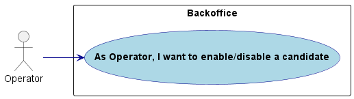
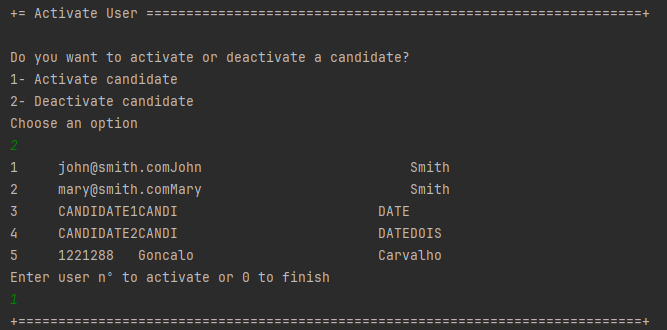
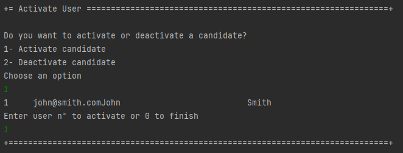

# US 2000b

Autor : 1211225

## 1. Context

This feature is being implemented for the first time

## 2. Requirements

**US 2000b** As Operator, I want to enable/disable a candidate

- 2000a.1. Create the method to fetch candidate

- 2000a.2. Create the method to toggle candidate status

- 2000a.3  Create the UI

- 2000a.5  Make this functionality available only in the menu for the Operator

## 2.1. Client Clarifications
> Q30 Alejandro – US2000b, o que é o enable/disable do candidato?

A30. (alguma referencia a Q23). Refere-se a desativar o acesso do candidato ao sistema (i.e., Candidate App)

## 3. Analysis

### 3.1. Conditions

- The operator must be authenticated and authorized to perform the operations.
- A candaite must be activated to disabled and disabled to be activated
### 3.1. Domain Model


### 3.2. Use case diagram




## 4. Design

### 4.1. Applied Patterns

### 4.2. Sequence Diagram


## 5. Implementation
```java
package lapr4.jobs4u.app.backoffice.console.presentation.authz;

import eapli.framework.infrastructure.authz.application.AuthorizationService;
import eapli.framework.infrastructure.authz.application.AuthzRegistry;
import eapli.framework.infrastructure.authz.application.UserManagementService;
import eapli.framework.infrastructure.authz.domain.model.SystemUser;
import lapr4.jobs4u.usermanagement.domain.Jobs4uRoles;

import java.util.ArrayList;
import java.util.List;

public class Activate_DeactivateCandidateController {
    private final AuthorizationService authz = AuthzRegistry.authorizationService();
    private final UserManagementService userSvc = AuthzRegistry.userService();

    public List<SystemUser> deactivatedCandidates() {
        authz.ensureAuthenticatedUserHasAnyOf(Jobs4uRoles.POWER_USER, Jobs4uRoles.OPERATOR);

        final List<SystemUser> list = new ArrayList<>();
        Iterable<SystemUser> dUsers = userSvc.deactivatedUsers();
        while(dUsers.iterator().hasNext()){   //remove da lista de users deativados todos os que não são canidadatos
            SystemUser u = dUsers.iterator().next();
            if(u.roleTypes().contains(Jobs4uRoles.CANDIDATE) && !u.isActive()){
                list.add(u);
            }
        }

        return list;
    }

    public List<SystemUser> activatedCandidates() {
        authz.ensureAuthenticatedUserHasAnyOf(Jobs4uRoles.POWER_USER, Jobs4uRoles.OPERATOR);

        final List<SystemUser> list = new ArrayList<>();
        Iterable<SystemUser> aUsers = userSvc.activeUsers();
        for(SystemUser u :aUsers){   //remove da lista de users deativados todos os que não são canidadatos
            if(u.roleTypes().contains(Jobs4uRoles.CANDIDATE) && u.isActive()){
                list.add(u);
            }
        }

        return list;
    }


    public SystemUser activateCandidate(final SystemUser user) {
        authz.ensureAuthenticatedUserHasAnyOf(Jobs4uRoles.POWER_USER, Jobs4uRoles.OPERATOR);

        return userSvc.activateUser(user);
    }

    public SystemUser deactivateCandidate(final SystemUser user) {
        authz.ensureAuthenticatedUserHasAnyOf(Jobs4uRoles.POWER_USER, Jobs4uRoles.OPERATOR);

        return userSvc.deactivateUser(user);
    }
}
```
## 6. Integration/Demonstration
### 6.1. Deactivate a candidate

### 6.2. Activate a candidate


## 7. Observations

- N/a