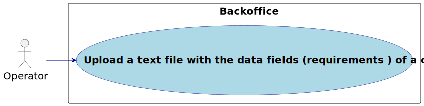
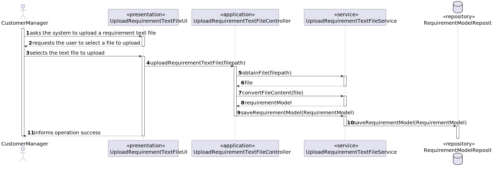
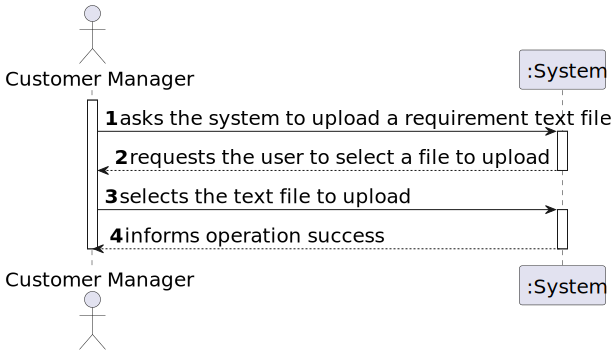

# US 2004

Autor : 1221288

## 1. Context
This is the first time this task is assigned to be developed. 
This is a new functionality that allow Operator To upload a text file with the data fields (requirements ) of a
candidate for its verification.

## 2. Requirements

**US 2004** As Operator, I want...

- 2004.1. To upload a text file with the data fields (requirements ) of a
  candidate for its verification.
- Priority: 1
- References: See NFR09(LPROG).

## 2.1. Client Clarifications

### Question 15

> É o Operador que regista uma candidatura ou é o sistema que
o faz automaticamente? E como integra o “plugin” de verificação da
candidatura neste processo?

Na US 2002 o Operator regista a candidatura. Para isso, é o Operator que inicia o
processo mas o sistema deve importar os dados resultantes do Application File Bot de
forma “automática” (Ver References da US 2002). O plugin referido entra neste processo
através da US 2003, em que o Operador gera um ficheiro template com os dados a
introduzir para validar uma candidatura. Na US 2004, o Operador, após preencher os
dados específicos da candidatura (com base no ficheiro template anterior) submete no
sistema esse ficheiro que vai ser usado para o sistema avaliar/verificar a candidatura. Se
os critérios não forem atingidos a candidatura é recusada.

### Question 102

> Quem vai preencher as respostas no ficheiro
template?

Será o Operador e, no âmbito da US2004, este submete o ficheiro já preenchido no
sistema.

### Question 166

> I'm having trouble
understading where are the requirements answer obtained from the
candidates, so that the operator can then register their answers in the
template previously generated and submit them to the system. Are these
answers already within the files processed by tge application fie bot?

Please see Q15, Q102, Q119 and Q123. We can assume that the operator has access
to all the files submitted by the candidates (since he/she is the one that imports the files
into the system – US2002). He/she can than consult these files in order to answer the
questions in the requirements template file. She/he then submits the file with the answers
(US2004).

### Question 180

> Does US2004 only deals with the
upload of the file to the system or also the registration of the candidate's
answer by the Operator? I've seen many mentions about the file's answers but
I want to understand if that aspect is also part of US2004.

In US2003 the Operator downloads a template file that he/she uses to register the
candidate requirements. In US 2004, the Operator uploads a file with the requirements and
the system should validate the file (verify of the syntax is correct). US 1015 is the one that
executes the verification of requirements for the candidates (based on the previously
uploaded files).

### Question 223

> Não vejo isso como uma obrigação, mas penso que faz mais sentido nessa fase admitindo que apenas nessa fase seja garantido que todas as entrevistas foram efetuadas e todos os candidatos “avaliados” pelas entrevistas.Pergunta

A file that fails the verification means that that file has an error (syntactic error) it does not mean that the application does not meet the requirements. The user should fix the error and submit again. Only US 1015 results in approving or rejecting an application.

## 3. Analysis

### 3.1. Use case diagram

## 4. Design

### 4.1. System Diagram

### 4.2 System Sequence Diagram

## 5. Observations

- N/a