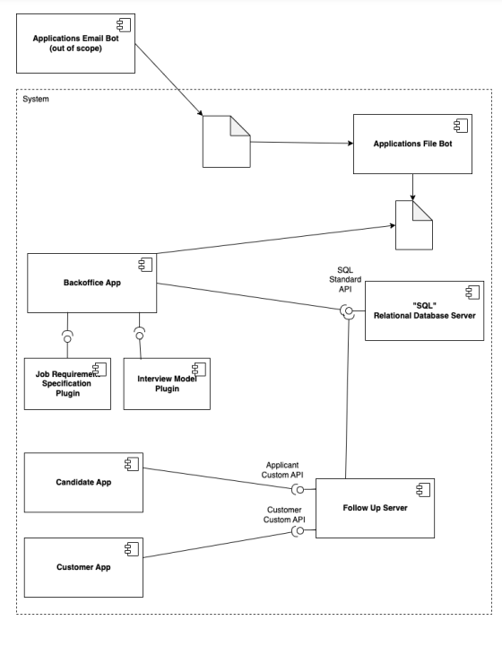
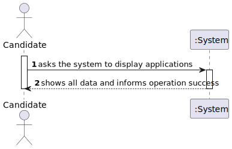
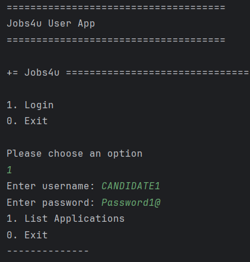
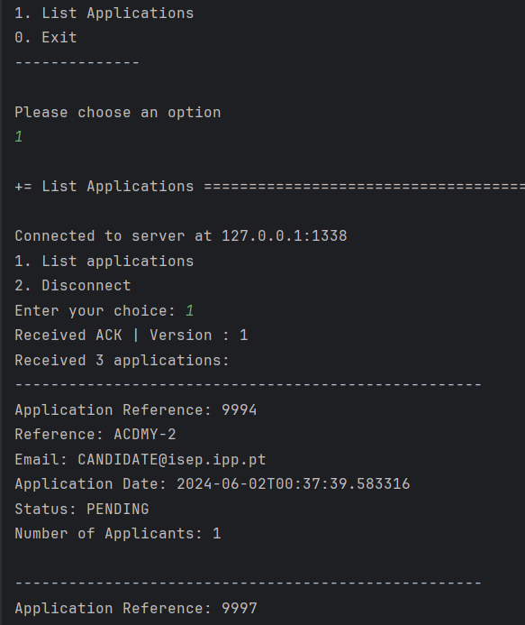

# US 3000

Autor : 1221959

## 1. Context
This is the first time this task is assigned to be developed.

## 2. Requirements

**US 3000** As Candidate, I want to list all my applications and their state (including the number of applicants).

- Priority: 1
- References: See NFR10(RCOMP) and NFR11(RCOMP).

## 2.1. Client Clarifications


### Question 34

> Na US3000 pede que, para alem de listar as aplicações e o estado das mesmas de um candidato, que liste o numero de candidatos. Este numero de candidatos é um somatório da quantidade de candidatos que fizeram uma aplicação para as mesmas Job Openings deste primeiro candidato (que esta a executar o caso de uso)?

Devem ser listadas todas as “applications” (candidaturas) do candidato, o estado delas, assim como o número de candidaturas que cada job opening teve (assim o candidato tem uma noção da “concorrência” que teve para cada uma das suas candidaturas).


### 3. Use case diagram


### 4. Applied Patterns

- **Repository:** This is used to get the applications of a candidate and the number os applicants for each job offer.

### 4.1. System Diagram


### 4.3 System Sequence Diagram



## 5. Implementation
```java
public class DisplayCandidateDataController {

    private final CandidateRepository repository = PersistenceContext.repositories().candidateUsers();
    private final AuthorizationService authorizationService = AuthzRegistry.authorizationService();
    private final JobOfferRepository jobOfferRepository = PersistenceContext.repositories().jobOffers();
    private final ApplicationRepository applicationRepository = PersistenceContext.repositories().applications();

    //email do manager logado
    private final String currentManager = getManagerEmail();

    //lista com o email de cada candidato e as job offers a que se candidatou
    private final Map<EmailAddress, List<Reference>> jobOffersPorCandidate= new HashMap<>();

    public List<CandidateUser> getAllCandidates() {

        //vai buscar o email de todos os candidatos a job offers da responsabilidade do manager logado currentManager
        boolean result = getCandidatesEmail();

        if (!result){
            return Collections.emptyList();
        }


        List<CandidateUser> candidateUsers = new ArrayList<>();

        //vou buscar o candidato atraves do emaile adiciono na lista para return
        try{
            for(EmailAddress email : jobOffersPorCandidate.keySet()) {
                Iterable<CandidateUser> candidateUser  = repository.findAllbyEmail(email);
                if (candidateUser.iterator().hasNext() && !candidateUsers.contains(candidateUser.iterator().next())) {
                    candidateUsers.add(candidateUser.iterator().next());
                }
            }
        }
        catch (Exception e){
            System.out.println("Error: " + e.getMessage());
        }
        return candidateUsers;
    }

    public boolean getFilesUploadedByCandidate(CandidateUser candidateUser) throws IOException, InterruptedException {
        //armazenar as job offers a que o candidato selecionado se candidatou
        List<Reference> references = jobOffersPorCandidate.get(candidateUser.email());

        //chamar método que vai contar as palavras dos ficheiros do candidato
        WordCounter.Counter(references, candidateUser.email().toString(), "SCOMP/sprint3/shared_folder");
        return true;
    }

    private String getManagerEmail() {
        authorizationService.ensureAuthenticatedUserHasAnyOf(Jobs4uRoles.POWER_USER, Jobs4uRoles.CUSTOMER_MANAGER);

        AuthorizationService authorizationService = AuthzRegistry.authorizationService();
        Optional<UserSession> userSessionOptional = authorizationService.session();
        UserSession userSession = userSessionOptional.get();
        SystemUser authenticatedUser = userSession.authenticatedUser();
        return authenticatedUser.email().toString();
    }

    public Iterable<JobOffer> getJobOffers() {
        authorizationService.ensureAuthenticatedUserHasAnyOf(Jobs4uRoles.POWER_USER, Jobs4uRoles.CUSTOMER_MANAGER);

        Iterable<JobOffer> jobOffers = jobOfferRepository.findAllByManager(currentManager);
        if (jobOffers == null || !jobOffers.iterator().hasNext()) {
            System.out.println("No job offers found.");
            return Collections.emptyList();
        }
        return jobOffers;
    }

    public Boolean getCandidatesEmail() {
        authorizationService.ensureAuthenticatedUserHasAnyOf(Jobs4uRoles.POWER_USER, Jobs4uRoles.CUSTOMER_MANAGER);

        try{
        Iterable<JobOffer> jobOffers = getJobOffers();
        Iterable<Application> applications=null;
        List<EmailAddress> candidatesEmail = new ArrayList<>();

        for (JobOffer jobOffer : jobOffers) {
            applications = applicationRepository.findByReference(jobOffer.getReference());
            for (Application application : applications) {
                if (!jobOffersPorCandidate.containsKey(application.email())) {
                    jobOffersPorCandidate.put(application.email(), new ArrayList<>());
                }
                if (!jobOffersPorCandidate.get(application.email()).contains(jobOffer.getReference())){
                    jobOffersPorCandidate.get(application.email()).add(jobOffer.getReference());
                }
                if (application.email() != null && !candidatesEmail.contains(application.email())) {
                    candidatesEmail.add(application.email());
                }
            }

        }
            return true;
        }catch (Exception e){
            System.out.println("Error: " + e.getMessage());
            return false;
        }
        }

    }
```


## 6. Integration & Demonstration

```
1- Entrar como candidate
2- Selecionar a opção 1
3- Em caso de sucesso, são impressas as 
candidaturas do candidato e o número de
candidatos para cada job offer
```





## 7. Observations

- N/a