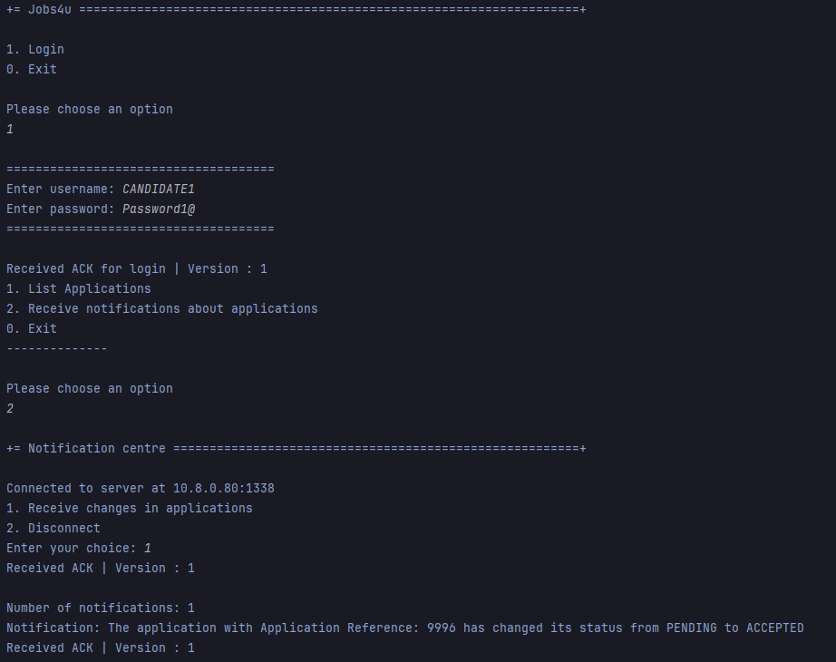

# US 3001

Author : 1221289

## 1. Context

It is the first time this task is being developed.

## 2. Requirements

**US 3001** As Candidate, I want to be notified in my application when the state of one of my applications changes.

- Priority: 1

## 2.1. Client Clarifications

## Question  174

> Na US 3001 pretende que o candidato seja notificado na sua aplicação quando o estado de uma aplicação mudar. De que forma pretende que o candidato seja notificado? E caso o candidato não esteja a correr a aplicação, essa notificação é perdida?

O candidato deve ser notificado quando a sua “app” está em execução. Relativamente a notificações que “acontecem” quando não está a correr a aplicação, seria interessante que as recebesse da próxima vez que executasse a aplicação.

## Question  175

> Questão âmbito notificações - O candidato será notificado, quando a sua candidatura mudar de estado. O que se entende por notificado, é receber um email, quando entra na aplicação tem uma fila de 'inbox' ? Quando a aplicação está ligada recebo email? É o candidato que faz o pedido(cliente) (Pop) inicia assim a comunicação, e recebe a resposta/notificação (servidor). E como encaixo o cenário de notificação(push)?

Ver Q174. Neste caso as notificações são na aplicação do candidato, não são por email.

## Question  189

> Application State – I'd like some clarifications regarding the state that US3001 mentions. Is it the "accepted/not accepted" state, or a state regarding the phases of the recruitment process of which the application is associated to?

This US is focused on the Candidate perspective. He/she may not be aware of the internal phases of the recruitment process. But he/she is interested in knowing the “external” state of his/her applications. For instance, as a candidate I would like to know if my application was received. Then I would like to know if my application was accepted or not and, finally, if I was selected or not.

## 3. Analysis

### 3.1. Domain Model

)

### 3.2. Use case diagram


## 4. Design

### 4.1. Realization

### 4.2. Applied Patterns

- **Repository:** This is used to store the revelant objects. This is done to allow the persistence of the enrollments and to allow the use of the enrollments in other parts of the application.

## 5. Implementation
## 5.1 ReceiveNotificationUI
```java

public class ReceiveNotificationUI extends AbstractListUI {

    private static final String SERVER = "10.8.0.80";
    private static final String LOCAL_SERVER = "127.0.0.1";
    private static final int PORT = 1338;

    String username;

    public ReceiveNotificationUI(String username) {
        this.username = username;
    }

    @Override
    protected boolean doShow() {
        try (Socket sock = new Socket(InetAddress.getByName(SERVER), PORT);
             DataInputStream dis = new DataInputStream(sock.getInputStream());
             DataOutputStream dos = new DataOutputStream(sock.getOutputStream())) {

            System.out.println("Connected to server at " + SERVER + ":" + PORT);

            Scanner scanner = new Scanner(System.in);

            while (true) {
                int choice = getOption(scanner);

                switch (choice) {
                    case 1:
                        try {
                            sendReceiveNotification(dos, username);

                            receiveResponseACKorERR(dis);

                            receiveNotification(dis);

                            receiveResponseACKorERR(dis);

                        } catch (Exception e) {
                            System.out.println("An error occurred: " + e.getMessage());
                            e.printStackTrace();
                        }
                        break;
                    case 2:
                        try {
                            sendDisconn(dos);
                            return true;
                        } catch (Exception e) {
                            System.out.println("An error occurred while disconnecting: " + e.getMessage());
                            e.printStackTrace();
                        }
                        return true;
                    default:
                        System.out.println("Invalid choice. Please enter 1 or 2.");
                        break;
                }
            }

        } catch (IOException ex) {
            System.out.println("Failed to establish TCP connection");
            System.exit(1);
        }
        return true;
    }

    private static int getOption(Scanner scanner) {
        System.out.println("1. Receive changes in applications");
        System.out.println("2. Disconnect");
        System.out.print("Enter your choice: ");
        return scanner.nextInt();
    }

    @Override
    public String headline() {
        return "Notification centre";
    }

    private static String readData(DataInputStream dis) throws IOException {
        int dataLen = dis.readByte() + 256 * dis.readByte();
        byte[] data = new byte[dataLen];
        dis.readFully(data);
        return new String(data);
    }

    private static void sendReceiveNotification(DataOutputStream dos, String username) throws IOException {
        dos.writeByte(1); // VERSION
        dos.writeByte(10); // CODE for RECEIVE NOTIFICATION
        dos.writeByte(username.length() % 256); // DATA1_LEN_L
        dos.writeByte(username.length() / 256); // DATA1_LEN_M
        dos.writeBytes(username); // DATA1
    }

    private static void receiveNotification(DataInputStream dis) throws IOException {

        int contador = dis.readInt();

        System.out.println("Number of notifications: " + contador);
        for (int i = 0; i < contador; i++) {
            String notification = readData(dis);
            System.out.println("Notification: " + notification);
        }
    }
    private static void receiveResponseACKorERR(DataInputStream dis) throws IOException {
        byte responseVersion = dis.readByte();
        byte responseCode = dis.readByte();
        if (responseCode == 3) { // ERR
            int data1_len = dis.readByte() + 256 * dis.readByte();
            byte[] data1 = new byte[data1_len];
            dis.readFully(data1);
            String errorMsg = new String(data1);
            System.out.println("Error: " + errorMsg + "| Version : " + responseVersion);
        } else if (responseCode == 2) { // ACK
            System.out.println("Received ACK | Version : " + responseVersion);
        } else {
            System.out.println("Error: Unexpected response code.");
        }
    }

    private static void sendDisconn(DataOutputStream dos) throws IOException {
        dos.writeByte(1); // VERSION
        dos.writeByte(1); // CODE for DISCONN
    }

    @Override
    protected Iterable elements() {
        return null;
    }

    @Override
    protected Visitor<Application> elementPrinter() {
        return null;
    }

    @Override
    protected String elementName() {
        return null;
    }

    @Override
    protected String listHeader() {
        return null;
    }

    @Override
    protected String emptyMessage() {
        return null;
    }
}

```

## 5.2 NotificationsReceiverController
```java

public class NotificationsReceiverController {

    public boolean checkForStateChange(Application application) {
        return application.getPreviousState() != application.getResult();
    }

}

```

## 5.3 Server
```java

public class Server {

    private static final int PORT = Integer.parseInt(Config.getProperty("PORT"));
    private static final JpaRepositoryFactory repositoryFactory = new JpaRepositoryFactory();
    private static final JpaApplicationRepository applicationRepository = repositoryFactory.applications();
    private static final JobOfferRepository jobOfferRepository = PersistenceContext.repositories().jobOffers();
    private static final CustomerRepository customerRepository = PersistenceContext.repositories().customerUsers();
    private static final ConfigurationRepository configurationRepository = PersistenceContext.repositories().configurations();
    private static final UserRepository userRepository = PersistenceContext.repositories().users();
    private static final EmailSender emailSender = new EmailSender(repositoryFactory.candidateUsers(), repositoryFactory.customerUsers());

    public static void main(String[] args) {

        // Configurar a autenticacao
        AuthzRegistry.configure(PersistenceContext.repositories().users()
                , new Jobs4uPasswordPolicy(),new PlainTextEncoder());

        try (ServerSocket serverSocket = new ServerSocket(PORT)) {
            System.out.println("Server listening on port " + PORT);

            // thread que serve para monitorizar a base de dados (tabela applications) e enviar emails
            new Thread(() -> {
                System.out.println("Email sender thread started");
                while (!Thread.currentThread().isInterrupted()) {

                    synchronized (Server.class) {
                        List<Application> unprocessedApplicationsList = new ArrayList<>();
                        applicationRepository.findUnprocessedApplications().forEach(unprocessedApplicationsList::add);
                        CopyOnWriteArrayList<Application> unprocessedApplications = new CopyOnWriteArrayList<>(unprocessedApplicationsList);

                        for (Application application : unprocessedApplications) {
                            emailSender.sendEmail(application);
                            application.markAsNotified();
                            applicationRepository.save(application);
                        }
                    }

                    try {
                        Thread.sleep(1000);
                    } catch (InterruptedException e) {
                        throw new RuntimeException(e);
                    }
                }
            }).start();

            // thread que serve para monitorizar a base de dados (tabela applications) e enviar emails dos results
            new Thread(() -> {
                System.out.println("Results sender thread started");

                while (!Thread.currentThread().isInterrupted()) {

                    synchronized (Server.class) {
                        boolean candidatesEmailSent = false;
                        List<Application> approvedApplicationsList = new ArrayList<>();
                        List<Application> notApprovedApplicationsList = new ArrayList<>();
                        applicationRepository.findApprovedApplicationsToPublish().forEach(approvedApplicationsList::add);
                        applicationRepository.findNotApprovedApplicationsToPublish().forEach(notApprovedApplicationsList::add);

                        CopyOnWriteArrayList<Application> approvedApplications = new CopyOnWriteArrayList<>(approvedApplicationsList);
                        CopyOnWriteArrayList<Application> notApprovedApplications = new CopyOnWriteArrayList<>(notApprovedApplicationsList);


                        if (!approvedApplications.isEmpty()) {
                            // Obtain job offer
                            Reference jobOfferReference = approvedApplicationsList.get(0).getReference();
                            JobOffer jobOffer = jobOfferRepository.findByReference(jobOfferReference).iterator().next();

                            // Obtain Company
                            String companyName = jobOffer.getCompany().getName();

                            // Obtain customer manager data
                            String customerManagerEmail = jobOffer.getManagerEmail();
                            SystemUser customerManager = getCustomerManager(customerManagerEmail);

                            if (customerManager != null) {
                                for (Application application : approvedApplications) {
                                    emailSender.publishResultsCandidate(customerManager, companyName, jobOfferReference, application);
                                    application.markResultAsNotified();
                                    application.markAsAlreadyPublished();
                                    applicationRepository.save(application);
                                    candidatesEmailSent = true;
                                }

                                for (Application application : notApprovedApplications) {
                                    emailSender.publishResultsCandidate(customerManager, companyName, jobOfferReference, application);
                                    application.markResultAsNotified();
                                    application.markAsAlreadyPublished();
                                    applicationRepository.save(application);
                                    candidatesEmailSent = true;
                                }

                                if (candidatesEmailSent) {
                                    CustomerCode customerCode = jobOffer.getCompany().getCustomerCode();
                                    CustomerUser customerUser = customerRepository.findByCustomerCode(customerCode).get();
                                    emailSender.publishResultsCustomer(customerManager, customerUser, jobOfferReference, approvedApplications);

                                    // Terminate Job Opening
                                    Configuration configuration = configurationRepository.findByReference(jobOfferReference).iterator().next();
                                    ResultPhase resultPhase = configuration.getResultPhase();
                                    resultPhase.close();
                                    configurationRepository.save(configuration);
                                }
                            }
                        }
                    }


                    try {
                        Thread.sleep(1000);
                    } catch (InterruptedException e) {
                        throw new RuntimeException(e);
                    }
                }
            }).start();


            // cada ligaçao com o servidor é criada uma thread para tratar a ligaçao
            while (true) {
                Socket clientSocket = serverSocket.accept();
                new Thread(new ClientHandler(clientSocket)).start();
            }

        } catch (IOException ex) {
            System.out.println("Failed to open server socket");
            System.exit(1);
        }
    }

    private static SystemUser getCustomerManager(String customerManagerEmail) {
        List<SystemUser> users = (List<SystemUser>) userRepository.findAll();

        for (SystemUser user : users) {
            if (user.email().toString().equals(customerManagerEmail) ) {
                return user;
            }
        }

        return null;
    }
}

class ClientHandler extends Thread {

    private static final byte COMMTEST = 0;
    private static final byte DISCONN = 1;
    private static final byte ACK = 2;
    private static final byte ERROR = 3;
    private static final byte AUTH = 4;
    private static final byte SEND_EMAIL = 7;
    private static final byte LIST_APPLICATIONS = 8;
    private static final byte LIST_JOB_OPENINGS = 9;
    private static final byte RECEIVE_NOTIFICATION = 10;

    private final Socket socket;
    private final ListJobOpeningController theController = new ListJobOpeningController();
    private final ListApplicationsController appController = new ListApplicationsController();
    private final NotificationsReceiverController notificationsReceiverController = new NotificationsReceiverController();
    private final ApplicationRepository applicationRepository = PersistenceContext.repositories().applications();

    public ClientHandler(Socket socket) {
        this.socket = socket;
    }

    @Override
    public void run() {
        try (DataInputStream dis = new DataInputStream(socket.getInputStream());
             DataOutputStream dos = new DataOutputStream(socket.getOutputStream())) {

            while (true) {
                try {
                    byte version = dis.readByte();
                    byte code = dis.readByte();
                    switch (code) {
                        case COMMTEST:
                            sendAck(version, dos);
                            break;

                        case DISCONN:
                            sendAck(version, dos);
                            socket.close();
                            return;

                        case AUTH:
                            handleAuth(version, dis, dos);
                            break;

                        case SEND_EMAIL:
                            handleSendEmail(version, dis, dos);
                            break;

                        case LIST_JOB_OPENINGS:
                            handleListJobOpenings(version, dis, dos);
                            break;

                        case LIST_APPLICATIONS:
                            handleListApplications(version, dis, dos);
                            break;
                        case RECEIVE_NOTIFICATION:
                            handleReceiveNotification(version, dis, dos);
                            break;
                        default:
                            System.out.println("Unknown operation code: " + code);
                            break;
                    }
                } catch (EOFException e) {
                    System.out.println("Client disconnected.");
                    break;
                } catch (SocketException e) {
                    System.out.println("Connection reset by client.");
                    break;
                }
            }
        } catch (IOException e) {
            System.out.println("An error occurred: " + e.getMessage());
            e.printStackTrace();
        }
    }

    private void sendAck(byte version, OutputStream dos) throws IOException {
        dos.write(version); // VERSION
        dos.write(ACK); // CODE for ACK
        // ACK does not have data
        System.out.println("Sent ACK to client!");
    }

    private void sendError(byte version, OutputStream dos) throws IOException {
        dos.write(version); // VERSION
        dos.write(ERROR); // CODE for ERROR
        writeData((DataOutputStream) dos, "An error occurred");
        System.out.println("Sent ERROR to client!");
    }

    private void handleAuth(byte version, DataInputStream dis, DataOutputStream dos) throws IOException {
        try {

            // ler o username
            int usernameLength = dis.readByte() + dis.readByte() * 256;
            byte[] usernameBytes = new byte[usernameLength];
            dis.readFully(usernameBytes);
            String username = new String(usernameBytes);

            //ler a password
            int passwordLength = dis.readByte() + dis.readByte() * 256;
            byte[] passwordBytes = new byte[passwordLength];
            dis.readFully(passwordBytes);
            String password = new String(passwordBytes);

            // autenticar o user
            AuthenticationCredentialHandler authHandler = new AuthenticationCredentialHandler();

            boolean authResult = authHandler.authenticated(username, password, Jobs4uRoles.CUSTOMER);
            if (!authResult){
                authResult = authHandler.authenticated(username, password, Jobs4uRoles.CANDIDATE);
            }

            // ver se o resultado do auth foi true or false e retornar um ack ou err respetivamente
            if (authResult) {
                System.out.println("User " + username + " authenticated successfully");
            } else {
                System.out.println("User " + username + " failed to authenticate");
            }

            if (authResult) {
                sendAck(version, dos);

            } else {
                sendError(version, dos);

            }

            sendAck(version, dos);

        } catch (Exception e) {
            System.out.println("An error occurred while authenticating the user: " + e.getMessage());
            sendError(version, dos);
        }
    }


    /**
     * Este metodo apenas serve como exemplo de envio de email por parametro
     * @param version versao
     * @param dis data input stream
     * @param dos data output stream
     * @throws IOException excecao
     */
    private void handleSendEmail(byte version, DataInputStream dis, DataOutputStream dos) throws IOException {
        try {
            String fromName = readData(dis);
            String fromEmail = readData(dis);
            String toEmail = readData(dis);
            String candidateName = readData(dis);
            String yourCompanyName = readData(dis);
            boolean isApproved = Boolean.parseBoolean(readData(dis));

            EmailDTO emailDTO = new EmailDTO(
                    fromName, fromEmail, toEmail, candidateName, yourCompanyName, isApproved);

            // Enviar email
            EmailService emailService = new EmailService();
            emailService.sendEmail(emailDTO);

            // Se correr tudo bem, enviar ack
            sendAck(version, dos);

        } catch (Exception e) {
            System.out.println("An error occurred while sending the email: " + e.getMessage());
            sendError(version, dos);
        }

    }


    /**
     * Este metodo serve para listar as ofertas de emprego
     * @param version versao
     * @param dis data input stream
     * @param dos  data output stream
     * @throws IOException excecao
     */
    private void handleListJobOpenings(byte version, DataInputStream dis, DataOutputStream dos) throws IOException {
        String username = null;

        try {
            username = readData(dis);
            sendAck(version, dos);
        } catch (Exception e) {
            System.out.println("An error occurred while trying to get job openings: " + e.getMessage());
            sendError(version, dos);
        }

        Iterable<JobOffer> jobOpeningsIterable = null;

        try {
            jobOpeningsIterable = retrieveJobOpenings(version, dos, username);

            List<JobOffer> jobOpenings = (List<JobOffer>) jobOpeningsIterable;

            dos.writeByte(version);             // VERSION
            dos.writeByte(10);               // CODE for JOB_OPENINGS
            dos.writeInt(jobOpenings.size());   // Number of job openings

            // para cada job opening vou enviar a reference,funcao, data de criacao e o numero de vagas para o cliente
            for (JobOffer job : jobOpenings) {
                writeData(dos, job.getReference().toString());
                writeData(dos, job.getFunction().toString());
                writeData(dos, job.getCreationDate().toString());
                dos.writeInt(job.getNrOfVacancies().getValue());
            }

            // caso de sucesso enviar ack
            sendAck(version, dos);
        } catch (Exception e) {
            System.out.println("An error occurred while retrieving job openings: " + e.getMessage());
            sendError(version, dos);
        }

    }

    private void handleListApplications(byte version, DataInputStream dis, DataOutputStream dos) throws IOException {
        // Read the username sent by the client

        String username = null;
        try {
            username = readData(dis);
            sendAck(version, dos);
        } catch (Exception e) {
            System.out.println("An error occurred while trying to get job openings: " + e.getMessage());
            sendError(version, dos);
        }

        // Converting the Iterable to List
        List<Application> applications = new ArrayList<>();
        Iterable<Application> applicationIterable = null;
        try {
            applicationIterable = retrieveApplications(version, dos, username);
            // Converting the Iterable to List
            applications = (List<Application>) applicationIterable;

            dos.writeByte(version); // VERSION
            dos.writeByte(8); // CODE for APPLICATIONS
            dos.writeInt(applications.size()); // Number of job openings


            if (!applications.isEmpty()) {
                for (Application app : applicationIterable) {
                    writeData(dos, app.getApplicationReference().toString());
                    writeData(dos, app.reference().toString());
                    writeData(dos, app.email().toString());
                    writeData(dos, app.date().toString());
                    writeData(dos, app.status().toString());
                    dos.writeInt(appController.getApplicants(app));
                }
            }

            sendAck(version, dos);
        } catch (Exception e) {
            System.out.println("An error occurred while retrieving job openings: " + e.getMessage());
            sendError(version, dos);
        }
    }

    private void handleReceiveNotification(byte version, DataInputStream dis, DataOutputStream dos) throws IOException {
        String username;

        try {
            username = readData(dis);
            System.out.println(username);
            sendAck(version, dos);
            System.out.println("Enviei ack do username");
        } catch (Exception e) {
            System.out.println("An error occurred while reading the user name: " + e.getMessage());
            sendError(version, dos);
            return;
        }

        try {
            Iterable<Application> applicationIterable = retrieveApplications(version, dos, username);
            List<Application> applications = new ArrayList<>();
            applicationIterable.forEach(applications::add);

            int contador = 0;
            for (Application ignored : applications) {
                if (!ignored.isNotificationSent() && notificationsReceiverController.checkForStateChange(ignored)) {
                    contador++;
                }
            }
            dos.writeInt(contador);

            for (Application app : applications) {
                if (!app.isNotificationSent() && notificationsReceiverController.checkForStateChange(app)) {
                    String message = String.format("The application with %s has changed its status from %s to %s", app.getApplicationReference().toString(), app.getPreviousState(), app.getResult());
                    writeData(dos, message);
                    System.out.println("Sent notification: " + message);

                    app.setNotificationSent(true);

                    applicationRepository.save(app);
                }
            }
            sendAck(version, dos);
        } catch (Exception e) {
            System.out.println("An error occurred while retrieving applications: " + e.getMessage());
            sendError(version, dos);
        }
    }

    /**
     * Este metodo serve para listar as ofertas de emprego
     * @param version versao
     * @param dos data output stream
     * @param username username
     * @return lista de ofertas de emprego
     * @throws IOException excecao
     */
    private Iterable<JobOffer> retrieveJobOpenings(byte version, DataOutputStream dos, String username) throws IOException {
        Iterable<JobOffer> jobOffers = null;
        try {
            jobOffers = theController.listCustomerJobOpenings(Username.valueOf(username));
        } catch (Exception e) {
            System.out.println("An error occurred while retrieving job openings: " + e.getMessage());
            sendError(version, dos);
        }

        if (jobOffers == null || !jobOffers.iterator().hasNext()) {
            System.out.println("No job openings available.");
        }

        return jobOffers;
    }

    private Iterable<Application> retrieveApplications(byte version, DataOutputStream dos, String username) throws IOException {
        Iterable<Application> applications = null;
        try {
            applications = appController.listApplications(Username.valueOf(username));
        } catch (Exception e) {
            System.out.println("No applications available.");
            sendError(version, dos);
        }

        if (applications == null || !applications.iterator().hasNext()) {
            System.out.println("No applications available.");
        }

        return applications;
    }

    /**
     * Ler data do cliente , serve para todos os casos
     * @param dis data input stream
     * @return data lida
     * @throws IOException excecao
     */
    private String readData(DataInputStream dis) throws IOException {
        int dataLen = dis.readByte() + 256 * dis.readByte();
        byte[] data = new byte[dataLen];
        dis.readFully(data);
        return new String(data, StandardCharsets.UTF_8);
    }

    /**
     * Escrever data para o cliente , serve para todos os casos
     * @param dos data output stream
     * @param data data a ser escrita
     * @throws IOException excecao
     */
    private void writeData(DataOutputStream dos, String data) throws IOException {
        dos.writeByte(data.length() % 256); // DATA_LEN_L
        dos.writeByte(data.length() / 256); // DATA_LEN_M
        dos.writeBytes(data); // DATA
    }

}

```

## 6. Integration & Demonstration



## 7. Observations

- N/a