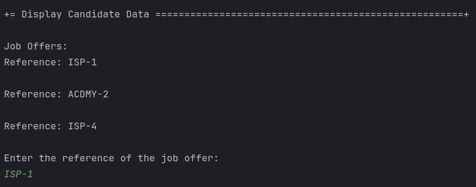
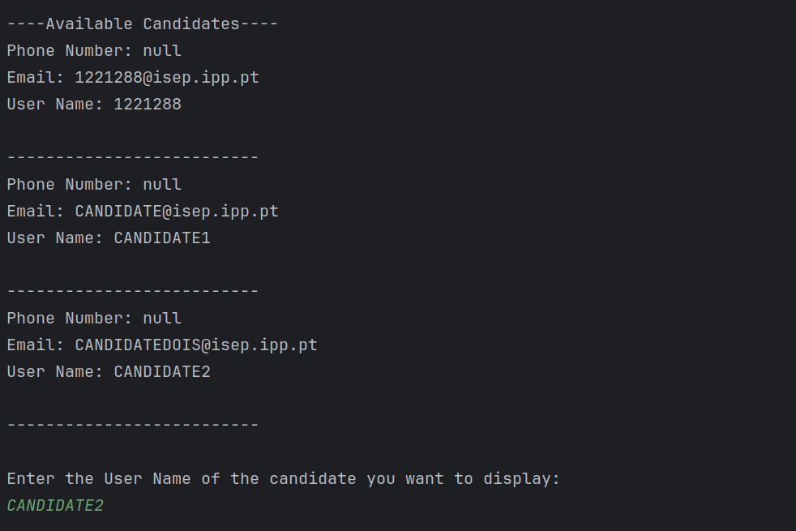
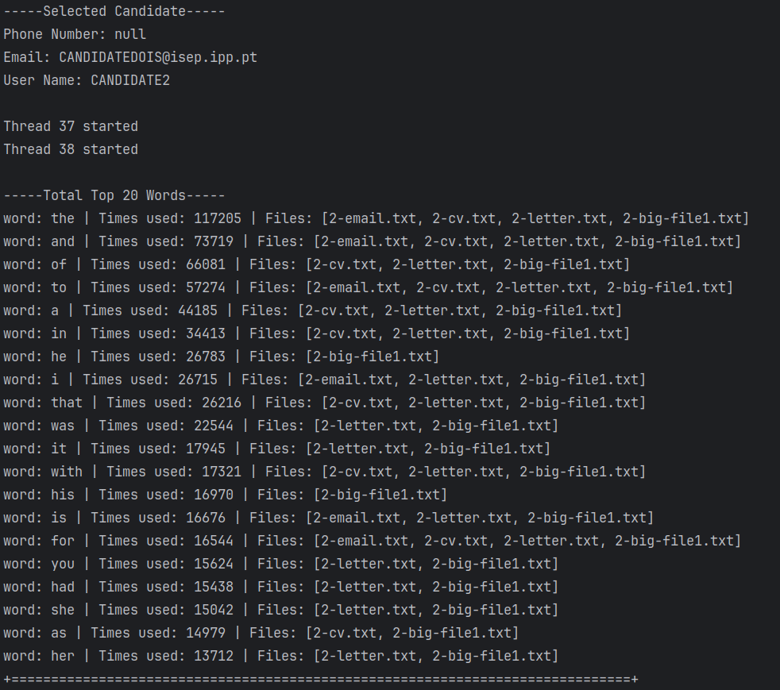

# US 3002

Autor : 1221959, 1221265

## 1. Context
This is the first time this task is assigned to be developed. 
This is a new functionality that allow Customer to list all my job openings, including job reference, position,
active since, number of applicants.

## 2. Requirements

**US 4000** As a Customer Manager, when displaying the candidate data, I expect the system to present a top 20 list of the most frequently referenced words from files uploaded by a candidate. Additionally, I require a comprehensive list of the files in which these words appear.

- Priority: 1
- References: NFR14(SCOMP) The process to count words of very large files should follow specific technical requirements such as implementing parallelism and concurrency using Java and threads. Specific requirements will be provided in SCOMP.


## 2.1. Client Clarifications


### Question 170

> Gostaria de saber se na US4000, relativa há criação da lista de palavras mais comuns, presentes nos ficheiros carregados pelo candidato, pretende escolher uma candidatura desse mesmo candidato e criar a respetiva lista, ou se pretende que esta lista seja criada, tendo em conta todas as candidaturas associadas a esse candidato.

A lista de palavras é relativa a uma candidatura em particular.

### Question 181

>Files for word count evaluation - When making the Top 20 Used Words by a candidate, the files subject to word counting are all files of all the chosen candidate's applications? Or can the Customer Manager choose a candidate's specific application and from there get the top 20 words from those files?

See Q170.

### Question 185

> The order of the list is important? Does it need to be ordered by the number of occurrences of the words?

Yes, the order is important. The system must present a top 20 list, from most referenced words to less referenced words.

### Question 186

> For the word count, should all types of words be counted, or are there words that don't make sense to count, such as conjunctions?

For the moment there are no restrictions like the one you mention since they depend on the language used in the text (the solution could/would be complex).

### Question 187

>  When displaying the candidate info is expected to show the list of words for each application of the candidate, or the customer manager needs to select a specific application to see the list of words?

This regards all the possible applications of a candidate that the customer manager is managing

### Question 191

> – Word Count – I think it makes sense to ignore words with less than 3 letters, or something like this, because it makes no sense to have words like as, I, am... Can we make this assumption or should we count any word?

See Q186. If you want, you may use a configuration file to configure the minimum number of sequence of characters to be counted as a word in the process. However, this is a temporary exception, accepted, but not considered as a good solution (a good solution should be one that takes into account the used language).

### Question 219

> Recentemente, respondeu a dúvidas sobre a funcionalidade que pretende que seja feita sobre o top 20 número de palavras em ficheiros de candidaturas de candidatos (Q170 e Q187). Quando analisamos as perguntas, ficámos na dúvida sobre qual a interpretação a levar em conta, de que a funcionalidade deve ser feita sobre todas as candidaturas do candidato (Q187), ou se o Customer Manager escolhe 1 candidatura do candidato e depois a funcionalidade faz o seu trabalho sobre apenas essa candidatura.(Q170)

Os dados do candidato (“candidate data”) referem-se aos dados do candidato que pode ter várias candidaturas. Nesse contexto ao apresentar os dados de cada candidatura devem aparecer, para cada candidatura (application), o top 20.

### Question 220

> Na us 4000 é referido, "Additionally, I require a comprehensive list of the files in which these words appear." Quer apenas que para a palavra "x" digamos em que ficheiros existe ou mais alguma informação?

É como indica, para cada palavra em que ficheiros aparece.


## 3. Analysis

### 3.1. Use case diagram


## 4. Design

### 4.1. SSD


### 5. Tests

### 5.1 WordCounterTest

**Test 1:** _Test Counter Method_
```
  @Test
    void testCounter() throws InterruptedException, IOException {
        // Executar o método Counter
        WordCounter.Counter(reference1, "test@example.com", tempDir.getAbsolutePath());

        // Verificar o resultado das palavras mais usadas em todas as candidaturas
        Map<String, Integer> sortedWordCountMap = WordCounter.sortByValue(WordCounter.wordCountMap);
        Map<String, Integer> top20Map = WordCounter.getTop20Word(sortedWordCountMap);

        assertTrue(top20Map.containsKey("sou"));
        assertTrue(top20Map.containsKey("um"));
        assertTrue(top20Map.containsKey("complemento"));
        assertTrue(top20Map.containsKey("para"));
        assertTrue(top20Map.containsKey("ver"));
        assertEquals(8, top20Map.get("sou")); // palavra word1 usada 2 vezes
        assertEquals(2, top20Map.get("um")); // palavra word2 usada 2 vezes
        assertEquals(6, top20Map.get("complemento")); // palavra word3 usada 4 vezes
        assertEquals(12, top20Map.get("para")); // palavra word4 usada 2 vezes
        assertEquals(2, top20Map.get("ver")); // palavra word5 usada 1 vez
    }
```

**Test 2:** _Test Get Top 20 Word Method_
```
  @Test
    void testGetTop20Word() {
        // Preencher o mapa wordCountMap com dados de teste
        for (int i = 1; i <= 30; i++) {
            WordCounter.wordCountMap.put("word" + i, i);
        }

        // Obter as top 20 palavras
        Map<String, Integer> sortedMap = WordCounter.sortByValue(WordCounter.wordCountMap);
        Map<String, Integer> top20 = WordCounter.getTop20Word(sortedMap);

        // Verificar o tamanho do resultado e as palavras esperadas
        assertEquals(20, top20.size());
        assertTrue(top20.containsKey("word30"));
        assertTrue(top20.containsKey("word29"));
        assertFalse(top20.containsKey("word10"));
    }
```

**Test 3:** _Test if Threads are created correctly_
```
  @Test
    void testIfThreadsAreCreatedCorrectly() throws InterruptedException, IOException {

        // Executar o método Counter
        WordCounter.Counter(reference1, "test@example.com", tempDir.getAbsolutePath());

        int usedThreads = WordCounter.numberThreadsUsed;
        int expected = WordCounter.FIXED_NUMBER_THREADS;

        // Verificar se o número de threads criadas é igual ao número de arquivos de candidatura
        assertEquals(usedThreads, expected);
    }
```


### 5.2 ProcessFileRunnableTest

**Test 1:** _Test with an empty file_
```
  @Test
    void testEmptyFile() throws IOException {

        FileQueue fileQueue = new FileQueue();
        fileQueue.addFiles(Collections.singletonList(emptyFile));
        fileQueue.setDone();

        ProcessFileRunnable runnable = new ProcessFileRunnable(fileQueue);
        Thread thread = new Thread(runnable);
        thread.start();
        try {
            thread.join();
        } catch (InterruptedException e) {
            e.printStackTrace();
        }
        assertEquals(0, WordCounter.wordCountMap.size());
    }
```

**Test 2:** _Test with a small file_
```
  @Test
    void testSmallFile() throws IOException {

        FileQueue fileQueue = new FileQueue();
        fileQueue.addFiles(Collections.singletonList(smallFile));
        fileQueue.setDone();


        ProcessFileRunnable runnable = new ProcessFileRunnable(fileQueue);
        Thread thread = new Thread(runnable);
        thread.start();
        try {
            thread.join();
        } catch (InterruptedException e) {
            e.printStackTrace();
        }

        assertEquals(3, WordCounter.wordCountMap.size());
        assertEquals(3, WordCounter.wordCountMap.get("and"));
        assertEquals(10, WordCounter.wordCountMap.get("the"));
        assertEquals(6, WordCounter.wordCountMap.get("ola"));
    }
```

**Test 3:** _Test with an extensive file_
```
  @Test
    void testWithBigFile() {

        FileQueue fileQueue = new FileQueue();
        fileQueue.addFiles(Collections.singletonList(bigFile));
        fileQueue.setDone();

        ProcessFileRunnable runnable = new ProcessFileRunnable(fileQueue);
        Thread thread = new Thread(runnable);
        thread.start();
        try {
            thread.join();
        } catch (InterruptedException e) {
            e.printStackTrace();
        }
        assertEquals(37165, WordCounter.wordCountMap.size());
        assertEquals(66819, WordCounter.wordCountMap.get("the"));
        assertEquals(47252, WordCounter.wordCountMap.get("and"));
    }
```

**Test 4:** _Test with a file with repeated words but in different formats_
```
  @Test
    void testFileWithNonAlphanumericCharacters() throws IOException {
        File specialCharFile = File.createTempFile("testfile_special", ".txt");
        try (FileWriter writer = new FileWriter(specialCharFile)) {
            writer.write("hello@world\nhello#world\nhello&world");
        }

        FileQueue fileQueue = new FileQueue();
        fileQueue.addFiles(List.of(specialCharFile));
        fileQueue.setDone();

        ProcessFileRunnable runnable = new ProcessFileRunnable(fileQueue);
        Thread thread = new Thread(runnable);
        thread.start();
        try {
            thread.join();
        } catch (InterruptedException e) {
            e.printStackTrace();
        }

        assertFalse(WordCounter.wordCountMap.containsKey("hello@world"));
        assertFalse(WordCounter.wordCountMap.containsKey("hello#world"));
        assertFalse(WordCounter.wordCountMap.containsKey("hello&world"));
    }
```


## 6. Integration & Demonstration

### 6.1 Input





### 6.2 Output




## 7. Observations

- N/a